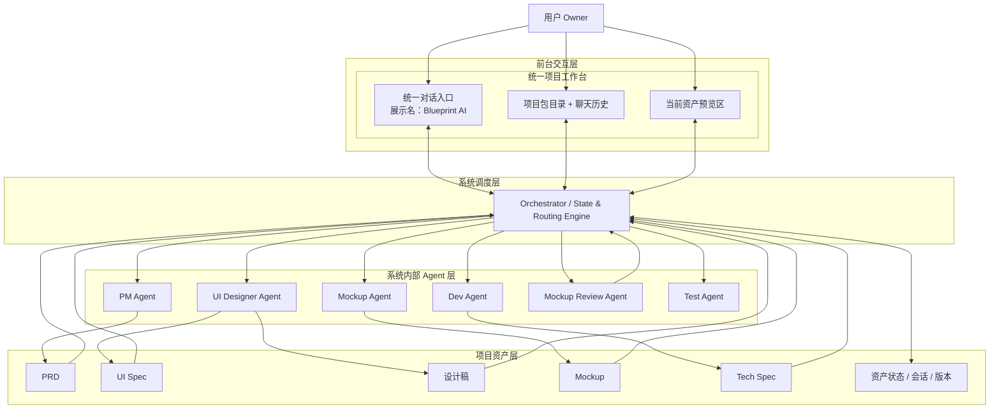
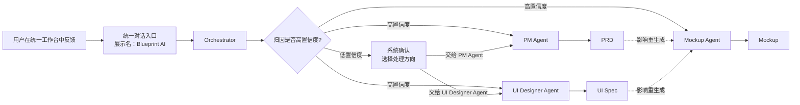
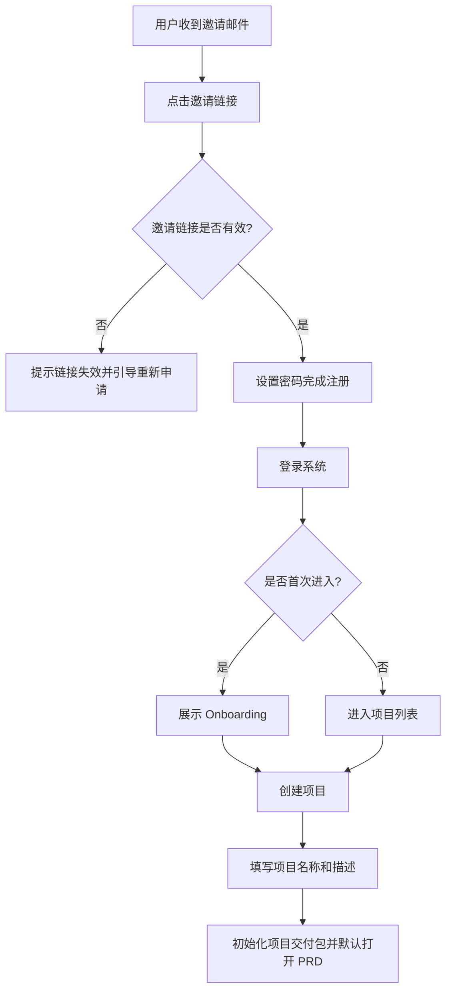
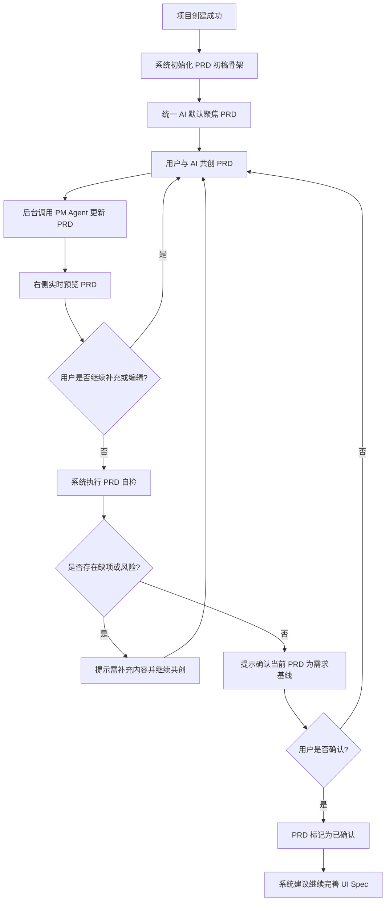
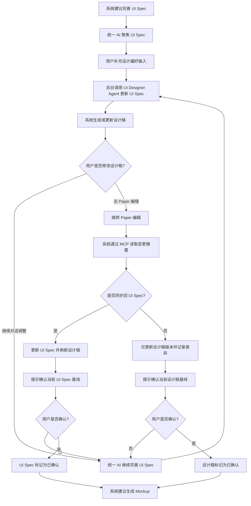
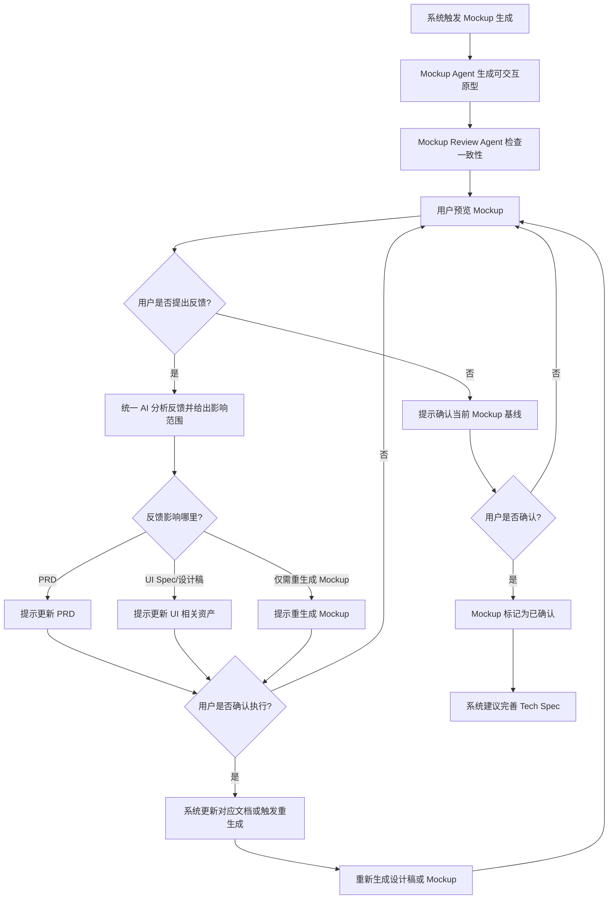
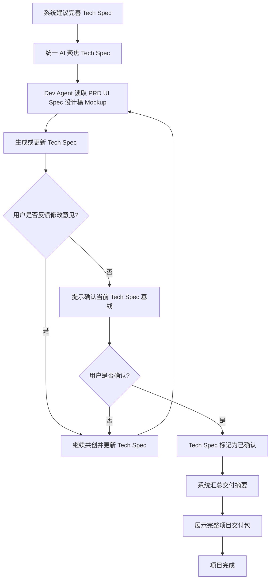
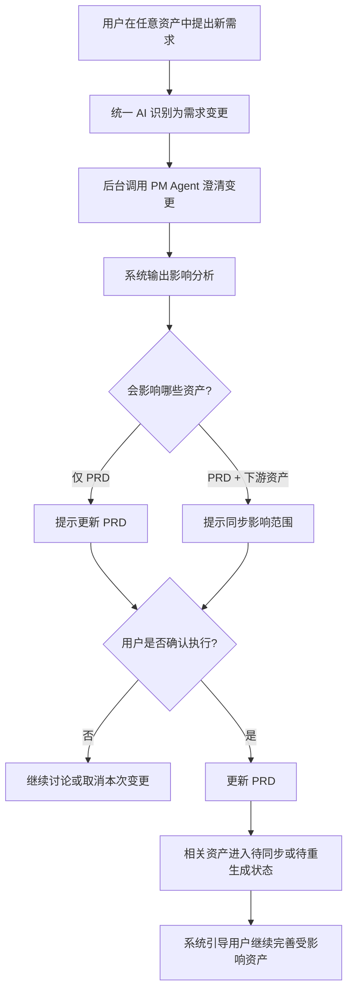
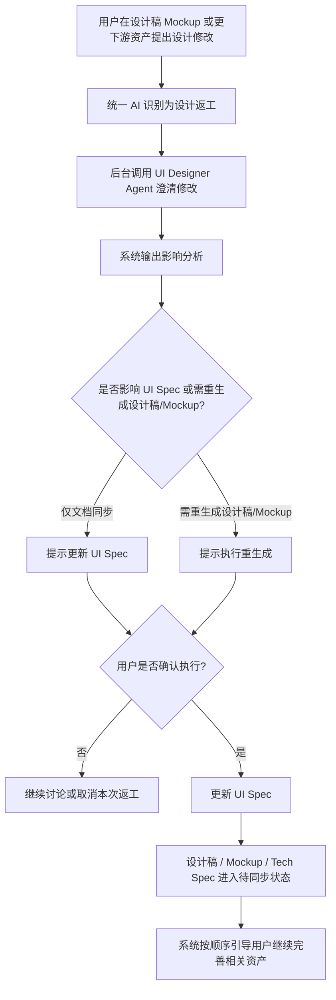

# PRD: Blueprint V1

## 📊 概述
**大版本**: V1（覆盖迭代 1.0 -> 当前）  
**当前迭代**: 1.16  
**状态**: Active  
**创建日期**: 2026-03-24  
**负责人**: TBD

---

## 📌 当前需求全貌（AI 实现代码时读这里）
> 本区域始终反映最新状态，包含所有累积至今的功能需求

### 产品定位
`Blueprint` 是一套 AI 驱动的 MVP 结构化交付平台。它面向小团队 PM、设计师、创业团队，以及对该模式感兴趣的 `57Blocks` 现有客户，目标是覆盖从模糊想法到结构化产品资产、再到代码仓库生成与最终部署交付的完整 MVP 交付链路。

当前的 `V1` 只是整个产品路线中的第一阶段。V1 的核心目标不是直接交付代码或部署后的产品，而是交付一套完整、可审阅、可迭代、可继续用于后续研发的**项目交付包**。平台将用户从想法输入一路带到 `PRD -> UI Spec -> 设计稿 -> Mockup -> Tech Spec -> 交付摘要` 这 6 个核心交付资产，但前台不再强调“逐阶段切换 Agent”的流程感，而是以统一工作台、统一 AI 对话和项目包目录的方式，持续完善整套交付资产。

### 当前阶段定位
`V1` 的定位是帮助用户把模糊的产品想法逐步沉淀为可以继续落地的结构化产品资产，确保后续研发、测试、部署与验收可以建立在稳定、可追踪、可迭代的文档基础之上。

### 路线图定位
- `Phase 1`：生成并确认结构化产品资产，包括 `PRD / UI Spec / 设计稿 / Mockup / Tech Spec`
- `Phase 2`：基于已确认资产生成可交付的代码仓库，由用户自行部署
- `Phase 3`：平台直接完成部署，用户验收 MVP，并获取代码仓库

### 官网表达策略
- 官网必须呈现 `Blueprint` 的最终目标，即一套 AI 驱动的 MVP 结构化交付平台，而不是只呈现为单一文档工具
- 官网首屏与价值表达应讲完整愿景：从想法到结构化资产，再到代码仓库与部署交付
- 官网中段必须清楚区分 `当前第一阶段已支持能力` 与 `后续阶段规划`
- 官网需要同时存在三层信息：`最终愿景`、`当前能力`、`路线图`
- 官网 CTA 仍以当前阶段能力为准，不夸大尚未交付的第二、第三阶段能力

### V1 核心原则
- 采用真实线上流程：`登录 -> Onboarding -> 创建项目 -> 统一工作台内持续共创交付资产`
- 系统内只有一个核心角色：`Owner`
- 账号体系为邀请制，非受邀用户不可自由注册
- 前台只保留一个统一对话入口，界面上可使用 `Blueprint AI` 作为展示名；`PM Agent / UI Designer Agent / Dev Agent / Mockup Agent / Mockup Review Agent / Orchestrator` 都属于后台能力，不作为前台人格切换暴露
- 项目创建成功后，系统立即初始化完整的项目交付包骨架：`PRD / UI Spec / 设计稿 / Mockup / Tech Spec / 交付摘要`
- 顶部只使用 6 个交付节点表达项目主流程，不额外长期暴露复杂阶段状态机
- 顶部交付节点表达的是资产成熟度，而不是资产是否存在；用户可见状态统一为 `待完善 / 完善中 / 已确认`
- 左侧不再是阶段导航，而是 `项目包目录 + 聊天历史`
- 中间永远是统一 AI 对话区；系统自动理解当前资产焦点和用户意图
- 右侧永远是当前资产预览区；随当前聚焦资产切换为文档、设计稿、原型或交付摘要视图
- 历史会话为项目级能力，但每条会话都绑定创建时的资产焦点与上下文来源
- 新建会话默认继承当前项目上下文，并以当前聚焦资产作为起点
- `PRD` 是默认首个聚焦资产；项目创建后 AI 主动引导用户从 PRD 初稿共创开始
- `UI Spec` 是主线设计资产，设计稿是可视化产物；若设计稿被人工修改，系统需识别变更摘要并提示是否同步回 `UI Spec`
- `Mockup` 定义为接近真实网页体验的可交互前端原型，使用 mock 数据还原核心流程
- Agent 需向用户展示动作状态与简要步骤日志，但不暴露完整思维链
- 官网首页主 CTA 为 `申请试用`
- `Onboarding` 首次登录强制展示，之后不再强制弹出，但统一工作台需始终保留“查看工作流说明”入口
- 项目创建页除项目名称和项目描述外，还需采集 `产品类型/行业`、`目标用户`、`目标平台(Web)`
- 旧的强 `stage-gate` 机制改为 `关键资产轻确认 + 影响范围确认`
- 关键资产轻确认不是“进入下一阶段按钮”，也不依赖独立确认按钮；而是由 AI 在完成自检后，通过对话给出确认摘要，再由用户在对话中将当前版本确认成 `当前基线`
- 当用户提出新的需求、设计变更或反馈，且系统判断会影响上游文档、当前基线或需要重生成设计稿/Mockup 时，必须先给出影响分析，并由用户确认是否执行更新或重生成
- 从下游资产返回分为两类：`需求变更` 与 `设计返工`；系统先由统一 AI 与用户澄清，再在必要时调用后台专业 Agent 完成对应文档更新与重生成
- 后台由 `Orchestrator` 统一调度，但 `Orchestrator` 不以独立人格暴露给用户
- `Orchestrator` 可读取所有资产状态和版本，但在 `V1` 中只承担 `意图路由 / 上下文装配 / 状态迁移 / 轻确认控制 / 任务触发` 这五类最小职责，不能直接修改用户资产正文，也不能直接生成文档
- 当前阶段不设通用 `Review Agent`；`PRD / UI Spec / Tech Spec` 的质量检查由对应后台能力或自检机制完成
- `Mockup Agent` 作为后台执行者存在，负责构建、运行和重生成 Mockup，但不作为前台可见 Agent 暴露
- `Mockup Review Agent` 是当前阶段唯一保留的专用 Review 角色，只负责检查 `Mockup` 与 `PRD / UI Spec / 设计稿` 之间的一致性、完整性与漂移
- `Orchestrator` 允许在对话中发出系统确认消息，例如提示影响范围、是否更新对应文档、是否重生成设计稿或 Mockup，但不以人格化 Agent 方式与用户进行多轮对话
- `Orchestrator` 的路由策略以 AI 自动判断优先；只有在归因低置信度时，才要求用户显式选择处理方向
- Agent 必须遵守质量约束：不乱编需求、不跨资产越权修改、输出结构化、每次修改有原因、不确定时主动追问、关键资产确认前先自检、低置信度结果必须显式提醒

### V1 交付范围
V1 必须支持以下主链路：
1. 用户通过邮件邀请链接进入系统并完成首次注册/密码设置
2. 用户登录后进入 Onboarding，理解平台工作流、所需输入和预期输出
3. 用户创建项目并填写项目基础信息
4. 项目创建成功后，系统自动初始化 `PRD / UI Spec / 设计稿 / Mockup / Tech Spec / 交付摘要` 六类资产的默认骨架
5. 统一 AI 助手默认引导用户从 `PRD` 初稿开始共创，可实时预览 Markdown，并支持编辑、导出、手动保存版本、填写更新说明
6. `PRD` 在达到可用质量后执行轻确认，作为当前需求基线
7. 用户继续与统一 AI 共创 `UI Spec`，可上传参考截图、输入参考网站链接、选择偏好品牌/字体/风格选项
8. 系统基于当前 `UI Spec` 生成高保真设计稿，平台内提供预览，并支持跳转到 `Paper` 进行外部编辑
9. 平台通过 MCP 读取设计稿修改结果，生成变更摘要，并提示用户是否同步更新 `UI Spec`
10. 后端基于当前 `PRD + UI Spec + 设计稿` 生成 `Mockup`
11. 用户在平台内或通过链接预览 `Mockup`，并通过统一对话反馈问题
12. 系统对反馈问题执行自动归因，判断应更新 `PRD`、`UI Spec`、仅重生成 `Mockup`，还是需要先回读设计稿；在真正执行更新或重生成前，必须先经用户确认
13. 用户继续与统一 AI 共创 `Tech Spec`
14. 当用户在任意资产中提出新的需求、修改意见或跨资产反馈时，系统自动理解意图，并提示会影响哪些资产以及是否需要同步更新或重生成
15. 只有在 AI 给出影响分析或自检结果，且用户在对话中明确确认执行后，系统才真正更新对应文档、重生成设计稿/Mockup，或变更当前基线
16. 若某份已确认基线被更新，受影响的其他资产需自动进入待同步状态，并在后续共创中继续完善
17. 当 `PRD / UI Spec / 设计稿 / Mockup / Tech Spec` 均达到已确认状态后，系统自动汇总交付摘要，形成完整项目交付包

### V1 交付结果
一个项目在 V1 中完成，意味着系统可稳定产出并保存以下资产：
- `PRD`
- `UI Spec`
- `视觉设计稿链接`
- `Mockup 链接`
- `Tech Spec`
- `交付摘要页`

这些资产共同组成一个**项目交付包（Project Delivery Package）**。用户最终获得的不是单个阶段页面，而是一整套可继续用于后续研发、测试、实现和验收的结构化资产包。

### V1 明确不做
- 不做公开注册与自由获客
- 不做 Google 快捷登录
- 不做站内多人实时协同编辑
- 不做站内评论系统
- 不做完整 Figma 级设计编辑器
- 不做自动代码生成与部署闭环
- 不做复杂计费/订阅系统
- 不做移动端 App
- 不做企业级工作区隔离与复杂权限体系
- 不做项目分享链接、只读协作者查看、精细版本 diff、多套设计方向对比、Mockup 历史版本回看、统一审批流

### Agent System Architecture

#### Agent 分层

**前台交互层**
- 统一项目工作台
- 统一对话入口（界面展示名可为 `Blueprint AI`）

**系统内部 Agent**
- `PM Agent`
- `UI Designer Agent`
- `Dev Agent`
- `Mockup Agent`
- `Mockup Review Agent`
- `Test Agent`
- `Orchestrator / Workflow Agent`

#### 总体架构原则
- 用户前台始终只看到统一工作台、统一对话入口和当前资产视图，而不是看到内部专业 Agent
- 系统后台由 `Orchestrator` 负责读取上下文、判断意图、选择调用哪个内部 Agent；被命中的专业 Agent 直接生成当前轮用户可见内容
- `Mockup` 是前台可预览资产，但 `Mockup Agent` 是后台执行者
- `Mockup Review Agent` 不参与前台共创，只承担 `Mockup` 一致性与漂移检查职责
- `Test Agent` 在 `V1` 作为后台保留能力存在，不前台暴露，也不进入当前交付包

#### Agent 架构图

##### 图 1：分层与调度架构


##### 图 2：Mockup 反馈与路由架构


#### 各 Agent 职责边界

| Agent | 可见性 | 主要职责 | 明确不负责 |
|------|------|---------|---------|
| `PM Agent` | 系统内部 | 需求澄清、PRD 生成与更新、需求变更处理、PRD 范围内解释与追问 | 不直接修改 `UI Spec / 设计稿 / Mockup / Tech Spec` |
| `UI Designer Agent` | 系统内部 | 基于 `PRD` 生成 `UI Spec`、理解设计偏好与参考输入、处理设计返工、基于设计稿变更回写 `UI Spec` 建议 | 不修改 `PRD` 需求本身 |
| `Dev Agent` | 系统内部 | 读取 `PRD / UI Spec / 设计稿 / Mockup`，生成结构化 `Tech Spec`，解释技术方案、边界、风险、假设 | 不在 `V1` 改代码，不直接修改 `PRD / UI Spec` |
| `Mockup Agent` | 系统内部 | 基于上游资产执行 Mockup 构建、运行、重生成与交付预览链接 | 不作为前台对话 Agent，不负责需求归因 |
| `Mockup Review Agent` | 系统内部 | 只检查 `Mockup` 与 `PRD / UI Spec / 设计稿` 的一致性、完整性和漂移问题，并输出结构化检查结果 | 不直接编辑资产，不负责 `PRD / UI Spec / Tech Spec` 阶段内自检，不与用户长期共创 |
| `Test Agent` | 系统内部 | 保留测试规格与后续自动化测试能力，为后续阶段做准备 | `V1` 不生成正式前台产物 |
| `Orchestrator` | 系统内部 | 读取资产状态与会话上下文，执行 `意图路由 / 上下文装配 / 状态迁移 / 轻确认控制 / 任务触发`，并协调内部 Agent | 不直接生成文档，不直接修改用户资产正文，不以独立人格长期与用户对话 |

#### Orchestrator V1 最小职责
- `意图路由`：根据当前会话与资产焦点，将用户输入路由到正确的后台 Agent 或内部任务
- `上下文装配`：在统一对话入口下为后台 Agent 注入当前资产、相关上游资产、历史会话摘要和来源版本
- `状态迁移`：统一维护资产的 `待完善 / 完善中 / 已确认 / 待同步 / 重生成中` 等用户可见状态，以及对应系统内部状态
- `轻确认控制`：在关键资产确认、文档更新、影响范围同步、重生成等动作发生前，先生成系统确认并等待用户执行
- `任务触发`：负责触发 `Mockup Review Agent`、`Mockup Agent`、设计稿读回、重生成等后台任务

#### 触发与路由规则
- 用户在统一工作台中点击某个资产时，系统切换当前资产焦点，但前台仍保持统一对话入口与统一展示名
- 项目创建成功后，系统默认打开 `PRD`，并由被路由命中的专业 Agent 直接引导用户从 PRD 初稿共创开始
- 用户在 `PRD` 相关对话中输入时，后台默认调用 `PM Agent`
- 用户在 `UI Spec / 设计稿` 相关对话中输入时，后台默认调用 `UI Designer Agent`
- 用户在 `Tech Spec` 相关对话中输入时，后台默认调用 `Dev Agent`
- 用户在 `Mockup` 相关视图中提交反馈时，先由 `Orchestrator` 判断：
  - 若属于需求问题，拉起 `PM Agent`
  - 若属于 UI / 设计问题，拉起 `UI Designer Agent`
  - 若仅需重生成 Mockup，则调用 `Mockup Agent`
- 若 `Orchestrator` 对问题归因的置信度不足，不直接自动路由，而是先弹出系统确认，让用户选择交给 `PM Agent` 或 `UI Designer Agent`
- 当用户提出会影响已有基线的新需求、设计修改或生成请求时，系统必须先展示影响范围，再等待用户确认是否执行更新或重生成

#### 轻确认与影响控制规则
- 所有关键资产的 `确认当前基线`、`更新对应文档`、`同步影响范围`、`重生成设计稿/Mockup` 都必须先由 AI 在对话中给出自检结果或影响分析摘要，再由用户在对话中明确确认，随后由 `Orchestrator` 执行最终裁决
- `Orchestrator` 在执行这些动作前，必须统一完成以下检查：
  - 当前资产是否已满足最低输入和前置条件
  - 是否需要触发该资产对应的自检或 `Mockup Review`
  - 是否存在未处理反馈、未处理设计变更或未确认的低置信度项
  - 本次动作会影响哪些其他资产，是否需要同步更新或标记待同步
- 只有在检查通过且 `Owner` 在对话中明确确认后，`Orchestrator` 才能执行基线确认、文档更新或重生成
- 若检查不通过，页面只展示失败原因和下一步引导，不允许自行跳过确认

#### 输入上下文与输出资产

| Agent | 读取上下文 | 输出结果 |
|------|---------|---------|
| `PM Agent` | 项目基础信息、当前 PRD 版本、历史会话、需求变更入口意图 | `PRD` 草稿/更新、需求澄清问题、需求变更方案 |
| `UI Designer Agent` | 已确认 `PRD`、设计偏好、参考截图/链接、设计返工入口意图、设计稿变更摘要 | `UI Spec` 草稿/更新、设计返工方案、回写建议 |
| `Dev Agent` | `PRD / UI Spec / 设计稿 / Mockup`、资产状态 | `Tech Spec`、实现风险、假设与边界说明 |
| `Mockup Agent` | `PRD / UI Spec / 设计稿`、生成参数 | 可运行 `Mockup`、预览链接、重生成结果 |
| `Mockup Review Agent` | `Mockup`、已确认 `PRD / UI Spec / 设计稿` | `Mockup` 一致性检查结果、漂移项、遗漏清单 |
| `Orchestrator` | 所有资产状态、当前资产摘要、用户入口动作与反馈 | 路由决定、系统状态变化、触发任务记录 |

#### 质量与权限约束
- Agent 不得凭空补写未经用户确认的业务需求
- Agent 不得跨资产直接修改不属于自己的资产正文
- 所有交付资产必须保持结构化输出，便于后续 Agent 消费
- Agent 每次建议修改时，必须说明修改原因或触发依据
- 当上下文不充分或低置信度时，Agent 必须先追问或显式提示风险
- 在确认当前基线前，必须经过对应 Review 或自检流程
- `Dev Agent` 可以指出需求或设计存在实现风险，但只能建议用户返回上游资产修正，不能越权修改

#### 前台可见方式
- 用户只看到统一 AI 助手、当前资产焦点和系统动作提示
- `Orchestrator` 不以 Agent 名称出现，只以系统动作文案呈现，例如：
  - `正在分析反馈归因`
  - `正在整理本次修改会影响的资产`
  - `正在触发 Mockup Review`
- `Orchestrator` 可以发出系统确认消息，例如：
  - `这次修改会更新 PRD，并影响 UI Spec / Mockup / Tech Spec，是否确认同步？`
  - `这次调整需要重新生成设计稿与 Mockup，是否现在执行？`
  - `系统无法高置信判断该问题属于需求还是设计，请选择处理方向`
- 当结果低置信度时：
  - Agent 在内容里明确表达不确定性
  - 系统层同时展示低置信度状态提示

---

## 📋 迭代历史（AI 理解上下文时读这里）

### v1.16 — 移除 Blueprint AI 的独立 Agent 定位（2026-03-26）
**变更内容**：将 `Blueprint AI` 从 Agent System 中移除，不再把它定义为独立 Prompt 或独立智能层，而是收口为前台统一展示名与统一对话入口；同时同步调整架构图、职责边界和相关 Prompt 语义  
**变更原因**：若将 `Blueprint AI` 设计成独立中间 Agent，会形成不必要的“传话筒”层，增加 token 消耗、时延和职责重叠。更合理的模型是：用户输入先到 `Orchestrator`，再由被路由命中的专业 Agent 直接生成用户可见内容，而前台仅保持统一展示名  

**本次新增要点**
- 删除 `Blueprint AI` 作为独立 Agent 的定位
- 明确 `Blueprint AI` 仅作为前台展示名与统一对话入口标签存在
- 强化 `Orchestrator -> 专业 Agent -> 用户可见内容` 的直接路径
- 同步清理 `PRD / CONTEXT / Agent Prompt` 中对 `Blueprint AI` 独立 Agent 身份的引用

### v1.15 — 关键资产确认改为对话确认（2026-03-26）
**变更内容**：将关键资产确认机制从“页面触发确认”进一步收口为“先自检、再在对话中输出确认摘要、最后由用户通过对话明确确认”，并同步更新相关页面交互、验收标准与 Agent 协作规则  
**变更原因**：当前统一 AI 工作台的真实交互不是依赖独立按钮完成基线确认，而是 AI 基于完整上下文和自检结果，在对话中给出确认摘要，再由用户在对话里明确回复确认。若文档仍保留“点击确认”心智，会与实际产品体验和 Agent 协作机制不一致  

**本次新增要点**
- 将关键资产轻确认正式定义为“对话确认”，而不是页面按钮动作
- 明确确认前置条件为：文档已生成、自检已完成、结果摘要已在对话中展示
- 将 `PRD / UI Spec / 设计稿 / Mockup / Tech Spec` 各资产视图中的确认交互统一改为摘要卡 + 对话确认
- 明确 `Orchestrator` 只在用户于对话中明确确认后，才执行基线确认、文档更新或重生成

### v1.14 — 前台模型重构为统一工作台（2026-03-26）
**变更内容**：将产品前台模型从“多阶段/多 Agent 工作台”重构为“统一工作台 + 项目交付包 + 单一 AI 助手”，并重写核心流程、关键页面原型、功能定义与验收标准  
**变更原因**：继续沿用前台多 Agent、强阶段切换的方案，会让用户需要理解系统内部角色和流程状态，增加使用心智负担，不符合“用户只和一个 AI 共创整套交付资产”的目标  

**本次新增要点**
- 前台统一收口为 `Blueprint AI`，后台保留多 Agent 能力
- 项目创建后默认初始化六类交付资产骨架
- 左侧导航改为 `项目包目录 + 聊天历史`，不再强调阶段导航
- 顶部以 6 个交付节点表达资产成熟度，不再长期暴露复杂阶段状态机
- 将强 `stage-gate` 改为 `关键资产轻确认 + 影响范围确认`

### v1.13 — Review 角色收口为 Mockup Review Agent（2026-03-26）
**变更内容**：移除当前阶段中的通用 `Review Agent` 定义，改为仅保留 `Mockup Review Agent` 作为专用审查角色，并明确 `PRD / UI Spec / Tech Spec` 的质量检查由各自阶段 Agent 自检完成  
**变更原因**：对照现有 `review.md` 和 `create-mockup.md` 的实际验证路径后，确认当前阶段真正需要的是 `Mockup` 一致性检查，而不是一个覆盖所有阶段的通用 `Review Agent`。继续保留泛化命名会与各阶段 Agent 自检机制重复，并混淆后续实现阶段的 Review 语义  

**本次新增要点**
- 删除当前阶段中的通用 `Review Agent` 定义
- 明确当前阶段只保留 `Mockup Review Agent`
- 明确 `PRD / UI Spec / Tech Spec` 的质量检查继续由各自阶段 Agent 自检完成
- 将架构分层、职责边界、输入输出和流程角色中的 `Review Agent` 收口为 `Mockup Review Agent`

### v1.12 — 架构图与最新 Orchestrator 规则对齐（2026-03-24）
**变更内容**：更新 `Agent 架构图` 与 `Mockup 反馈与路由架构图`，让图示与最新确认的 `Orchestrator` 最小职责、状态归属和低置信度路由规则保持一致  
**变更原因**：在补强 `Orchestrator` 的文字规则后，发现两张 Mermaid 图仍保留旧的表达方式，继续保留会让后续实现时优先相信图还是文字产生歧义  

**本次新增要点**
- 将 `Orchestrator` 在图 1 中明确为 `State & Routing Engine`
- 将 `Review Agent` 对状态的直接影响改为先回到 `Orchestrator`，由 `Orchestrator` 统一维护状态
- 将图 2 从默认 `Orchestrator -> Review Agent -> 路由` 调整为 `自动归因 -> 低置信度时系统确认 -> 再路由`
- 在图 2 中补上用户在低置信度情况下选择 `PM Agent / UI Designer Agent` 的分支

### v1.11 — Orchestrator 职责收口与 Gate 补强（2026-03-24）
**变更内容**：收敛 `Orchestrator` 在 `V1` 中的最小职责，补充全局 `Gate` 规则、低置信度路由回退逻辑，并修正 `Mockup` 页前台暴露 `Review Agent` 的问题  
**变更原因**：随着 `PM Agent` 与 `UI Designer Agent` Prompt 逐步成型，发现 `Orchestrator` 的现有描述仍略偏宽泛，且 `Mockup` 页前台身份展示与“内部 Agent 不暴露”原则存在冲突，需要在 PRD 中正式收口架构边界  

**本次新增要点**
- 明确 `Orchestrator` 在 `V1` 只承担 `阶段绑定 / 路由分发 / 状态迁移 / Gate 控制 / 任务触发` 五类最小职责
- 明确 `Orchestrator` 可发送系统确认消息，但不进行多轮人格化对话
- 明确路由策略采用 `AI 判断优先，低置信度时再由用户选择方向`
- 新增全局 `Gate 控制规则`，统一约束所有 `确认并进入下一阶段` 的最终裁决逻辑
- 修正 `Mockup` 页面中将 `Review Agent` 作为前台身份展示的不一致问题

### v1.10 — Agent 架构图补全（2026-03-24）
**变更内容**：在 `Agent System Architecture` 中新增 Mermaid 架构图，补充分层关系与 Mockup 反馈路由图  
**变更原因**：文字定义已经清楚，但缺少直观可视化表达，不利于后续 UI Spec、技术方案和执行阶段对 Agent 系统的统一理解  

**本次新增要点**
- 新增 `图 1：分层与调度架构`
- 新增 `图 2：Mockup 反馈与路由架构`
- 明确前台交互层、系统调度层、内部 Agent 层与项目资产层的关系
- 明确 Mockup 阶段反馈如何通过 `Orchestrator` 路由到 `PM Agent / UI Designer Agent / Mockup Agent`

### v1.9 — Agent 架构补强（2026-03-24）
**变更内容**：新增 Agent System Architecture，明确可见/内部 Agent 分层、职责边界、Orchestrator 权限、路由规则与质量约束  
**变更原因**：产品流程与页面已经较完整，但 Agent 系统才是核心执行能力，需要在 PRD 中单独定义架构边界与协作方式  

**本次新增要点**
- 明确 `PM / UI Designer / Dev` 为用户可见 Agent
- 明确 `Mockup / Review / Test / Orchestrator` 为系统内部 Agent
- 明确 `Mockup 工作台` 在前台，但 `Mockup Agent` 在后台执行
- 明确 `Review Agent` 只做质量守门员，尤其负责 Mockup 与设计稿一致性检查
- 明确 `Orchestrator` 只能路由、Review、状态迁移，不能直接编辑用户资产正文
- 明确 Agent 的输入上下文、输出结果与质量约束

### v1.8 — 首页主 CTA 收敛（2026-03-24）
**变更内容**：移除 `Page001 官网首页` Hero 区域中与 `申请试用` 并列的 `去登录` CTA，仅保留右上角导航中的登录入口  
**变更原因**：避免首页主视觉区域 CTA 分散注意力，进一步突出 `申请试用` 作为当前阶段的核心行动入口  

**本次新增要点**
- Hero 区仅保留一个主 CTA：`申请试用`
- 登录入口保留在页面右上角导航与页尾辅助入口中
- 首页首屏行动优先级更加聚焦

### v1.7 — 官网首页文案补全（2026-03-24）
**变更内容**：补充 `Page001 官网首页` 的完整核心文案，包括 Hero、副标题、当前阶段说明、流程说明、路线图说明、差异化与 CTA 文案  
**变更原因**：当前首页页面原型已有结构，但主要区块仍缺少可直接用于设计和实现的完整文案表达  

**本次新增要点**
- Hero 区补充完整标题、说明文案和行动解释
- Current Stage 区补充当前支持能力与即将支持能力的完整说明
- Workflow 区补充“每一步为什么存在”的说明文案
- Roadmap 区补充分阶段目标与用户收益表达
- Differentiation 区补充与普通 Demo 工具的完整对比文案
- CTA 区补充试用、登录与联系的完整引导文案

### v1.6 — 官网首页原型重构（2026-03-24）
**变更内容**：重构 `Page001 官网首页` 的页面原型，使其承载最终愿景、当前能力、工作流、路线图、差异化与 CTA 的完整信息结构  
**变更原因**：之前仅补充了定位说明，但首页页面原型本身仍偏向第一阶段说明页，无法准确承接 `Blueprint` 的长期定位  

**本次新增要点**
- 首页信息结构调整为：`Hero -> Current Stage -> Workflow -> Roadmap -> Differentiation -> CTA`
- Hero 主标题统一为 `From idea to MVP delivery.`
- 单独增加“当前支持能力”区块，明确当前支持与即将支持
- 路线图区采用“用户旅程 + 产品阶段”结合表达

### v1.5 — 产品定位与官网表达补强（2026-03-24）
**变更内容**：补充最终产品定位、V1 当前阶段定位、三阶段路线图，以及官网表达策略  
**变更原因**：确保官网既呈现 `Blueprint` 的长期愿景，又准确说明当前第一阶段可交付能力，避免用户预期错位  

**本次新增要点**
- 明确 `Blueprint` 的最终目标是完整的 AI 驱动 MVP 交付平台
- 明确 `V1` 只是第一阶段，当前聚焦结构化产品资产生成与确认
- 新增 `Phase 1 / Phase 2 / Phase 3` 路线图说明
- 新增官网表达策略：同时呈现最终愿景、当前能力和路线图

### v1.4 — Agent 驱动回退机制补强（2026-03-24）
**变更内容**：将需求变更与设计返工从“直接状态迁移”改为“先拉起对应阶段 Agent 新会话，多轮澄清后再确认执行”  
**变更原因**：使产品更符合真实共创流程，避免用户一点击入口就触发过早的阶段重开  

**本次新增要点**
- `发起需求变更` 始终拉起与 `PM Agent` 的新会话
- `返回 UI 阶段重设计` 始终拉起与 `UI Designer Agent` 的新会话
- 入口按钮保持动作型文案，但会话头部需明确当前正在讨论的 Agent 身份与意图
- 阶段重开不在入口点击瞬间发生，而是在 Agent 澄清后由用户显式确认执行
- 新增显式确认动作：`确认按此方案更新 PRD`、`确认按此方案重开 UI Spec`

### v1.3 — 导航与回退机制补强（2026-03-24）
**变更内容**：明确所有工作台统一输入框、阶段导航点击规则、会话区块与阶段导航关系，并新增 `设计返工` 机制  
**变更原因**：补齐工作台交互模型，支持用户从 Mockup 返回 UI 阶段重设计，而不误触发需求层变更  

**本次新增要点**
- 所有工作台页面明确保留 Agent 对话输入框
- 阶段导航定义为一级切换，会话区块定义为阶段内二级切换
- 增加阶段导航可点击规则、锁定规则和 `Outdated` 阶段访问规则
- 在 `Mockup / Tech Spec / 交付摘要` 增加 `返回 UI 阶段重设计` 入口
- 区分 `需求变更` 与 `设计返工` 两类回退路径

### v1.2 — 会话与变更机制补强（2026-03-24）
**变更内容**：补充首页完整表达、Onboarding 四步内容、阶段内会话历史与新建会话机制、需求变更与阶段重开机制  
**变更原因**：让产品支持真实迭代场景，避免进入下游阶段后无法安全回到上游修改需求  

**本次新增要点**
- 首页文案从骨架升级为可执行的信息表达
- Onboarding 明确为 4 步流程，并定义逐步切换与完成态
- 各工作台新增阶段内独立的会话历史区块和 `新建会话` 入口
- Agent 由阶段自动绑定，不提供 slash 命令式手动切换
- 新增 `发起需求变更` 入口、影响分析、阶段重开与下游过期标记机制
- 明确定义 `Draft / In Review / Confirmed / Reopened / Outdated / Regenerating / Reconfirmed` 等阶段状态

### v1.1 — 页面原型补强（2026-03-24）
**变更内容**：统一产品对外名称为 `Blueprint`，补充 P0 页面原型、统一工作台框架、补足官网与项目创建的验收标准  
**变更原因**：使 PRD 能直接支持后续 `UI Spec` 生成、页面设计与前端实现  

**本次新增要点**
- 产品对外名称统一改为 `Blueprint`
- 新增 `## 🖼️ 页面原型`，覆盖首页、账号、Onboarding、项目创建、各阶段工作台与交付摘要页
- 明确文档类与预览类页面共享统一工作台框架
- 首页主 CTA 明确为 `申请试用`
- Onboarding 支持首次强制展示与后续回看入口
- 项目创建页新增 `产品类型/行业`、`目标用户`、`目标平台(Web)` 字段
- 工作台顶部按钮统一采用 `确认并进入下一阶段`

### v1.0 — 初始版本（2026-03-24）
**变更内容**：完成 V1 产品定义、范围收敛、核心流程和功能边界设计  
**变更原因**：为 `57Blocks` 内部试运营与小范围客户试用建立统一的产品需求基线  

**本次确定的关键取舍**
- V1 聚焦交付结构化产品文档包，而非代码与部署
- 仅保留 `Owner` 单角色，避免早期协作复杂度
- 采用邀请制账号体系，不开放自由注册
- `PRD` 不做站内评论，采用在线编辑 + 导出 + 手动版本快照
- `UI Spec` 作为主线资产，设计稿为可视化产物
- 设计稿编辑通过 `Paper` 承接，平台负责预览与 MCP 读回
- `Mockup` 作为可交互前端原型，用于验证核心流程体验
- 每阶段都需要人工确认后才能进入下一阶段

## 🎯 目标与成功指标

### 核心问题
当前市场上的 AI 建站或 AI 原型工具能够快速生成 Demo，但往往缺少结构化产品资产，导致后续研发、交付、测试和部署难以高质量衔接。`Blueprint` 要解决的问题是：如何把一次性的 AI 聊天成果升级为可继续交付、可审阅、可迭代的完整产品文档包。

### 目标用户
- 小团队 PM
- 设计师主导或参与的创业团队
- 有明确业务方向但产品化能力不足的创业团队
- 对该模式感兴趣的 `57Blocks` 现有客户

### 成功指标
- 文档包满意度 `>= 9/10`
- Mockup 验收前平均迭代轮次 `<= 3 次`
- 首次生成后无需大改的 `UI Spec` 占比 `>= 95%`

## 📋 功能清单

### P0（必须有）
| 功能ID | 功能名称 | 功能描述 |
|--------|---------|---------|
| F001 | 品牌官网 | 展示核心 story、工作流、产品价值差异，并提供 `申请试用` 主 CTA 与 `登录 / 联系 57Blocks` 辅助入口 |
| F002 | 邀请制账号体系 | 通过邮件邀请链接完成注册、设置密码、登录与找回密码 |
| F003 | Onboarding | 向用户解释工作流、阶段输入、预期输出与预计耗时 |
| F004 | 项目创建与管理 | 创建项目并填写项目名称、描述、产品类型/行业、目标用户、目标平台(Web)，然后进入统一项目工作台 |
| F005 | PRD 初稿共创 | 通过统一 AI 对话持续完善 PRD，并支持实时预览 |
| F006 | PRD 编辑与版本快照 | 支持 Markdown 编辑、导出、手动保存版本、填写更新说明 |
| F007 | PRD 轻确认与需求基线 | 在 PRD 质量可用时执行自检，并允许用户确认当前基线 |
| F008 | UI Spec 共创 | 基于 PRD 生成结构化 UI Spec，并允许补充设计偏好输入 |
| F009 | 设计偏好输入 | 支持参考截图、参考链接、品牌与风格偏好输入或推荐选择 |
| F010 | 设计稿生成与预览 | 基于 UI Spec 生成高保真设计稿，并在平台内提供预览 |
| F011 | Paper 集成 | 支持跳转 `Paper` 外部编辑，并通过 MCP 读回变更摘要 |
| F012 | UI Spec 同步回写 | 根据设计稿变化提示用户是否同步更新 UI Spec |
| F013 | Mockup 生成与预览 | 生成可交互 Web 原型，支持链接或内嵌预览 |
| F014 | 反馈归因、影响分析与回写 | 对 Mockup 反馈执行问题归因，提示影响范围，并在用户确认后更新 PRD 或 UI Spec，或仅重生成 Mockup |
| F015 | Tech Spec 共创 | 在前述资产逐步成熟后生成结构化 Tech Spec |
| F016 | 交付摘要与导出 | 汇总完整文档包、资产成熟度与最终输出 |
| F017 | 需求变更与影响同步 | 在任意资产中提出需求变化后，先澄清，再由系统给出影响分析，并在用户确认后同步更新受影响资产 |
| F018 | 设计返工与重生成 | 在不改变产品需求的前提下提出设计修改，系统分析影响范围，并在用户确认后更新 UI Spec / 设计稿 / Mockup |

### P1（后续考虑）
| 功能ID | 功能名称 | 功能描述 |
|--------|---------|---------|
| F101 | 项目分享链接 | 允许通过受控链接分享项目结果 |
| F102 | 只读查看角色 | 支持站内只读查看交付结果 |
| F103 | 版本 Diff | 支持文档与设计产物的细粒度版本对比 |
| F104 | 多方案设计探索 | 支持多套设计方向并行生成与比较 |
| F105 | Mockup 历史版本回看 | 支持查看和比较历次 Mockup 输出 |
| F106 | 阶段时间线 | 记录每个阶段的状态、确认记录与关键节点 |

### P2（远期演进）
| 功能ID | 功能名称 | 功能描述 |
|--------|---------|---------|
| F201 | 代码生成闭环 | 基于文档包继续生成代码、测试与开发任务 |
| F202 | 自动化部署 | 自动部署 MVP 并交付在线访问链接 |
| F203 | 开放式 SaaS | 面向外部市场开放注册与自助付费使用 |

## 👤 用户故事

### US001: 邀请加入并开始项目
**As a** 受邀用户  
**I want** 通过邀请邮件快速完成注册并登录  
**So that** 我可以立即进入平台开始构建 MVP 文档包

### US002: 了解工作流
**As a** 产品负责人  
**I want** 在开始前看到清晰的工作流与每阶段需要准备的输入  
**So that** 我知道接下来该做什么，以及最终能获得什么

### US003: 用对话生成 PRD
**As a** 产品负责人  
**I want** 与统一 AI 通过对话生成并编辑 PRD  
**So that** 我的产品想法可以被结构化为后续可落地的产品需求文档

### US004: 基于 PRD 生成 UI Spec
**As a** 产品负责人  
**I want** 基于已确认的 PRD 生成 UI Spec  
**So that** 后续设计稿和原型生成可以建立在更稳定的界面规范上

### US005: 调整设计结果
**As a** 产品负责人  
**I want** 预览设计稿，并在必要时通过外部设计工具进行修改  
**So that** 我可以对难以用文字表达的视觉细节做出直接调整

### US006: 验证 Mockup 体验
**As a** 产品负责人  
**I want** 预览可点击的 Mockup 并反馈问题  
**So that** 我可以验证核心流程是否符合预期用户体验

### US007: 自动归因并迭代
**As a** 产品负责人  
**I want** 让系统帮助判断问题来自 PRD 还是 UI Spec  
**So that** 我可以快速修正文档源头，并重新生成更好的结果

### US008: 输出完整文档包
**As a** 产品负责人  
**I want** 在关键资产确认后获得一套完整文档包和交付摘要  
**So that** 我可以把这些结果交给团队或后续研发流程继续推进

### US009: 在后续阶段回到上游修改需求
**As a** 产品负责人  
**I want** 在完成 UI Spec、设计稿或 Mockup 后仍能安全地发起需求变更  
**So that** 我可以在不丢失上下文的前提下更新 PRD，并让受影响的下游结果重新生成

### US010: 从 Mockup 返回 UI 阶段重设计
**As a** 产品负责人  
**I want** 在需求不变的情况下从 Mockup 返回 UI 阶段重新设计界面  
**So that** 我可以优化交互结构和视觉方向，而不需要错误地回到 PRD 重写需求

## ✅ 关键验收标准

### F001: 品牌官网
- Given 未登录用户访问首页
- When 页面加载完成
- Then 用户应看到 `Blueprint` 的核心 story、工作流说明、与普通 Demo 工具的差异化说明，以及 `申请试用` 主 CTA

- Given 用户在首页查看导航和首屏
- When 用户选择任一入口
- Then 系统应提供 `申请试用`、`登录`、`联系 57Blocks` 三类清晰动作入口，并保证主次层级明显

### F002: 邀请制账号体系
- Given 用户收到有效邀请邮件
- When 用户点击邀请链接
- Then 用户应进入设置密码页面并完成注册

- Given 用户已完成注册
- When 用户输入正确账号密码登录
- Then 系统应允许其进入平台首页或最近项目页

- Given 用户忘记密码
- When 用户提交找回密码请求
- Then 系统应发送重置密码邮件并允许其完成密码重设

### F003: Onboarding
- Given 用户首次登录成功
- When 系统检测到用户尚未完成 Onboarding
- Then 系统应展示工作流、阶段输入要求、预期输出和预计耗时说明

- Given 用户已完成首次 Onboarding
- When 用户进入统一项目工作台
- Then 系统应提供“查看工作流说明”入口，但不应再次强制弹出完整 Onboarding

### F004: 项目创建与管理
- Given 用户进入项目创建页
- When 用户填写项目名称、项目描述、产品类型/行业、目标用户、目标平台并提交
- Then 系统应成功创建项目、初始化默认交付包骨架，并进入统一项目工作台的 `PRD` 资产视图

- Given 用户未填写必填字段
- When 用户点击创建项目
- Then 系统应阻止提交，并在对应字段展示明确的校验提示

### F005-F007: PRD 共创与轻确认
- Given 用户已创建项目
- When 用户与统一 AI 对话
- Then 系统应生成可实时预览的 Markdown PRD，并默认将 `PRD` 作为当前聚焦资产

- Given 用户修改了 PRD
- When 用户手动保存版本
- Then 系统应记录版本快照和更新说明

- Given 用户准备将 PRD 作为当前需求基线
- When 系统执行 PRD 自检
- Then 系统应在对话中展示缺失项或风险项，并在通过后给出确认摘要，等待用户回复确认当前基线

### F008-F012: UI Spec 与设计稿
- Given PRD 已达到可用质量
- When 用户开始完善 UI Spec
- Then 系统应允许用户补充设计偏好输入并生成 UI Spec

- Given UI Spec 已生成
- When 系统生成设计稿
- Then 用户应能在平台中预览设计稿，并可跳转到 Paper 编辑

- Given 用户在 Paper 中修改了设计稿
- When 系统读回设计稿变更
- Then 系统应生成变更摘要并提示用户是否同步更新 UI Spec

### F013-F014: Mockup 与问题归因
- Given 设计稿已确认
- When 系统生成 Mockup
- Then 用户应能够通过链接或内嵌预览方式体验可点击原型

- Given 用户对 Mockup 提出问题反馈
- When Agent 分析反馈内容
- Then 系统应给出问题归因建议、影响范围和建议动作，并要求用户确认更新 PRD 或 UI Spec，或仅重生成 Mockup

### F015-F016: Tech Spec 与交付摘要
- Given `PRD / UI Spec / 设计稿 / Mockup` 已达到可用基线
- When 用户开始完善 Tech Spec
- Then 系统应生成结构化 Tech Spec

- Given 全部必需资产已确认
- When 系统生成交付摘要
- Then 用户应看到完整文档包入口、交付节点状态和最终交付摘要

### F017: 需求变更与影响同步
- Given 用户已处于任意资产视图
- When 用户提出新的需求或需求修改
- Then 系统应识别为需求变更，并在统一对话中输出影响分析

- Given 用户已与系统完成多轮澄清
- When 系统输出影响分析与建议方案
- Then 系统应展示将被更新的文档、受影响的资产，以及明确确认动作

- Given 系统已输出建议方案
- When 用户在对话中明确确认执行
- Then 系统应更新对应文档，并将受影响资产标记为待同步或待重生成

### F018: 设计返工与重生成
- Given 用户位于 `设计稿 / Mockup / Tech Spec / 交付摘要` 任一资产视图
- When 用户提出设计修改
- Then 系统应识别当前意图为设计返工，并在统一对话中输出影响分析

- Given 用户已与系统完成多轮澄清
- When 系统输出返工建议与影响范围
- Then 系统应展示明确确认动作，并说明不会直接修改 `PRD`

- Given 系统已输出返工方案
- When 用户在对话中明确确认执行
- Then 系统应更新 `UI Spec`，并将 `设计稿 / Mockup / Tech Spec` 标记为待同步或待重生成

## 🔀 核心流程图
> 每个核心流程覆盖正常路径、关键分支与异常出口

### Flow001: 邀请注册与项目启动
**涉及角色**: 用户 / 系统  
**关联功能**: F001, F002, F003, F004



### Flow002: PRD 初稿共创与需求基线确认
**涉及角色**: 用户 / 统一 AI / 系统 / PM Agent  
**关联功能**: F005, F006, F007



### Flow003: UI Spec 与设计稿持续完善闭环
**涉及角色**: 用户 / 统一 AI / 系统 / UI Designer Agent / Paper  
**关联功能**: F008, F009, F010, F011, F012



### Flow004: Mockup 生成、反馈归因与再生成
**涉及角色**: 用户 / 统一 AI / 系统 / Mockup Agent / Mockup Review Agent  
**关联功能**: F013, F014



### Flow005: Tech Spec 完善与交付包汇总
**涉及角色**: 用户 / 统一 AI / 系统 / Dev Agent  
**关联功能**: F015, F016



### Flow006: 需求变更、影响分析与同步更新
**涉及角色**: 用户 / 统一 AI / 系统 / PM Agent  
**关联功能**: F017



### Flow007: 设计返工、影响确认与重生成
**涉及角色**: 用户 / 统一 AI / 系统 / UI Designer Agent  
**关联功能**: F018



## 🖼️ 页面原型
> 每个核心页面用三层表达：ASCII 线框图 + 组件树 + 交互状态表

### Page001: 官网首页 (`/`)

#### 线框图
```text
Screen: Marketing Home | Route: / | Layout: long-scroll marketing

┌────────────────────────────────────────────────────────────────────────────┐
│ [Blueprint]                                 登录   联系 57Blocks           │
│                                                                            │
│  From idea to MVP delivery.                                                │
│  Blueprint 是一套 AI 驱动的 MVP 结构化交付平台。                           │
│  它帮助你把模糊想法沉淀为可继续落地的产品资产，并逐步走向                  │
│  代码仓库生成、部署交付与最终验收。                                        │
│  当前第一阶段，我们先把最关键的事情做好：                                  │
│  让需求、设计、原型和技术规格形成一套可以继续交付的结构化基础。            │
│                                                                            │
│  ╔══════════════╗                                                        │
│  ║   申请试用   ║                                                        │
│  ╚══════════════╝                                                        │
│                                                                            │
│  [当前阶段能力]                                                             │
│  当前支持: PRD / UI Spec / 设计稿 / Mockup / Tech Spec                     │
│  你可以先把产品想法讲清楚、做成结构化文档，并通过设计稿与 Mockup           │
│  反复校验到足够稳定。                                                       │
│  即将支持: 代码仓库生成 / 自动部署                                          │
│  当第一阶段稳定后，Blueprint 会继续延伸到真正的代码与交付。               │
│                                                                            │
│  [完整流程]                                                                 │
│  想法澄清 -> PRD -> UI Spec -> 设计稿 -> Mockup -> Tech Spec               │
│  每一步都不是孤立输出，而是下一步的输入基础，确保产品逐步收敛。            │
│                                                                            │
│  [路线图]                                                                   │
│  Phase 1: 结构化产品资产                                                     │
│  Phase 2: 可交付代码仓库                                                     │
│  Phase 3: 自动部署、验收与仓库交付                                          │
│  这是产品的分阶段实施路径，也是用户最终会经历的完整交付旅程。              │
│                                                                            │
│  [差异化说明]                                                               │
│  普通 Demo 工具生成“看起来像产品”的结果，难以继续进入真实交付。            │
│  Blueprint 从一开始就围绕“可继续落地”来组织需求、设计、原型与技术规格。   │
│                                                                            │
│  [收尾 CTA]                                                                 │
│  当前开放第一阶段试用。                                                     │
│  如果你希望把想法更快变成一套可交付的产品资产，可以申请试用。              │
│  如果你已经收到邀请，可以直接登录开始。                                    │
│  如果你想进一步了解合作方式，可以联系 57Blocks。                          │
└────────────────────────────────────────────────────────────────────────────┘
```

#### 组件树
```text
Page: Marketing Home
  Route: /
  Layout: marketing, multi-section, max-width content

  - Header
    - Brand: "Blueprint"
    - NavLink: "登录" -> /login
    - NavLink: "联系 57Blocks" -> /contact
  - Hero
    - Eyebrow: "AI-powered MVP delivery platform"
    - Heading/h1: "From idea to MVP delivery."
    - Paragraph: "Blueprint 是一套 AI 驱动的 MVP 结构化交付平台。从模糊想法，到结构化产品资产，再到代码仓库与部署交付。"
    - SupportingText: "当前第一阶段，我们先帮助你把需求、设计、原型和技术规格沉淀为一套可以继续交付的结构化基础。"
    - Button[primary]: "申请试用"
  - CurrentStageSection
    - Heading/h2: "当前第一阶段已支持"
    - CapabilityList[current]: PRD, UI Spec, 设计稿, Mockup, Tech Spec
    - CapabilityList[next]: 代码仓库生成, 自动部署
    - Note: "你可以先把产品想法讲清楚、做成结构化文档，并通过设计稿与 Mockup 反复校验到足够稳定。"
    - SubNote: "后续阶段将在此基础上继续生成代码仓库并完成部署。"
  - WorkflowSection
    - Heading/h2: "完整流程"
    - Paragraph: "想法澄清 -> PRD -> UI Spec -> 设计稿 -> Mockup -> Tech Spec。每一步都作为下一步的输入基础，让产品逐步收敛，而不是停留在零散聊天记录中。"
    - StepList: 想法澄清, PRD, UI Spec, 设计稿, Mockup, Tech Spec
  - RoadmapSection
    - Heading/h2: "Blueprint 路线图"
    - Paragraph: "这既是 Blueprint 的产品演进路线，也是用户最终会经历的完整交付旅程。"
    - PhaseCard[Phase 1]: "生成并确认结构化产品资产"
    - PhaseCard[Phase 2]: "基于确认结果生成可交付代码仓库"
    - PhaseCard[Phase 3]: "完成自动部署、用户验收并交付仓库"
  - DifferentiationSection
    - Heading/h2: "为什么不是普通 Demo 工具"
    - CompareCard: "普通 Demo 工具生成演示结果；Blueprint 从一开始就围绕可继续交付来组织需求、设计、原型与技术规格。"
  - FooterCTA
    - Heading/h2: "开始体验 Blueprint"
    - Paragraph: "当前开放第一阶段试用。如果你希望更快把想法变成一套可交付的产品资产，现在就可以申请试用。"
    - SubParagraph: "如果你已收到邀请，请直接登录；如果你想了解合作方式，也可以联系 57Blocks。"
    - Button[primary]: "申请试用"
    - Link/Button: "去登录"
    - Link/Button: "联系 57Blocks"
```

#### 关键文案

| 区块 | 文案类型 | 建议文案 |
|------|------|---------|
| Hero | Eyebrow | `AI-powered MVP delivery platform` |
| Hero | H1 | `From idea to MVP delivery.` |
| Hero | Body | `Blueprint 是一套 AI 驱动的 MVP 结构化交付平台。从模糊想法，到结构化产品资产，再到代码仓库与部署交付。` |
| Hero | Supporting | `当前第一阶段，我们先帮助你把需求、设计、原型和技术规格沉淀为一套可以继续交付的结构化基础。` |
| Current Stage | Heading | `当前第一阶段已支持` |
| Current Stage | Body | `你可以先把产品想法讲清楚、做成结构化文档，并通过设计稿与 Mockup 反复校验到足够稳定。` |
| Current Stage | Current | `当前支持：PRD / UI Spec / 设计稿 / Mockup / Tech Spec` |
| Current Stage | Next | `即将支持：代码仓库生成 / 自动部署` |
| Workflow | Heading | `完整流程` |
| Workflow | Body | `想法澄清 -> PRD -> UI Spec -> 设计稿 -> Mockup -> Tech Spec。每一步都作为下一步的输入基础，让产品逐步收敛，而不是停留在零散聊天记录中。` |
| Roadmap | Heading | `Blueprint 路线图` |
| Roadmap | Body | `这既是 Blueprint 的产品演进路线，也是用户最终会经历的完整交付旅程。` |
| Roadmap | Phase 1 | `生成并确认结构化产品资产` |
| Roadmap | Phase 2 | `基于确认结果生成可交付代码仓库` |
| Roadmap | Phase 3 | `完成自动部署、用户验收并交付仓库` |
| Differentiation | Heading | `为什么不是普通 Demo 工具` |
| Differentiation | Body | `普通 Demo 工具生成演示结果；Blueprint 从一开始就围绕可继续交付来组织需求、设计、原型与技术规格。` |
| Footer CTA | Heading | `开始体验 Blueprint` |
| Footer CTA | Body | `当前开放第一阶段试用。如果你希望更快把想法变成一套可交付的产品资产，现在就可以申请试用。` |
| Footer CTA | Secondary | `如果你已收到邀请，请直接登录；如果你想了解合作方式，也可以联系 57Blocks。` |

#### 交互与状态

| 触发 | 行为 | 结果状态 |
|------|------|---------|
| 页面加载 | 拉取基础营销内容 | 页面展示 Hero、当前阶段能力、流程、路线图、差异化与 CTA 区块 |
| 点击 `申请试用` | 打开试用申请入口 | 跳转申请试用表单或试用联系流程 |
| 点击 `联系 57Blocks` | 打开联系入口 | 展示联系表单或联系方式 |
| 向下滚动 | 浏览首页各区块 | 按顺序浏览最终愿景、当前能力、工作流、路线图和差异化说明 |
| 浏览 `当前第一阶段已支持` 区块 | 查看能力范围 | 明确当前支持与即将支持能力的边界 |
| 浏览 `Blueprint 路线图` 区块 | 查看三阶段规划 | 理解当前处于 Phase 1，后续将支持代码仓库生成与自动部署 |

### Page002: 邀请注册/设置密码页 (`/invite/accept`)

#### 线框图
```text
Screen: Invite Accept | Route: /invite/accept | Layout: centered-card

┌─────────────────────────────────────┐
│           [Blueprint]               │
│      "完成注册，开始你的项目"        │
│                                     │
│  邀请邮箱: invited@company.com      │
│  ┌───────────────────────────────┐  │
│  │ 新密码                         │  │
│  └───────────────────────────────┘  │
│  ┌───────────────────────────────┐  │
│  │ 确认密码                       │  │
│  └───────────────────────────────┘  │
│                                     │
│  ╔═══════════════════════════════╗  │
│  ║     完成注册并进入系统         ║  │
│  ╚═══════════════════════════════╝  │
└─────────────────────────────────────┘
```

#### 组件树
```text
Page: Invite Accept
  Route: /invite/accept
  Layout: center-card, max-w-480

  - Header
    - Brand: "Blueprint"
    - Text/h1: "完成注册，开始你的项目"
  - InviteSummary
    - ReadonlyText: invited email
  - Form
    - Input[password]: label="新密码", required
    - Input[password]: label="确认密码", required
    - Button[primary, submit]: "完成注册并进入系统"
  - ErrorBanner: hidden by default
```

#### 交互与状态

| 触发 | 行为 | 结果状态 |
|------|------|---------|
| 页面加载 | 校验邀请 token | 有效 -> 展示表单；无效 -> 展示失效提示 |
| 点击完成注册 | 提交密码设置 | Loading -> 成功进入 `/onboarding` 或项目页 |
| 密码不一致 | 前端校验拦截 | 字段报错，禁止提交 |

### Page003: 登录页 (`/login`)

#### 线框图
```text
Screen: Login | Route: /login | Layout: centered-card

┌─────────────────────────────────────┐
│           [Blueprint]               │
│            "欢迎回来"               │
│                                     │
│  ┌───────────────────────────────┐  │
│  │ 邮箱                           │  │
│  └───────────────────────────────┘  │
│  ┌───────────────────────────────┐  │
│  │ 密码                           │  │
│  └───────────────────────────────┘  │
│       忘记密码? →                  │
│                                     │
│  ╔═══════════════════════════════╗  │
│  ║            登录               ║  │
│  ╚═══════════════════════════════╝  │
└─────────────────────────────────────┘
```

#### 组件树
```text
Page: Login
  Route: /login
  Layout: center-card, max-w-480

  - Header
    - Brand: "Blueprint"
    - Heading/h1: "欢迎回来"
  - Form
    - Input[email]: required
    - Input[password]: required
    - Link: "忘记密码?" -> /forgot-password
    - Button[primary, submit]: "登录"
  - ErrorBanner
```

#### 交互与状态

| 触发 | 行为 | 结果状态 |
|------|------|---------|
| 点击登录且表单合法 | 提交登录请求 | Loading -> 成功跳转最近项目或 Onboarding |
| 点击登录且表单非法 | 前端校验 | 字段错误提示 |
| 密码错误 | 后端返回失败 | 展示 error banner |

### Page004: 忘记密码页 (`/forgot-password`)

#### 线框图
```text
Screen: Forgot Password | Route: /forgot-password | Layout: centered-card

┌─────────────────────────────────────┐
│         "重置你的密码"              │
│                                     │
│  ┌───────────────────────────────┐  │
│  │ 注册邮箱                       │  │
│  └───────────────────────────────┘  │
│                                     │
│  ╔═══════════════════════════════╗  │
│  ║        发送重置邮件           ║  │
│  ╚═══════════════════════════════╝  │
└─────────────────────────────────────┘
```

#### 组件树
```text
Page: Forgot Password
  Route: /forgot-password
  Layout: center-card, max-w-480

  - Header
    - Heading/h1: "重置你的密码"
  - Form
    - Input[email]: label="注册邮箱", required
    - Button[primary]: "发送重置邮件"
  - SuccessState
  - ErrorBanner
```

#### 交互与状态

| 触发 | 行为 | 结果状态 |
|------|------|---------|
| 提交邮箱 | 请求发送重置邮件 | Loading -> 成功提示“请检查邮箱” |
| 邮箱格式错误 | 前端校验 | 字段报错 |
| 邮件服务失败 | 后端失败 | 展示重试提示 |

### Page005: Onboarding 页 (`/onboarding`)

#### 线框图
```text
Screen: Onboarding | Route: /onboarding | Layout: stepper-content

┌──────────────────────────────────────────────────────────────┐
│ [进度] 1/4  2/4  3/4  4/4                                   │
│                                                              │
│  [Step 1] Blueprint 是什么，能解决什么问题                  │
│  你有想法，但缺少结构化产品化过程。Blueprint 帮你把想法      │
│  变成可继续交付的产品资产，而不是只停留在聊天记录中。        │
│                                                              │
│  [底部操作]                                                  │
│  ┌──────────────┐      ╔══════════════════════════╗          │
│  │     上一步    │      ║          下一步          ║          │
│  └──────────────┘      ╚══════════════════════════╝          │
└──────────────────────────────────────────────────────────────┘
```

#### 组件树
```text
Page: Onboarding
  Route: /onboarding
  Layout: full-page, stepper

  - Header
    - Brand
    - ProgressIndicator
  - StepContent
    - Step1: "Blueprint 是什么，能解决什么问题"
    - Step2: "完整工作流与每一步产出"
    - Step3: "你需要准备哪些输入，分别在什么时候提供"
    - Step4: "协作与确认机制、修改回退、最终交付包"
  - FooterActions
    - Button[secondary]: "上一步"
    - Button[primary]: "下一步"
    - FinalButton[primary]: "开始创建项目"
```

#### 交互与状态

| 触发 | 行为 | 结果状态 |
|------|------|---------|
| 首次登录 | 自动进入 Onboarding | 强制展示 Step 1/4 |
| 点击下一步 | 切换到下一步内容 | 更新进度到 2/4、3/4、4/4 |
| 点击上一步 | 返回上一屏 | 展示前一步内容 |
| 点击已看过的进度点 | 跳转到对应已访问步骤 | 只允许切换已浏览过的步骤 |
| 到达 Step 4 | 隐藏“下一步”并显示“开始创建项目” | 用户可完成 Onboarding |
| 点击开始创建项目 | 标记 Onboarding 完成 | 跳转 `/projects/new` |
| 后续在工作台点击“查看工作流说明” | 打开说明层 | 展示 4 步内容的回看版本 |

### Page006: 项目创建页 (`/projects/new`)

#### 线框图
```text
Screen: New Project | Route: /projects/new | Layout: centered-form

┌──────────────────────────────────────────────────────────────┐
│                  "创建一个新的 Blueprint 项目"               │
│                                                              │
│  项目名称                                                    │
│  ┌────────────────────────────────────────────────────────┐  │
│  └────────────────────────────────────────────────────────┘  │
│  项目描述                                                    │
│  ┌────────────────────────────────────────────────────────┐  │
│  │                                                        │  │
│  └────────────────────────────────────────────────────────┘  │
│  产品类型 / 行业   目标用户   目标平台(Web)                 │
│                                                              │
│  ╔════════════════════════════════════════════════════════╗  │
│  ║                创建项目并进入 PRD                     ║  │
│  ╚════════════════════════════════════════════════════════╝  │
└──────────────────────────────────────────────────────────────┘
```

#### 组件树
```text
Page: Project Create
  Route: /projects/new
  Layout: form-page, max-w-720

  - Header
    - Heading/h1: "创建一个新的 Blueprint 项目"
  - Form
    - Input[text]: label="项目名称", required
    - Textarea: label="项目描述", required
    - Select: label="产品类型 / 行业", required
    - Input[text]: label="目标用户", required
    - Select: label="目标平台", default="Web", disabled=true
    - Button[primary]: "创建项目并进入 PRD"
```

#### 交互与状态

| 触发 | 行为 | 结果状态 |
|------|------|---------|
| 提交完整表单 | 创建项目 | 成功后进入 `/projects/:id/prd` |
| 缺失必填项 | 前端校验 | 字段级错误提示 |
| 创建失败 | 后端失败 | 顶部 banner 提示并允许重试 |

### Page007: PRD 资产视图 (`/projects/:id/prd`)

#### 线框图
```text
Screen: Project Workspace - PRD Focus | Route: /projects/:id/prd | Layout: unified-workspace

┌─────────────────────────────────────────────────────────────────────────────┐
│ Blueprint / 项目名 [PRD*][UI][设计稿][Mockup][Tech][交付摘要] [当前聚焦: PRD] │
├───────────────┬───────────────────────────────┬─────────────────────────────┤
│ 项目包目录    │ 统一 AI 对话区                 │ PRD Markdown 预览           │
│ - PRD*        │ - 当前目标提示                 │ - 标题                      │
│ - UI Spec     │ - 消息流                       │ - 章节目录                  │
│ - 设计稿      │ - 动作状态                     │ - 正文                      │
│ - Mockup      │ - 简要步骤日志                 │ - 编辑/导出/保存版本        │
│ - Tech Spec   │ - 输入框                       │ - 确认当前基线              │
│ - 交付摘要    │                               │                             │
│ [聊天历史]    │                               │                             │
│ - 当前对话    │                               │                             │
│ - PRD 初稿    │                               │                             │
│ [新建聊天]    │                               │                             │
├───────────────┴───────────────────────────────┴─────────────────────────────┤
│ 底部提示: PRD 已初始化为默认骨架，建议先完善目标、范围和核心流程后再确认基线    │
└─────────────────────────────────────────────────────────────────────────────┘
```

#### 组件树
```text
Page: PRD Asset View
  Route: /projects/:id/prd
  Layout: unified-workspace, 3-column

  - TopBar
    - Breadcrumb
    - DeliveryProgress[6]: PRD, UI Spec, 设计稿, Mockup, Tech Spec, 交付摘要
    - FocusBadge: "当前聚焦: PRD"
    - VersionSelect
  - Sidebar
    - ProjectSummary
    - AssetDirectory[*]: PRD, UI Spec, 设计稿, Mockup, Tech Spec, 交付摘要
    - LinkButton: "查看工作流说明"
    - ChatHistorySection
      - ChatItem[*]: 项目级历史会话，显示创建时的资产焦点
      - Button[secondary]: "新建聊天"
  - ConversationPane
    - AssistantLabel: "Blueprint AI"
    - FocusBanner: "当前正在完善 PRD"
    - ImpactBanner: default hidden; 当跨资产影响时展示影响范围与确认动作
    - AgentStatus
    - StepLog
    - MessageList
    - PromptInput
  - PreviewPane
    - Tab: "预览"
    - Tab: "编辑"
    - MarkdownDocument
    - Button: "导出 Markdown"
    - Button: "保存版本"
    - Input: "更新说明"
    - SelfCheckSummaryCard
```

#### 交互与状态

| 触发 | 行为 | 结果状态 |
|------|------|---------|
| 发送消息 | 触发后台 `PM Agent` 生成或修改 PRD | 对话区显示动作状态与步骤日志，右侧文档实时更新 |
| 点击项目包目录中的其他资产 | 切换当前资产焦点 | 中间对话保持连续，右侧预览切换为对应资产 |
| 点击历史聊天 | 切换对应会话线程 | 中间对话区切换到对应历史会话，右侧继续展示当前资产最新版本 |
| 点击新建聊天 | 基于当前项目上下文创建新线程 | 新聊天建立，默认继承当前聚焦资产 |
| 点击保存版本 | 记录快照和更新说明 | 新版本生成并可切换 |
| AI 在对话中给出 PRD 自检结果与确认摘要 | 等待用户在对话中明确确认 | 确认后将 PRD 标记为 `已确认`，顶部 PRD 节点变为完成状态 |
| 在对话中提出会影响其他资产的新需求 | 系统生成影响分析 | 展示“将影响 UI Spec / Mockup / Tech Spec，是否同步更新” |
| 点击查看工作流说明 | 打开说明面板 | 展示简化版 Onboarding 内容 |

### Page008: UI Spec 资产视图 (`/projects/:id/ui-spec`)

#### 线框图
```text
Screen: Project Workspace - UI Spec Focus | Route: /projects/:id/ui-spec | Layout: unified-workspace

┌─────────────────────────────────────────────────────────────────────────────┐
│ 项目名 [PRD][UI*][设计稿][Mockup][Tech][交付摘要] [当前聚焦: UI Spec]       │
├───────────────┬───────────────────────────────┬─────────────────────────────┤
│ 项目包目录    │ 统一 AI 对话区                 │ UI Spec 文档预览            │
│ [聊天历史]    │ - 当前目标提示                 │ - 页面结构                  │
│ - 当前对话    │ - 风格偏好输入                 │ - 组件建议                  │
│ - 风格迭代2   │ - 参考链接/截图                │ - 状态说明                  │
│ [新建聊天]    │ - 推荐选项说明                 │ - 自检结果摘要              │
│               │ - 输入框                        │                             │
└───────────────┴───────────────────────────────┴─────────────────────────────┘
```

#### 组件树
```text
Page: UI Spec Asset View
  Route: /projects/:id/ui-spec
  Layout: unified-workspace, 3-column

  - TopBar
    - DeliveryProgress[6]
    - FocusBadge: "当前聚焦: UI Spec"
    - VersionSelect
  - Sidebar
    - AssetDirectory[*]
    - LinkButton: "查看工作流说明"
    - ChatHistorySection
      - ChatItem[*]
      - Button[secondary]: "新建聊天"
  - ConversationPane
    - AssistantLabel: "Blueprint AI"
    - FocusBanner: "当前正在完善 UI Spec"
    - ImpactBanner: default hidden
    - AgentStatus
    - MessageList
    - PromptInput
    - Upload: "参考截图"
    - Input: "参考网站链接"
    - SelectGroup: "品牌色/字体/风格偏好"
  - PreviewPane
    - StructuredSpecPreview
    - Button: "保存版本"
    - SelfCheckSummaryCard
```

#### 交互与状态

| 触发 | 行为 | 结果状态 |
|------|------|---------|
| 上传截图或输入参考链接 | 提供设计上下文 | Agent 在生成时引用这些输入 |
| 选择推荐风格 | 更新偏好参数 | 下一轮 UI Spec 与设计稿生成使用该偏好 |
| 点击项目包目录中的其他资产 | 切换当前资产焦点 | 右侧切换为对应资产预览 |
| 点击历史聊天 | 切换当前对话线程 | 对话区切换到对应会话，右侧继续显示当前资产最新版本 |
| 点击新建聊天 | 基于当前 UI Spec 最新版本开启新线程 | 顶部显示上下文来源版本 |
| AI 在对话中给出 UI Spec 自检结果与确认摘要 | 等待用户在对话中明确确认 | 确认后将 UI Spec 标记为 `已确认` |
| 设计稿被外部修改后读回 | 生成变更摘要 | 提示“是否同步回 UI Spec”并等待确认 |

### Page009: 设计稿资产视图 (`/projects/:id/design`)

#### 线框图
```text
Screen: Project Workspace - Design Focus | Route: /projects/:id/design | Layout: unified-workspace

┌─────────────────────────────────────────────────────────────────────────────┐
│ 项目名 [PRD][UI][设计稿*][Mockup][Tech][交付摘要] [当前聚焦: 设计稿]         │
├───────────────┬───────────────────────────────┬─────────────────────────────┤
│ 项目包目录    │ 统一 AI 对话 / 操作区          │ 大尺寸设计稿预览            │
│ [聊天历史]    │ - 当前目标提示                 │ - 缩放/切换页面             │
│ - 初版设计稿  │ - 生成状态                     │ - 打开 Paper 编辑           │
│ - 视觉调整1   │ - 变更摘要                     │ - 基线状态摘要              │
│ [新建聊天]    │ - 是否同步回 UI Spec           │                             │
│               │ - 消息流                        │                             │
│               │ - 输入框                        │                             │
└───────────────┴───────────────────────────────┴─────────────────────────────┘
```

#### 组件树
```text
Page: Design Asset View
  Route: /projects/:id/design
  Layout: unified-workspace, preview-heavy

  - TopBar
    - DeliveryProgress[6]
    - FocusBadge: "当前聚焦: 设计稿"
    - VersionSelect
  - Sidebar
    - AssetDirectory[*]
    - ChatHistorySection
      - ChatItem[*]
      - Button[secondary]: "新建聊天"
  - ControlPane
    - AssistantLabel: "Blueprint AI"
    - FocusBanner: "当前正在查看和完善设计稿"
    - ImpactBanner: default hidden
    - AgentStatus
    - MessageList
    - PromptInput
    - ChangeSummary
    - Button[secondary]: "去 Paper 编辑"
    - ButtonGroup: "同步回 UI Spec / 暂不同步"
    - BaselineStatusCard
  - PreviewPane
    - DesignCanvasPreview
    - ZoomControl
    - PageSwitcher
```

#### 交互与状态

| 触发 | 行为 | 结果状态 |
|------|------|---------|
| 点击去 Paper 编辑 | 跳转外部设计工具 | 打开 Paper 并标记当前版本为“外部编辑中” |
| 在输入框中发送设计反馈 | 请求 Agent 更新设计方向 | 中间消息流新增反馈记录，后续重新生成设计稿 |
| 点击项目包目录中的其他资产 | 切换当前资产焦点 | 会话保持连续，右侧切换为对应资产预览 |
| 点击历史聊天 | 查看该资产相关历史讨论 | 对话区切换到历史会话，设计稿预览保持当前最新版本 |
| 点击新建聊天 | 基于当前设计相关最新版本开启新线程 | 对话区出现新的设计讨论线程 |
| 系统读回设计稿变更 | 生成变更摘要 | 显示“请先处理设计变更”并要求选择是否回写 UI Spec |
| AI 在对话中给出设计稿检查结果与确认摘要 | 等待用户在对话中明确确认 | 无未处理变更时将设计稿标记为 `已确认` |
| 点击同步回 UI Spec | 请求更新 UI Spec | 系统展示影响范围并等待用户确认执行 |

### Page010: Mockup 资产视图 (`/projects/:id/mockup`)

#### 线框图
```text
Screen: Project Workspace - Mockup Focus | Route: /projects/:id/mockup | Layout: unified-workspace

┌─────────────────────────────────────────────────────────────────────────────┐
│ 项目名 [PRD][UI][设计稿][Mockup*][Tech][交付摘要] [当前聚焦: Mockup]        │
├───────────────┬───────────────────────────────┬─────────────────────────────┤
│ 项目包目录    │ 统一 AI 反馈区                 │ 内嵌原型预览                 │
│ [聊天历史]    │ - 当前目标提示                 │ - Web 原型 iframe            │
│ - 首轮验收    │ - 反馈输入框                   │ - 新窗口打开                 │
│ - 反馈修正2   │ - 归因建议                     │ - Review 摘要               │
│ [新建聊天]    │ - 消息流                        │                             │
│               │ - 重新生成按钮                 │                             │
│               │ - 影响范围提示                 │                             │
└───────────────┴───────────────────────────────┴─────────────────────────────┘
```

#### 组件树
```text
Page: Mockup Asset View
  Route: /projects/:id/mockup
  Layout: unified-workspace, preview-heavy

  - TopBar
    - DeliveryProgress[6]
    - FocusBadge: "当前聚焦: Mockup"
    - VersionSelect
  - Sidebar
    - AssetDirectory[*]
    - ChatHistorySection
      - ChatItem[*]
      - Button[secondary]: "新建聊天"
  - FeedbackPane
    - AssistantLabel: "Blueprint AI"
    - FocusBanner: "当前正在校验 Mockup"
    - ImpactBanner: default hidden
    - AgentStatus
    - MessageList
    - Textarea: "反馈问题"
    - Button: "提交反馈"
    - AttributionSuggestion
    - Button: "重新生成 Mockup"
  - PreviewPane
    - EmbeddedPrototype
    - LinkButton: "新窗口打开"
    - ReviewSummaryCard
```

#### 交互与状态

| 触发 | 行为 | 结果状态 |
|------|------|---------|
| 页面加载 | 获取最新原型链接 | 成功则显示内嵌预览，失败则展示错误态 |
| 点击项目包目录中的其他资产 | 切换当前资产焦点 | 会话保持连续，右侧切换为对应资产预览 |
| 点击历史聊天 | 查看过往反馈轮次 | 中间反馈区切换到对应会话，右侧继续展示当前最新原型 |
| 点击新建聊天 | 基于当前 Mockup 最新版本创建新线程 | 开启新一轮验收反馈 |
| 提交反馈 | `Orchestrator` 先执行自动归因 | 高置信度时显示建议更新 `PRD` 或 `UI Spec`；低置信度时提示用户选择交给 `PM Agent` 或 `UI Designer Agent` |
| 用户确认归因和影响范围 | 路由到对应后台 Agent 或触发重生成 | 需求问题更新 PRD；设计问题更新 UI Spec；仅需重生成时状态切换为“重新生成中” |
| AI 在对话中给出 Mockup Review 结果与确认摘要 | 等待用户在对话中明确确认 | 无待处理项时将 Mockup 标记为 `已确认` |
| 反馈会影响上游文档时 | 展示同步确认 | 用户确认后再执行 PRD/UI Spec 更新与重生成 |

### Page011: Tech Spec 资产视图 (`/projects/:id/tech-spec`)

#### 线框图
```text
Screen: Project Workspace - Tech Spec Focus | Route: /projects/:id/tech-spec | Layout: unified-workspace

┌─────────────────────────────────────────────────────────────────────────────┐
│ 项目名 [PRD][UI][设计稿][Mockup][Tech*][交付摘要] [当前聚焦: Tech Spec]      │
├───────────────┬───────────────────────────────┬─────────────────────────────┤
│ 项目包目录    │ 统一 AI 对话区                 │ Tech Spec 文档预览          │
│ [聊天历史]    │ - 当前目标提示                 │ - 系统边界                  │
│ - 首版 Tech   │ - 生成状态                     │ - 模块/接口建议             │
│ - 结构调整    │ - 修改建议                     │ - 风险与假设                │
│ [新建聊天]    │ - 工作流说明入口               │ - 自检结果摘要              │
│               │ - 消息流                        │                             │
│               │ - 输入框                        │                             │
└───────────────┴───────────────────────────────┴─────────────────────────────┘
```

#### 组件树
```text
Page: Tech Spec Asset View
  Route: /projects/:id/tech-spec
  Layout: unified-workspace, 3-column

  - TopBar
    - DeliveryProgress[6]
    - FocusBadge: "当前聚焦: Tech Spec"
    - VersionSelect
  - Sidebar
    - AssetDirectory[*]
    - LinkButton: "查看工作流说明"
    - ChatHistorySection
      - ChatItem[*]
      - Button[secondary]: "新建聊天"
  - ConversationPane
    - AssistantLabel: "Blueprint AI"
    - FocusBanner: "当前正在完善 Tech Spec"
    - ImpactBanner: default hidden
    - AgentStatus
    - MessageList
    - PromptInput
  - PreviewPane
    - StructuredDocPreview
    - Button: "保存版本"
    - Button: "导出"
    - SelfCheckSummaryCard
```

#### 交互与状态

| 触发 | 行为 | 结果状态 |
|------|------|---------|
| 发送修改意见 | 触发 Dev Agent 更新 Tech Spec | 右侧文档同步更新 |
| 点击项目包目录中的其他资产 | 切换当前资产焦点 | 会话保持连续，右侧切换对应资产预览 |
| 点击历史聊天 | 切换资产相关历史讨论 | 中间对话区切换，右侧保留当前最新确认版本 |
| 点击新建聊天 | 基于当前 Tech Spec 最新版本继续讨论 | 新线程创建成功并展示上下文来源 |
| AI 在对话中给出 Tech Spec 自检结果与确认摘要 | 等待用户在对话中明确确认 | 通过后将 Tech Spec 标记为 `已确认` |
| 上游资产发生变化 | 顶部展示待同步提示 | 用户确认后重新完善 Tech Spec |

### Page012: 交付摘要页 (`/projects/:id/delivery`)

#### 线框图
```text
Screen: Delivery Summary | Route: /projects/:id/delivery | Layout: unified-workspace-summary

┌──────────────────────────────────────────────────────────────────────────────┐
│ 项目名 [PRD][UI][设计稿][Mockup][Tech][交付摘要*]              [导出全部]   │
│ 最后更新时间: 2026-03-24  当前确认版本: v1.1                                 │
├──────────────────────────────────────────────────────────────────────────────┤
│ 交付节点: PRD ✓ | UI Spec ✓ | 设计稿 ✓ | Mockup ✓ | Tech Spec ✓            │
├──────────────────────┬───────────────────────────────────────────────────────┤
│ 项目包目录           │ 交付摘要说明                                          │
│ - PRD                │ - 项目背景                                            │
│ - UI Spec            │ - 当前完成范围                                        │
│ - 设计稿             │ - 后续建议                                            │
│ - Mockup             │                                                       │
│ - Tech Spec          │                                                       │
│ [聊天历史]           │                                                       │
└──────────────────────┴───────────────────────────────────────────────────────┘
```

#### 组件树
```text
Page: Delivery Summary
  Route: /projects/:id/delivery
  Layout: unified-workspace-summary, 2-column

  - Header
    - ProjectName
    - DeliveryProgress[6]
    - MetaText: last updated, confirmed version
    - Button[primary]: "导出全部"
  - AssetDirectory
    - LinkCard[*]: 各阶段产物入口
  - ChatHistorySection
    - ChatItem[*]
    - Button[secondary]: "新建聊天"
  - SummaryPanel
    - OverviewText
    - ScopeText
    - NextStepText
```

#### 交互与状态

| 触发 | 行为 | 结果状态 |
|------|------|---------|
| 页面加载 | 汇总所有已确认资产 | 展示资产状态、版本与资产入口 |
| 点击任一资产入口 | 打开对应资产成果 | 跳转到文档或预览页 |
| 点击导出全部 | 生成导出包 | 下载或导出完整文档包 |
| 在对话中提出需求变更 | 系统识别并输出影响分析 | 用户确认后同步更新受影响资产 |
| 在对话中提出设计返工 | 系统识别并输出影响分析 | 用户确认后更新 UI Spec 并重生成相关资产 |

## ⚠️ 异常处理
> 按功能和全局两个层次定义异常场景

### F002: 邀请制账号体系 - 异常处理

| 异常场景 | 触发条件 | 用户提示 | 系统行为 |
|---------|---------|---------|---------|
| 邀请链接失效 | 链接已过期或已被使用 | "邀请链接已失效，请联系邀请方重新发送" | 拒绝注册，记录异常并提供重新申请入口 |
| 邮箱不匹配 | 用户尝试使用非受邀邮箱注册 | "该邮箱与邀请信息不一致" | 阻止注册并提示检查邮箱 |
| 重置邮件发送失败 | 邮件服务异常 | "密码重置邮件发送失败，请稍后再试" | 记录错误并提供重试入口 |
| 多次登录失败 | 连续输入错误密码 | "账号或密码错误，请重试" | 记录失败次数，达到阈值后临时限制尝试 |

### F005-F007: PRD 资产 - 异常处理

| 异常场景 | 触发条件 | 用户提示 | 系统行为 |
|---------|---------|---------|---------|
| Agent 生成失败 | 模型服务失败或返回异常 | "PRD 生成失败，请重试" | 保留当前上下文，允许重新生成 |
| Agent 超时 | 生成超过设定时间 | "PRD 生成超时，系统正在重试或请稍后再试" | 自动重试一次，仍失败则提示人工重试 |
| 版本保存失败 | 保存快照时写入异常 | "版本保存失败，请稍后重试" | 保留编辑区内容，阻止误丢失 |
| 未通过自检强行确认基线 | 用户尝试跳过必填校验 | "请先完成 PRD 自检中的必需项" | 阻止确认当前基线 |

### F008-F012: UI Spec 与设计稿资产 - 异常处理

| 异常场景 | 触发条件 | 用户提示 | 系统行为 |
|---------|---------|---------|---------|
| UI Spec 生成失败 | Agent 无法生成结构化结果 | "UI Spec 生成失败，请调整输入后重试" | 保留已有 PRD 和偏好输入 |
| 设计稿生成失败 | 渲染服务异常 | "设计稿生成失败，请稍后重试" | 记录任务失败并支持重新触发 |
| Paper 集成失败 | 无法打开或连接外部设计工具 | "暂时无法连接设计工具，请稍后再试" | 允许用户继续使用平台内生成流程 |
| 设计稿读回失败 | MCP 无法读取 Paper 修改结果 | "设计稿修改暂未同步，请稍后重试" | 保留上一次成功版本并标记同步失败 |
| 同步回写冲突 | UI Spec 在读回期间已被手动修改 | "检测到 UI Spec 已更新，请确认如何处理变更" | 暂停自动回写，要求用户确认 |

### F013-F014: Mockup 资产 - 异常处理

| 异常场景 | 触发条件 | 用户提示 | 系统行为 |
|---------|---------|---------|---------|
| Mockup 生成失败 | 原型构建任务异常 | "Mockup 生成失败，请稍后重试" | 保留输入资产并允许重新触发 |
| Mockup 预览不可用 | 预览链接失效或加载错误 | "当前原型暂时无法预览" | 提供重新生成链接或重新打开预览 |
| 反馈归因不明确 | Agent 无法判断问题来自 PRD 或 UI Spec | "该问题暂无法自动归因，请选择优先更新 PRD 还是 UI Spec" | 由用户手动选择归因方向 |
| 循环迭代过多 | 多轮修改仍未通过 | "建议先回到上游资产重新梳理需求或设计基线" | 标记项目风险并提示先完善上游资产 |

### F017: 需求变更与影响同步 - 异常处理

| 异常场景 | 触发条件 | 用户提示 | 系统行为 |
|---------|---------|---------|---------|
| 会话初始化失败 | 系统未能成功拉起后台需求澄清能力 | "暂时无法启动需求变更分析，请稍后重试" | 保留入口上下文并允许重新尝试 |
| 影响分析失败 | Agent 无法判断变更影响范围 | "暂时无法完成影响分析，请补充需求说明后重试" | 保留会话上下文并允许继续澄清 |
| 受影响资产标记失败 | 部分受影响资产未成功更新为待同步状态 | "部分受影响资产状态更新失败，请检查后重试" | 记录告警并阻止继续确认相关基线 |
| 基于待同步资产继续确认 | 用户尝试确认已受影响的旧基线 | "该资产已因上游变化需要同步，请先更新后再确认" | 阻止确认并引导回到当前待处理资产 |

### F018: 设计返工与重生成 - 异常处理

| 异常场景 | 触发条件 | 用户提示 | 系统行为 |
|---------|---------|---------|---------|
| 会话初始化失败 | 系统未能成功拉起后台设计澄清能力 | "暂时无法启动设计返工分析，请稍后重试" | 保留入口上下文并允许重新尝试 |
| 返工原因不明确 | 用户未说明需要重设计的界面问题 | "请补充需要重设计的页面或交互问题" | 阻止执行并保留输入内容 |
| 错误触发 PRD 级变更 | Agent 判断返工内容实际涉及需求变更 | "该修改影响产品需求，建议改走需求变更流程" | 中止设计返工并引导用户切换到需求变更 |
| UI Spec 更新失败 | 资产更新异常 | "UI Spec 更新失败，请稍后重试" | 保持当前基线不变 |
| 相关资产待同步标记失败 | 设计稿/Mockup/Tech Spec 未成功标记为待同步 | "部分相关资产未成功标记为待同步，请检查后重试" | 阻止继续确认相关资产 |

### F015-F016: Tech Spec 与交付摘要 - 异常处理

| 异常场景 | 触发条件 | 用户提示 | 系统行为 |
|---------|---------|---------|---------|
| 上游资产基线未稳定 | 用户直接生成 Tech Spec | "请先确认前序关键资产基线" | 阻止确认当前 Tech Spec 基线，并高亮受影响资产 |
| Tech Spec 生成失败 | Dev Agent 生成异常 | "Tech Spec 生成失败，请重试" | 保留上游资产与当前上下文 |
| 交付摘要汇总失败 | 资产索引或展示异常 | "交付摘要暂时不可用，请稍后重试" | 允许单独访问各资产成果 |

### 全局异常处理

| 异常场景 | 触发条件 | 用户提示 | 系统行为 |
|---------|---------|---------|---------|
| 邀请链接失效 | 链接过期或已失效 | "邀请已失效，请联系邀请方" | 阻止注册，记录日志 |
| Agent 生成失败或超时 | 任一 Agent 在规定时间内未成功返回 | "当前任务处理中断，请稍后重试" | 自动重试一次，失败后保留上下文并提示 |
| Paper 集成失败 / 设计稿无法读回 | 外部设计工具调用失败 | "设计稿同步失败，请稍后重试" | 保留最近一次成功版本，允许后续继续同步 |
| Mockup 生成失败 | Mockup 服务或任务异常 | "Mockup 生成失败，请稍后重试" | 保留输入资产并支持重新生成 |
| 未确认直接继续关键动作 | 用户跳过关键资产确认 | "请先确认当前资产基线，或明确本次修改是否继续暂存" | 阻止关键动作并定位到待处理资产 |
| 文档版本冲突 / 回退失败 | 版本写入或恢复异常 | "版本恢复失败，请检查当前版本后重试" | 锁定风险版本，保留最新稳定版本 |

## 📊 关键事件追踪
> 定义试运营期间的事件、漏斗和监控指标

### 事件清单

| 事件名称 | 触发时机 | 事件属性 | 用途 |
|---------|---------|---------|------|
| invite_link_opened | 用户打开邀请链接 | invite_id, email_domain | 衡量邀请转化起点 |
| invite_registration_completed | 用户完成邀请注册 | invite_id, duration_ms | 评估邀请制注册体验 |
| login_success | 用户登录成功 | user_id, login_method=password | 评估登录稳定性 |
| onboarding_completed | 用户完成 Onboarding | user_id, project_type | 衡量工作流理解完成率 |
| project_created | 用户创建项目 | project_id, industry | 衡量启动项目数量 |
| delivery_package_initialized | 项目创建后初始化默认交付包骨架 | project_id | 衡量项目包初始化成功率 |
| prd_generation_started | 用户开始完善 PRD | project_id | 统计 PRD 资产启动量 |
| prd_generation_completed | 首版 PRD 生成完成 | project_id, duration_ms | 监控生成时长与成功率 |
| prd_self_check_failed | PRD 自检发现缺项 | project_id, missing_count | 分析 PRD 常见缺失项 |
| prd_baseline_confirmed | 用户确认 PRD 当前基线 | project_id, version | 衡量 PRD 资产成熟度 |
| ui_spec_generated | UI Spec 生成完成 | project_id, duration_ms | 衡量 UI Spec 输出效率 |
| ui_spec_baseline_confirmed | 用户确认 UI Spec 当前基线 | project_id, version | 衡量 UI Spec 资产成熟度 |
| ui_spec_major_rework_flagged | UI Spec 被标记为大改 | project_id, reason | 计算无需大改占比 |
| design_preview_viewed | 用户查看设计稿 | project_id, source=platform | 衡量设计稿触达情况 |
| paper_edit_opened | 用户跳转 Paper 编辑 | project_id | 分析外部编辑使用率 |
| design_change_synced | 设计稿改动同步回 UI Spec | project_id, synced=true/false | 评估双轨单主线机制有效性 |
| design_baseline_confirmed | 用户确认设计稿当前基线 | project_id, version | 衡量设计资产成熟度 |
| mockup_generated | Mockup 生成完成 | project_id, duration_ms | 衡量原型生成效率 |
| mockup_feedback_submitted | 用户提交 Mockup 反馈 | project_id, feedback_count | 评估迭代强度 |
| mockup_baseline_confirmed | 用户确认 Mockup 当前基线 | project_id, iteration_count | 计算平均迭代轮次 |
| tech_spec_generated | Tech Spec 生成完成 | project_id, duration_ms | 衡量交付包完成进度 |
| tech_spec_baseline_confirmed | 用户确认 Tech Spec 当前基线 | project_id, version | 衡量技术方案成熟度 |
| chat_created | 用户创建新聊天 | project_id, asset_focus, based_on_version | 衡量项目级分支讨论使用情况 |
| chat_viewed | 用户切换历史聊天 | project_id, asset_focus, session_id | 分析历史聊天回看频率 |
| change_request_submitted | 用户发起需求变更 | project_id, asset_focus, affected_asset_count | 统计真实变更发生量 |
| change_request_clarification_started | 需求变更分析启动 | project_id, source_asset, based_on_version | 衡量需求变更分析成功率 |
| change_request_confirmed | 用户确认按方案同步更新 | project_id, affected_asset_count | 衡量从澄清到执行的转化率 |
| design_rework_requested | 用户发起设计返工 | project_id, asset_focus, affected_asset_count | 衡量从下游资产返回设计修正的频率 |
| design_rework_clarification_started | 设计返工分析启动 | project_id, source_asset, based_on_version | 衡量设计返工分析成功率 |
| design_rework_confirmed | 用户确认按方案更新设计相关资产 | project_id, affected_asset_count | 统计返工执行量 |
| asset_marked_pending_sync | 受影响资产被标记为待同步 | project_id, asset, reason | 分析需求变化对交付包的影响 |
| delivery_package_completed | 完整文档包完成 | project_id, total_cycle_time_ms | 统计项目完成量 |
| satisfaction_submitted | 用户提交满意度评分 | project_id, score | 衡量整体满意度 |

### 核心转化漏斗

| 漏斗名称 | 步骤 | 预期转化率 |
|---------|------|----------|
| 邀请激活漏斗 | 打开邀请链接 -> 完成注册 -> 登录成功 | >= 80% |
| PRD 完成漏斗 | 创建项目 -> 初始化交付包 -> 启动 PRD 完善 -> 首版 PRD 生成 -> PRD 基线确认 | >= 70% |
| 设计交付漏斗 | UI Spec 生成 -> UI Spec 基线确认 -> 设计稿生成 -> 设计稿基线确认 -> Mockup 生成 -> Mockup 基线确认 | >= 60% |
| 完整文档包漏斗 | 项目创建 -> PRD 基线确认 -> UI Spec 基线确认 -> 设计稿基线确认 -> Mockup 基线确认 -> Tech Spec 基线确认 -> 交付包完成 | >= 40% |

### 关键业务监控指标

| 指标名称 | 计算方式 | 告警阈值 |
|---------|---------|---------|
| 文档包满意度 | 满意度评分平均值 | < 9.0 |
| Mockup 平均迭代轮次 | Mockup 确认前总迭代次数 / 确认项目数 | > 3 |
| UI Spec 无大改占比 | 首次生成后未标记大改项目数 / UI Spec 生成项目数 | < 95% |
| Agent 任务失败率 | 失败任务数 / 总任务数 | > 10% |
| 邀请注册链接成功率 | 完成注册用户数 / 打开邀请链接用户数 | < 80% |
| Mockup 可预览成功率 | 成功打开预览次数 / Mockup 生成次数 | < 95% |

## 🚫 明确不做（Out of Scope）
- 面向公众开放的注册和自助获客
- Google 或其他第三方快捷登录
- 站内多人协作编辑与评论
- 站内只读查看角色与外部分享链接
- 复杂版本管理与审批流
- 完整设计编辑器能力
- 自动代码生成、测试、部署与线上交付
- 计费、订阅、企业采购流程
- 移动端原生 App
- 多租户企业级权限体系

## ⚙️ 非功能性需求

### 性能
- 关键页面首屏加载时间目标 `< 3s`
- Agent 任务必须在界面中提供明确状态反馈，避免用户在等待期间失去上下文
- 文档和设计类异步任务需支持轮询或状态刷新

### 安全
- 邀请链接必须具备时效性和一次性约束能力
- 密码必须安全存储，禁止明文保存
- 仅允许受邀用户访问项目内容
- 导出功能必须受当前用户权限控制

### 可访问性
- 核心表单需支持键盘操作
- 错误提示需清晰可见，避免仅通过颜色表达
- 状态变化应有明确文本说明，例如生成中、失败、待确认

### 兼容性
- V1 优先支持桌面端现代浏览器：Chrome、Edge、Safari 最新两个主版本
- 暂不保证移动端完整体验

## 📎 附录

### 首页信息架构建议
- 品牌名称：`Blueprint`
- Hero 首屏应表达最终愿景：`从模糊想法，到结构化产品资产，再到代码仓库与部署交付`
- 核心 story：不是做 Demo，而是做能继续落地的结构化产品资产，并逐步走向完整 MVP 交付
- 当前阶段说明：当前第一阶段聚焦 `PRD -> UI Spec -> 设计稿 -> Mockup -> Tech Spec`
- 路线图区：清楚展示 `Phase 1 / Phase 2 / Phase 3`
- 产品差异化：说明与普通 Demo 工具的区别，以及 `Blueprint` 最终不是单点工具，而是一条交付链路
- CTA：主 CTA 为 `申请试用`，辅助入口为 `登录 / 联系 57Blocks`

### 角色定义
- `Owner`：项目唯一编辑者与确认者，负责创建项目、主导对话、确认每个阶段结果

### 关键术语定义
- `PRD`：结构化产品需求文档，是后续 UI、原型和技术方案的输入基础
- `UI Spec`：结构化界面规格说明，是设计稿与原型生成的主线资产
- `设计稿`：高保真视觉设计结果，偏设计工具资产
- `Mockup`：接近真实网页体验的可交互前端原型，使用 mock 数据呈现核心流程
- `Tech Spec`：基于前述文档包生成的结构化技术规格说明
- `交付摘要`：项目最终输出页，汇总各项交付资产结果与完成状态

### 资产状态定义
- `待完善`：资产已初始化，但内容仍是骨架或初稿
- `完善中`：资产正在被 AI 与用户持续共创
- `已确认`：当前版本已被用户确认，可作为当前基线
- `待同步`：该资产因上游变化需要更新，暂不应继续作为最新基线
- `重生成中`：系统正在基于上游更新重新生成该资产或其关联产物

### 版本历史
- v1.15 (2026-03-26): 将关键资产确认机制进一步收口为“先自检、后在对话中输出确认摘要、再由用户通过对话明确确认”，并同步更新相关页面交互、验收标准与 Agent 协作表述
- v1.14 (2026-03-26): 将产品前台模型重构为“统一工作台 + 项目交付包 + 单一 AI 助手”，弱化阶段 Gate，改为关键资产轻确认与影响范围确认，并重写 Flow002-Flow007 及 Page007-Page012
- v1.10 (2026-03-24): 新增 Agent System Architecture Mermaid 架构图与 Mockup 路由图
- v1.9 (2026-03-24): 新增 Agent System Architecture，明确各 Agent 的职责边界、路由与质量约束
- v1.8 (2026-03-24): 移除首页 Hero 区并列登录 CTA，进一步突出申请试用
- v1.7 (2026-03-24): 补全 Page001 官网首页核心文案，新增首页关键文案表
- v1.5 (2026-03-24): 补充最终产品定位、V1 当前阶段定位、路线图与官网表达策略
- v1.4 (2026-03-24): 将需求变更与设计返工改为先拉起对应 Agent 新会话，多轮澄清后再确认执行阶段重开
- v1.3 (2026-03-24): 明确工作台统一输入框、阶段导航点击规则、会话与阶段关系，并新增设计返工机制
- v1.2 (2026-03-24): 补充首页完整文案、Onboarding 四步、阶段内会话机制、需求变更与阶段重开流程
- v1.1 (2026-03-24): 统一产品名为 Blueprint，补充页面原型与缺失验收标准
- v1.0 (2026-03-24): 初始版本
