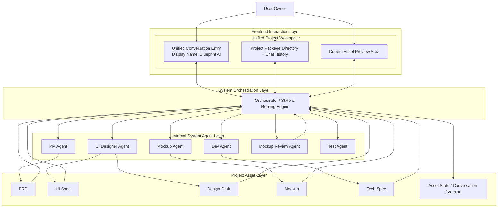
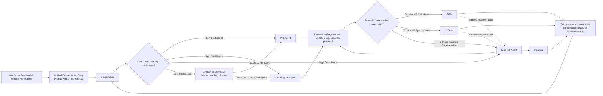
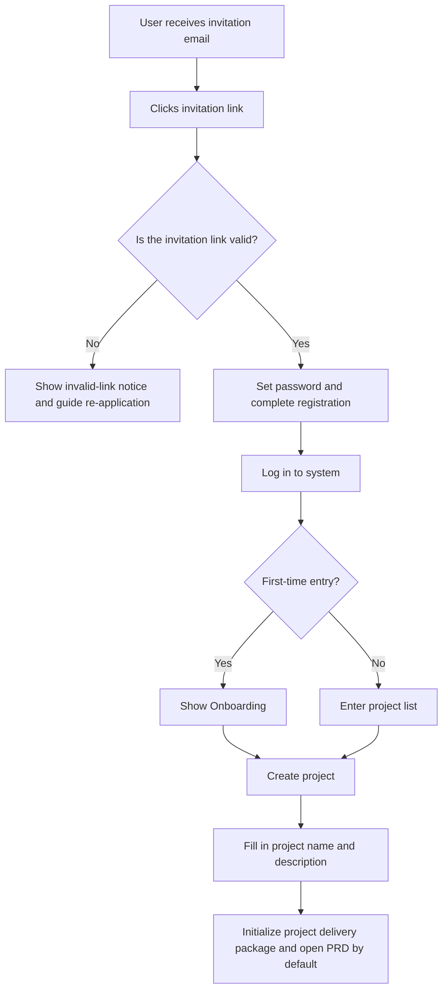
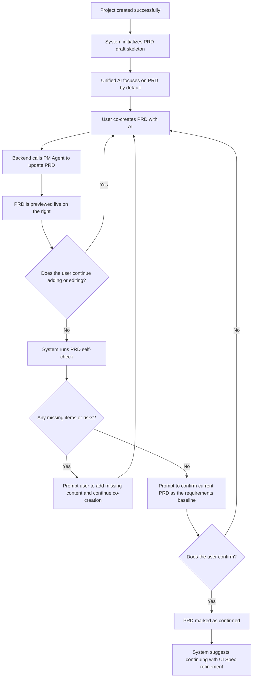
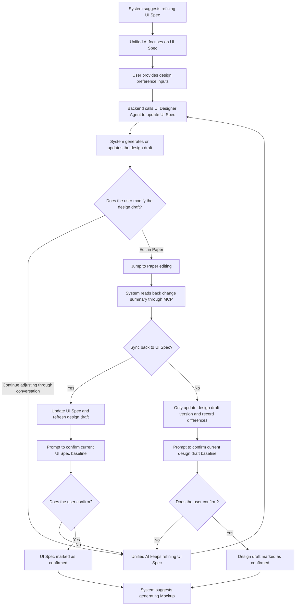
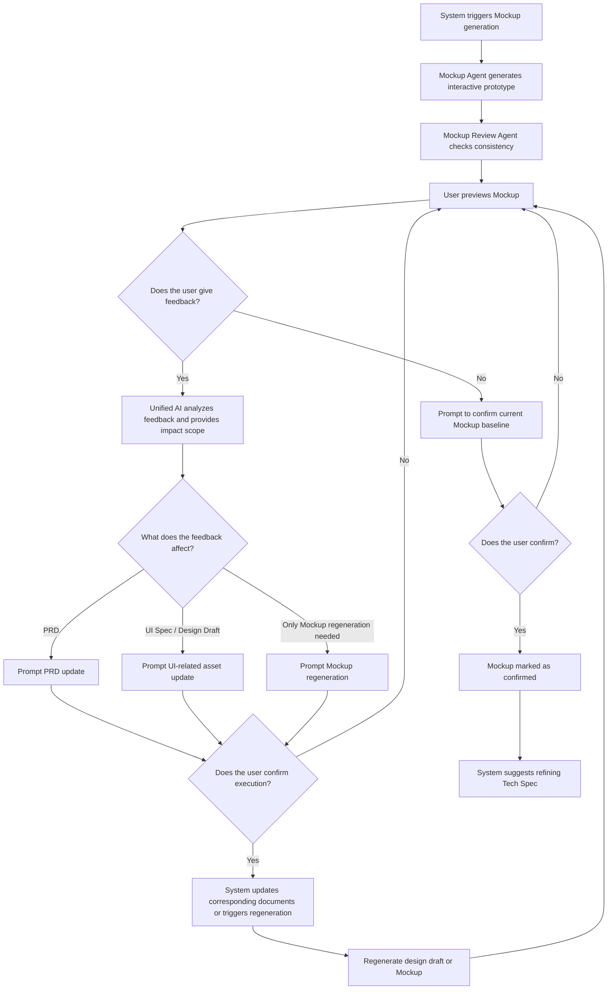
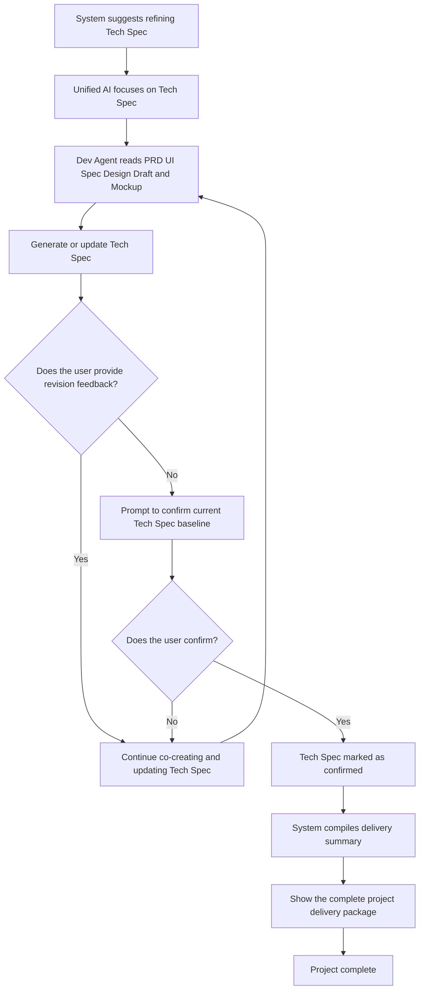
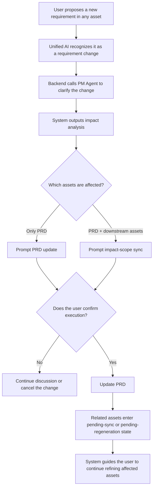
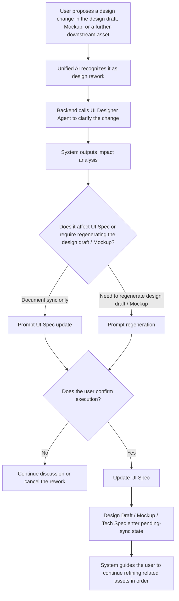

# PRD: Blueprint V1

## 📊 Overview
**Major Version**: V1 (covers iteration 1.0 -> current)  
**Current Iteration**: 1.21  
**Status**: Active  
**Created On**: 2026-03-24  
**Owner**: TBD

---

## 📌 Current Requirements Snapshot (Read This When AI Implements the Code)
> This section always reflects the latest state and includes all accumulated functional requirements to date.

### Product Positioning
`Blueprint` is an AI-driven structured MVP delivery platform. It is aimed at small-team PMs, designers, startup teams, and existing `57Blocks` clients interested in this model. Its goal is to cover the full MVP delivery chain from vague ideas to structured product assets, then to code repository generation and final deployment delivery.

The current `V1` is only the first stage of the overall product roadmap. The core goal of V1 is not to directly deliver code or a deployed product, but to deliver a complete, reviewable, iterable **Project Delivery Package** that can continue to support downstream development. The platform takes users from idea input all the way to the six core deliverables: `PRD -> UI Spec -> Design Draft -> Mockup -> Tech Spec -> Delivery Summary`. However, the frontend no longer emphasizes a "switching Agents stage by stage" experience. Instead, it continuously improves the full set of deliverables through a unified workspace, unified AI conversation, and project package directory.

### Current Stage Positioning
`V1` is positioned to help users gradually crystallize vague product ideas into structured product assets that can continue into implementation, ensuring that subsequent development, testing, deployment, and acceptance can all be built on stable, traceable, and iterable documentation.

### Roadmap Positioning
- `Phase 1`: Generate and confirm structured product assets, including `PRD / UI Spec / Design Draft / Mockup / Tech Spec`
- `Phase 2`: Generate a deliverable code repository based on confirmed assets, to be deployed by the user
- `Phase 3`: The platform completes deployment directly, the user accepts the MVP, and receives the code repository

### Website Messaging Strategy
- The website must present `Blueprint`'s final goal as an AI-driven structured MVP delivery platform, not merely as a single-document tool
- The hero section and value messaging must communicate the full vision: from idea to structured assets, then to code repository and deployment delivery
- The middle section of the site must clearly distinguish `capabilities already supported in the current first stage` from `future-stage plans`
- The website must simultaneously contain three layers of information: `ultimate vision`, `current capabilities`, and `roadmap`
- Website CTAs must still align with current-stage capabilities and must not overstate Stage 2 or Stage 3 functionality that has not yet been delivered

### Core Principles of V1
- Use a real online flow: `Sign in -> Onboarding -> Create Project -> Continuously co-create delivery assets inside a unified workspace`
- There is only one core system role: `Owner`
- The account system is invite-only; non-invited users cannot freely register
- The frontend keeps only one unified conversation entry point. The interface may use `Blueprint AI` as the display name. `PM Agent / UI Designer Agent / Dev Agent / Mockup Agent / Mockup Review Agent / Orchestrator` are all backend capabilities and are not exposed as frontend persona switches
- After a project is successfully created, the system immediately initializes the full project delivery package skeleton: `PRD / UI Spec / Design Draft / Mockup / Tech Spec / Delivery Summary`
- The top navigation uses only 6 delivery nodes to represent the main project flow, without long-term exposure of a complex stage state machine
- The top delivery nodes represent asset maturity, not whether the asset exists; user-visible states are unified as `To Be Refined / In Progress / Confirmed`
- The left side is no longer stage navigation, but `Project Package Directory + Chat History`
- The center is always the unified AI conversation area; the system automatically understands the current asset focus and user intent
- The right side is always the current asset preview area; it switches to document, design draft, prototype, or delivery summary view according to the current focused asset
- The standard output format for the three document assets `PRD / UI Spec / Tech Spec` is unified as `Markdown`; the document area on the right must support both `Preview` rendering mode and raw `Markdown` mode
- When the user switches to raw `Markdown` mode, they can edit the original Markdown directly; the system must treat that raw content as the latest document source and allow switching back to `Preview` to view the rendered result
- The workspace must support dragging to resize between the center chat pane and the right content pane; for document assets, the right content pane should by default occupy a wider proportion to ensure reading and browsing comfort
- Historical conversations are a project-level capability, but each conversation is bound to the asset focus and context source at the time it was created
- A new conversation inherits the current project context by default and starts from the current focused asset
- In addition to the asset focus and context source at creation time, each conversation must persist `active agent`, the reason for the latest `handoff`, pending confirmations, affected assets, and pending tasks
- Each conversation must also persist the current `conversation_stage`, latest `execution_phase`, `plan_level`, and `pending_confirmation_type` to support Agent Runtime restoration and explainable display
- At any given time, only one `active agent` is allowed in the same conversation; by default that Agent handles multiple turns continuously, and `Orchestrator` only performs side observation instead of fully rerouting on every turn
- When a conversation is restored, the system must restore the latest valid `active agent` and related pending state to avoid losing the current discussion mode when the user returns
- `PRD` is the default first focused asset; after project creation the AI proactively guides the user to co-create the initial PRD draft
- `UI Spec` is the mainline design asset, while the design draft is the visual output; if the design draft is manually modified, the system must identify the change summary and ask whether to sync it back to `UI Spec`
- `Mockup` is defined as an interactive frontend prototype close to a real web experience, using mock data to reproduce the core flow
- The Agent must show action status and brief step logs to the user, but must not expose the full chain of thought
- The homepage primary CTA is `Apply for Trial`
- `Onboarding` must be shown on first login and is no longer forced afterward, but the unified workspace must always keep a "View Workflow Guide" entry
- In addition to project name and project description, the project creation page must also collect `Product Type / Industry`, `Target Users`, and `Target Platform (Web)`
- The old strong `stage-gate` mechanism is replaced by `light confirmation of key assets + impact scope confirmation`
- Light confirmation of key assets is not a "move to next stage" button and does not depend on an independent confirmation button; instead, after self-checking, the AI provides a confirmation summary in the conversation, and the user confirms the current version as the `current baseline` within the conversation
- When the user proposes new requirements, design changes, or feedback, and the system judges that they affect upstream documents, the current baseline, or require regenerating the design draft or Mockup, it must first provide impact analysis and let the user confirm whether to execute the update or regeneration
- Returning from downstream assets is split into two types: `Requirement Change` and `Design Rework`; the unified AI first clarifies with the user, then invokes the appropriate backend professional Agent if needed to update the document and regenerate the outputs
- The backend is orchestrated uniformly by `Orchestrator`, but `Orchestrator` is not exposed to the user as an independent persona
- `Orchestrator` can read all asset states, conversation states, and versions, but in `V1` it only undertakes the minimum responsibilities of `initial routing / ongoing takeover governance / handoff arbitration / context assembly / state transition / light confirmation control / task triggering / result collection`; it cannot directly modify user asset content and cannot directly generate documents
- There is no general `Review Agent` in the current stage; quality checks for `PRD / UI Spec / Tech Spec` are handled by corresponding backend capabilities or self-check mechanisms
- `Mockup Agent` exists as a backend executor responsible for building, running, and regenerating Mockups, but it is not exposed as a visible frontend Agent
- `Mockup Review Agent` is the only specialized Review role retained in the current stage; it only checks consistency, completeness, and drift between `Mockup` and `PRD / UI Spec / Design Draft`
- `Orchestrator` may send system confirmation messages in the conversation, such as impact prompts, whether to update related documents, or whether to regenerate the design draft or Mockup, but it does not engage in multi-turn conversation with the user as a persona
- The routing strategy of `Orchestrator` uses `first hit + continuous ownership within the conversation + condition-triggered switch`: the AI determines the initial route automatically; once the conversation is stable, the current `active agent` remains by default and is only re-arbitrated when switch triggers appear; if confidence is low, the user is asked to explicitly choose the handling direction
- `PM Agent / UI Designer Agent / Dev Agent / Mockup Agent / Mockup Review Agent` follow a unified `Full Runtime` by default: `think -> plan -> execute -> reflect`
- `Orchestrator` follows a lighter `Lite Runtime` by default: `analyze -> decide -> act -> verify`
- Runtime should be visible to the user in the form of structured summaries such as "Current understanding / Plan for this turn / Execution result / This-turn check" or system status summaries; the system must not expose the full raw chain of thought
- Agents must follow quality constraints: do not invent requirements, do not modify assets across ownership boundaries, keep outputs structured, give a reason for every modification, proactively ask follow-up questions when uncertain, self-check before key asset confirmation, and explicitly warn when confidence is low

### V1 Delivery Scope
V1 must support the following main chain:
1. The user enters the system through an email invitation link and completes initial registration/password setup
2. After login, the user enters Onboarding to understand the platform workflow, required inputs, and expected outputs
3. The user creates a project and fills in basic project information
4. After successful project creation, the system automatically initializes the default skeleton of the six asset types: `PRD / UI Spec / Design Draft / Mockup / Tech Spec / Delivery Summary`
5. The unified AI assistant guides the user by default to start co-creating the initial `PRD` draft; `PRD / UI Spec / Tech Spec` use Markdown as the standard source format in the right pane of the workspace and support both `Preview / Markdown` view modes, exporting, manual version saving, and update notes
6. Once `PRD` reaches usable quality, it goes through light confirmation and becomes the current requirements baseline
7. The user continues co-creating `UI Spec` with the unified AI and can upload reference screenshots, input reference website links, and select preferred brand/font/style options
8. The system generates a high-fidelity design draft based on the current `UI Spec`, provides an in-platform preview, and supports jumping to `Paper` for external editing
9. The platform reads design draft modifications through MCP, generates a change summary, and asks the user whether to sync them back into `UI Spec`
10. The backend generates `Mockup` based on the current `PRD + UI Spec + Design Draft`
11. The user previews the `Mockup` inside the platform or through a link and gives feedback through the unified conversation
12. The system automatically attributes issues in the feedback and determines whether it should update `PRD`, `UI Spec`, only regenerate `Mockup`, or first reread the design draft; before any update or regeneration is actually executed, user confirmation is required
13. The user continues co-creating `Tech Spec` with the unified AI
14. When the user raises new requirements, revision requests, or cross-asset feedback in any asset, the system automatically understands the intent and prompts which assets will be affected and whether synchronized updates or regeneration are needed
15. The system only updates the corresponding document, regenerates the design draft/Mockup, or changes the current baseline after the AI has provided impact analysis or self-check results and the user has explicitly confirmed execution in the conversation
16. If a confirmed baseline is updated, other affected assets must automatically enter pending-sync status and continue to be refined in later co-creation
17. When `PRD / UI Spec / Design Draft / Mockup / Tech Spec` all reach the confirmed state, the system automatically compiles the delivery summary and forms a complete project delivery package

### V1 Deliverables
Completing a project in V1 means the system can stably produce and store the following assets:
- `PRD`
- `UI Spec`
- `Visual Design Draft Link`
- `Mockup Link`
- `Tech Spec`
- `Delivery Summary Page`

Together, these assets form a **Project Delivery Package**. What the user ultimately receives is not a single-stage page, but a complete structured asset package that can continue to support downstream development, testing, implementation, and acceptance.

### Explicitly Not Included in V1
- No public registration or open self-serve acquisition
- No Google quick sign-in
- No in-product multi-user real-time collaborative editing
- No in-product commenting system
- No full Figma-level design editor
- No automatic code generation and deployment closed loop
- No complex billing/subscription system
- No mobile app
- No enterprise-grade workspace isolation and complex permission system
- No project share links, read-only collaborator views, fine-grained version diffs, comparison of multiple design directions, Mockup history review, or unified approval workflows

### Agent System Architecture

#### Agent Layers

**Frontend Interaction Layer**
- Unified project workspace
- Unified conversation entry point (display name may be `Blueprint AI`)

**Internal System Agents**
- `PM Agent`
- `UI Designer Agent`
- `Dev Agent`
- `Mockup Agent`
- `Mockup Review Agent`
- `Test Agent`
- `Orchestrator / Workflow Agent`

#### Overall Architecture Principles
- The user-facing frontend always shows only the unified workspace, unified conversation entry point, and current asset view, not the internal specialized Agents
- In the system backend, `Orchestrator` reads the conversation state, determines the initial intent, and chooses which internal Agent to invoke; the matched professional Agent directly generates the user-visible content for the current turn
- At any point in a conversation, there is only one `active agent`; if the current conversation already has an `active agent`, subsequent messages go to that Agent by default, while `Orchestrator` only performs side observation each turn rather than default rerouting
- Each professional Agent has generation / update control over its own asset; `Orchestrator` is uniformly responsible for conversation state, routing / handoff, context assembly, confirmation gates, state transition, task triggering, and result collection, but does not centrally take over the detailed execution of all assets
- `asset focus` is an important context signal, but in a conversation with an existing `active agent`, it is only a weak signal and must not forcibly interrupt the current topic just because the user switched the left-side asset
- `active agent`, `handoff`, pending confirmations, and executable tasks must be stored in recoverable conversation state and maintained by `Orchestrator` as the single source of truth
- `Mockup` is a previewable frontend asset, but `Mockup Agent` is a backend executor
- `Mockup Review Agent` does not participate in frontend co-creation and only handles consistency and drift checking for `Mockup`
- In `V1`, `Test Agent` remains as a reserved backend capability; it is not exposed in the frontend and is not included in the current delivery package

#### Implementation Layering Principles
- This mechanism cannot rely only on Agent Prompts to "remember" the current handling mode; `active agent`, `handoff`, and confirmation-gate states must be persistently maintained by the orchestration / state layer where `Orchestrator` resides
- Professional Agent return results must support structured fields such as `user_visible_reply`, `runtime`, `confidence`, `handoff_request`, `needs_confirmation`, and `affected_assets`
- At minimum, `runtime` should support `phase_trace`, `task_complexity`, `plan_level`, `goal_of_this_turn`, and `goal_completed` for system consumption, conversation recovery, and explainable frontend display
- `agent-prompts/*` defines each Agent's behavioral constraints, switching awareness, and expression style; `agent-capabilities/*` defines capability boundaries, executable actions, and structured return contracts
- `AGENT_RUNTIME_PROTOCOL_V1.md` defines the unified cross-Agent runtime protocol, including `Full Runtime / Lite Runtime`, phase semantics, visible summary principles, and the structured `runtime` wrapper
- Actual routing arbitration, `active agent` switch execution, state persistence, audit log recording, and executable task triggering must be implemented by the workflow / backend orchestration layer, not handled by Prompt text alone

#### Agent Architecture Diagrams

##### Diagram 1: Layering and Orchestration Architecture


##### Diagram 2: Conversation Continuity and Handoff Architecture

```mermaid
flowchart LR
    U[User Sends Message]
    CHAT[Unified Conversation Entry<br/>Display Name: Blueprint AI]
    ORC[Orchestrator]
    HAS{Does the current conversation<br/>already have an active agent?}
    INIT[Perform initial routing based on<br/>entry intent + context]
    AG[Current active agent]
    RESP[Structured result<br/>reply / confidence / handoff_request]
    OBS[Orchestrator side observation]
    TRIGGER{Should switch / confirmation / task be triggered?}
    HIGH{Is switch confidence high enough?}
    SYS[System confirmation<br/>choose handling direction]
    SWITCH[Update active agent<br/>write handoff event]
    TASK[Trigger executable task<br/>Review / Regenerate / Sync]
    STATE[Update conversation state<br/>confirmation records / impact records]

    U --> CHAT
    CHAT --> ORC
    ORC --> HAS
    HAS -->|No| INIT
    HAS -->|Yes| AG
    INIT --> AG
    AG --> RESP
    RESP --> OBS
    OBS --> TRIGGER
    TRIGGER -->|No| STATE
    TRIGGER -->|Yes| HIGH
    HIGH -->|High Confidence| SWITCH
    HIGH -->|Low Confidence| SYS
    SYS --> SWITCH
    SWITCH --> TASK
    TASK --> STATE
    STATE --> ORC
```


##### Diagram 3: Mockup Feedback and Routing Architecture


#### Responsibility Boundaries of Each Agent

| Agent | Visibility | Primary Responsibilities | Explicitly Not Responsible For |
|------|------|---------|---------|
| `PM Agent` | Internal system | Requirement clarification, PRD generation and updates, requirement-change handling, explanations and follow-up questions within PRD scope | Does not directly modify `UI Spec / Design Draft / Mockup / Tech Spec` |
| `UI Designer Agent` | Internal system | Generate `UI Spec` based on `PRD`, understand design preferences and reference inputs, handle design rework, propose sync-back updates to `UI Spec` based on design draft changes | Does not modify the requirements in `PRD` itself |
| `Dev Agent` | Internal system | Read `PRD / UI Spec / Design Draft / Mockup`, generate structured `Tech Spec`, explain technical solutions, boundaries, risks, and assumptions | Does not write code in `V1` and does not directly modify `PRD / UI Spec` |
| `Mockup Agent` | Internal system | Build, run, regenerate Mockups, and deliver preview links based on upstream assets | Is not a frontend conversation Agent and is not responsible for requirement attribution |
| `Mockup Review Agent` | Internal system | Only checks consistency, completeness, and drift issues between `Mockup` and `PRD / UI Spec / Design Draft`, and outputs structured review results | Does not directly edit assets, does not handle self-checks inside `PRD / UI Spec / Tech Spec`, and does not co-create with the user over the long term |
| `Test Agent` | Internal system | Reserved testing specification and future automated testing capability, preparing for later stages | Does not generate formal frontend deliverables in `V1` |
| `Orchestrator` | Internal system | Reads asset status and conversation context, performs `initial routing / continuous active-agent governance / handoff arbitration / context assembly / state transition / light confirmation control / task triggering / result collection`, and coordinates internal Agents | Does not directly generate documents, does not centrally take over the detailed execution of all assets, and does not converse with the user long-term as an independent persona |

#### Minimum Responsibilities of Orchestrator V1
- `Initial routing`: When a conversation starts or the current conversation has no `active agent`, route the user input to the correct backend Agent according to entry intent and context
- `Continuous takeover governance`: In a conversation with an existing `active agent`, pass subsequent messages to the current Agent by default and maintain recoverable state
- `Handoff arbitration`: When switch trigger conditions appear, decide whether to execute an `active agent` switch and initiate system confirmation when confidence is low
- `Context assembly`: Under the unified conversation entry, inject the current asset, relevant upstream assets, historical conversation summaries, and source versions into the backend Agent
- `State transition`: Uniformly maintain user-visible states such as `To Be Refined / In Progress / Confirmed / Pending Sync / Regenerating`, as well as corresponding internal system states
- `Light confirmation control`: Before key asset confirmation, document updates, impact-scope synchronization, or regeneration, first generate a system confirmation and wait for user execution
- `Task triggering`: Trigger backend tasks such as `Mockup Review Agent`, `Mockup Agent`, design draft readback, and regeneration
- `Result collection`: Collect structured results from each professional Agent and update status, confirmation records, and impact records accordingly

#### Conversation State Model
- Each conversation must at minimum maintain the following fields: `session_id`, `entry_asset_focus`, `current_asset_focus`, `active_agent`, `last_handoff_reason`, `last_handoff_confidence`, `pending_confirmation`, `affected_assets`, `pending_task`, `resume_snapshot`
- `Orchestrator` is the only role allowed to write the above system conversation state; professional Agents may provide suggestions but cannot directly rewrite `active_agent` or system confirmation status
- When the user re-enters an existing conversation, the system must prioritize restoring the latest valid `resume_snapshot`, including `active agent`, unfinished confirmations, and pending tasks
- `handoff` must be recorded as an explicit system event and at minimum include `from_agent`, `to_agent`, `trigger_reason`, `confidence`, `user_confirmed`, and `affected_assets` for debugging, audit, and strategy optimization

#### Workspace View State Model
- Document asset interface preferences must be maintained independently from conversation state, at minimum including `document_view_mode` (`Preview / Markdown`), `pane_split_ratio`, and `has_unsaved_manual_edits`
- `document_view_mode` and `pane_split_ratio` belong to workspace view state or user preference state and must not be mixed with conversation routing state such as `active agent`, `handoff`, or confirmation gates
- When the user switches document assets within the same project, the system should preserve the most recent document viewing mode and layout width preferences as much as possible; if there are unsaved edits, the system must prompt for confirmation before switching

#### Triggering and Routing Rules
- When the user clicks an asset in the unified workspace, the system switches the current asset focus, but the frontend still keeps the unified conversation entry and unified display name
- After project creation, the system opens `PRD` by default; if the current conversation does not yet have an `active agent`, `Orchestrator` initially routes to `PM Agent`, which directly guides the user to start co-creating the PRD draft
- When the conversation already has an `active agent`, subsequent messages continue to go to that Agent by default; `Orchestrator` only performs side observation each turn and does not fully reroute during ordinary continuous conversation
- When an `active agent` already exists, `asset focus` is only a weak signal; if the user switches the left-side asset but the message content clearly continues the current topic, the system should prioritize keeping the current `active agent`
- If the current conversation has no `active agent`, or the user explicitly requests a switch in handling direction, initial routing should preferentially use the following default hits:
  - `PRD`-related conversations preferentially route to `PM Agent`
  - `UI Spec / Design Draft`-related conversations preferentially route to `UI Designer Agent`
  - `Tech Spec`-related conversations preferentially route to `Dev Agent`
  - `Mockup`-related execution or feedback is first judged by `Orchestrator` to determine whether it should route to `PM Agent / UI Designer Agent / Mockup Agent`
- When any of the following occurs, the current Agent should mark the turn result as `handoff_request` and pass it to `Orchestrator` for arbitration:
  - The user explicitly switches to another type of asset or another type of task
  - The current Agent judges that the question is beyond its own responsibility boundary
  - The current input has low confidence and ownership cannot be determined
  - Cross-asset impact is involved and unified confirmation is required
  - An executable task must be triggered, such as `Mockup` regeneration, `Mockup Review`, design draft readback, or synchronization
  - The user actively requests "let another Agent handle this"
- The current `active agent` must have the ability to proactively request a switch, but cannot complete the switch by itself; the final switch can only be executed by `Orchestrator`
- If `handoff` confidence is high enough, `Orchestrator` automatically switches the `active agent` and records a system event; if confidence is insufficient, it first initiates system confirmation and then decides which Agent to hand over to
- When the user submits feedback in a `Mockup`-related view and the current conversation needs to be re-evaluated, `Orchestrator` first judges:
  - If it is a requirements issue, invoke `PM Agent`
  - If it is a UI / design issue, invoke `UI Designer Agent`
  - If only Mockup regeneration is needed, invoke `Mockup Agent`
- When the user proposes new requirements, design changes, or generation requests that affect an existing baseline, the system must first display the impact scope and then wait for user confirmation before executing the update or regeneration
- Before the user confirms execution, the corresponding professional Agent should first form the update proposal, regeneration proposal, or confirmation summary for the current turn; `Orchestrator` must not directly replace the professional Agent in generating business content or executing complex asset implementation

#### Light Confirmation and Impact Control Rules
- All `confirm current baseline`, `update corresponding document`, `sync impact scope`, and `regenerate design draft / Mockup` actions for key assets must first be preceded by the corresponding professional Agent giving self-check results, update proposals, or impact analysis summaries in the conversation, and then explicitly confirmed by the user in the conversation, after which `Orchestrator` performs the final control decision
- Before executing these actions, `Orchestrator` must uniformly complete the following checks:
  - Whether the current asset meets the minimum inputs and prerequisite conditions
  - Whether the asset's corresponding self-check or `Mockup Review` needs to be triggered
  - Whether there are unprocessed feedback items, unprocessed design changes, or unconfirmed low-confidence items
  - Which other assets this action will affect, and whether they need synchronized updates or pending-sync marking
- Only after the checks pass and the `Owner` explicitly confirms in the conversation may the system allow the corresponding owner Agent to generate / update / regenerate the asset; `Orchestrator` is responsible for triggering the action, collecting the results, updating the state, and recording confirmations and impacts
- If the checks fail, the page only displays the failure reason and next-step guidance, and must not allow the confirmation step to be bypassed

#### Input Context and Output Assets

| Agent | Context Read | Output |
|------|---------|---------|
| `PM Agent` | Project basic information, current PRD version, historical conversations, entry intent for requirement changes, current `active agent` context | `PRD` draft/update, requirement clarification questions, requirement change proposal, whether to recommend confirming the current baseline, optional `handoff_request` |
| `UI Designer Agent` | Confirmed `PRD`, design preferences, reference screenshots/links, entry intent for design rework, design draft change summary, current `active agent` context | `UI Spec` draft/update, design rework proposal, sync-back proposal, whether to recommend confirming the current baseline, optional `handoff_request` |
| `Dev Agent` | `PRD / UI Spec / Design Draft / Mockup`, asset status, current `active agent` context | `Tech Spec`, implementation risks, assumptions and boundary explanations, whether to recommend confirming the current baseline, optional `handoff_request` |
| `Mockup Agent` | `PRD / UI Spec / Design Draft`, generation parameters, current `active agent` context | Runnable `Mockup`, preview link, regeneration result, execution status and failure summary, optional `handoff_request` |
| `Mockup Review Agent` | `Mockup`, confirmed `PRD / UI Spec / Design Draft` | `Mockup` consistency review result, drift items, omission list, whether it is allowed to continue |
| `Orchestrator` | All asset states, current asset summary, user entry action and feedback, conversation state, `handoff_request` | Initial routing decision, `active agent` update, system confirmation, triggered task record, `handoff` audit event, system state changes |

#### Structured Return Contract
- All professional Agents capable of sustained conversation in `V1` must support a unified structured return wrapper, at minimum including `user_visible_reply`, `runtime`, `confidence`, `handoff_request`, `needs_confirmation`, and `affected_assets`
- The `runtime` field is used to express the Runtime phases traversed in the turn, complexity, and plan level; this serves both system orchestration and the frontend display of "process visibility without exposing raw reasoning"
- When `handoff_request` is empty, it means subsequent conversation should continue to be handled by the current `active agent` by default; it is not allowed to express switching intent only through natural language without outputting a structured field
- When `needs_confirmation=true`, `Orchestrator` must generate the system confirmation layer, rather than allowing the professional Agent to bypass the confirmation gate and directly execute state or asset modification

#### Quality and Permission Constraints
- Agents must not fabricate business requirements that the user has not confirmed
- Agents must not directly modify the content of assets outside their ownership across asset boundaries
- Each professional Agent independently controls generation / updates of its own assets, but must comply with the unified bottom line of readiness, confirmation gates, gap grading, and structured result return
- Continuous ownership by the `active agent` must not rely on Prompt short-term memory assumptions; if the conversation state conflicts with the Agent's own statement, `Orchestrator`'s persisted state must prevail
- All delivery assets must maintain structured output to facilitate downstream Agent consumption
- Every time an Agent suggests a change, it must explain the reason or trigger basis
- When context is insufficient or confidence is low, the Agent must first ask follow-up questions or explicitly warn about risks
- Before confirming the current baseline, the corresponding review or self-check process must be completed
- `Dev Agent` may point out implementation risks in requirements or design, but can only recommend returning to upstream assets for revision and may not modify them beyond its authority

#### Frontend Visibility
- Users only see the unified AI assistant, the current asset focus, and system action prompts
- `Orchestrator` does not appear by Agent name; it is only presented as system action copy, for example:
  - `Restoring the previous requirement discussion mode`
  - `The current topic is better handled as a design task, switching now`
  - `Analyzing feedback attribution`
  - `Organizing which assets this change will affect`
  - `Triggering Mockup Review`
- `Orchestrator` can issue system confirmation messages, for example:
  - `The current topic may have shifted from requirements discussion to design rework. Continue with design handling instead?`
  - `This change will update PRD and affect UI Spec / Mockup / Tech Spec. Confirm synchronized updates?`
  - `This adjustment requires regenerating the design draft and Mockup. Execute now?`
  - `The system cannot determine with high confidence whether this issue belongs to requirements or design. Please choose the handling direction.`
- When the result has low confidence:
  - The Agent explicitly expresses uncertainty in the content
  - The system layer simultaneously shows a low-confidence status prompt

---

## 📋 Iteration History (Read This When AI Needs Context)

### v1.21 — Introduced Unified Agent Runtime Protocol (2026-03-30)
**Change**: Officially elevated the unified runtime protocol defined in `AGENT_RUNTIME_PROTOCOL_V1.md` to a PRD-level product conclusion. It clarifies that professional Agents default to `Full Runtime`, `Orchestrator` defaults to `Lite Runtime`, and adds conversation state fields, the structured `runtime` wrapper, and frontend-visible summary principles.  
**Reason**: Although the Runtime design had already landed in `agent-prompts/*`, the PRD still stayed at the level of "active agent + handoff + structured return" and did not formally define how each Agent works internally in each turn, nor did it bring the product rule of "process visibility without exposing the raw chain of thought" back into the system-level specification. This could easily cause the overall design and Prompt layer to drift apart.

**New highlights in this update**
- Clarified that professional Agents default to `think -> plan -> execute -> reflect`
- Clarified that `Orchestrator` defaults to `analyze -> decide -> act -> verify`
- Clarified that conversation state must additionally include `conversation_stage / execution_phase / plan_level / pending_confirmation_type`
- Clarified that professional Agent structured return must additionally include the `runtime` field
- Clarified that the frontend shows Runtime summaries rather than the full raw chain of thought

### v1.20 — Dual-Mode Document Viewing and Resizable Workspace Rules (2026-03-30)
**Change**: Added the rule that `PRD / UI Spec / Tech Spec` all use Markdown as the standard source format, the right-side document area uniformly supports `Preview / Markdown` dual modes, and the center/right workspace panes support drag-to-resize with preference persistence.  
**Reason**: Previously, the PRD only vaguely defined a "right-side preview area" without clearly distinguishing rendered preview from raw Markdown, nor did it incorporate UI Spec and Tech Spec into the same unified document interaction model. Adding this makes the product more consistent for reading, manual revision, and downstream implementation.

**New highlights in this update**
- Clarified that the standard output format of `PRD / UI Spec / Tech Spec` is uniformly `Markdown`
- Clarified that the right document pane uniformly supports `Preview / Markdown` dual mode and allows users to directly edit the raw Markdown manually
- Clarified that the center chat pane and right content pane support drag-to-resize, and document assets should default to a wider right pane
- Clarified that `document_view_mode / pane_split_ratio / has_unsaved_manual_edits` belong to workspace view state and must not be mixed into conversation routing state
- Added relevant acceptance criteria, page prototypes, exception handling, and tracking / monitoring metrics

### v1.19 — Introduced Active Agent Continuous Ownership and Handoff Collaboration Mechanism (2026-03-27)
**Change**: Added the conversation-level continuous ownership mechanism of `active agent`, clarified that `Orchestrator` uses "side observation + condition-triggered switching" rather than rerouting on every turn, and added implementation layering principles, conversation state model, structured `handoff` protocol, restoration rules, and related tracking metrics.  
**Reason**: If `Orchestrator` had to fully reroute every time the user spoke, conversation continuity would become poor, switching jitter would increase, implementation complexity would rise, and the experience of "one unified AI continuously collaborating" would feel unnatural. A better model is that the same conversation is continuously led by one `active agent`, and `Orchestrator` only intervenes when switch triggers, confirmation gates, or executable tasks appear.

**New highlights in this update**
- Clarified that only one `active agent` is allowed in the same conversation at any point in time
- Clarified that `Orchestrator` performs side observation every turn but does not reroute by default
- Clarified that `asset focus` is only a weak signal when there is already an `active agent`
- Clarified that professional Agents can proactively raise `handoff_request`, but switch execution authority belongs only to `Orchestrator`
- Clarified automatic switching under high confidence and system confirmation first under low confidence
- Clarified `active agent` restoration, `handoff` audit events, structured return contracts, and implementation layering principles

### v1.18 — Aligned Agent Generation / Update Control Language with Architecture Diagrams (2026-03-26)
**Change**: Updated the overall principles in `Agent System Architecture`, `Diagram 2: Mockup Feedback and Routing Architecture`, the `Light Confirmation and Impact Control Rules`, input/output tables, and permission constraints to align with the latest principle of "each professional Agent controls its own generation/update, while `Orchestrator` uniformly controls the bottom line."  
**Reason**: As `AGENT_MUTATION_GUARDRAILS_V1.md` took shape, the original PRD wording could still easily be misread as if `Orchestrator` would centrally take over all detailed writes or regeneration execution across all assets. The PRD needs to formally clarify that `Orchestrator` is responsible for routing, confirmation gates, state transitions, task triggering, and result collection, while each corresponding professional Agent is responsible for generation, updates, or executable implementation of its own asset.

**New highlights in this update**
- Clarified that each professional Agent owns generation / update control over its own asset
- Clarified that `Orchestrator` uniformly controls the bottom line, but does not centrally take over detailed execution across all assets
- Expanded `Diagram 2` from a pure routing diagram into "routing + confirmation gate + owner Agent execution + state collection"
- Added confirmation suggestions, execution status, and advancement recommendations for each professional Agent in the input/output tables
- Added unified mutation guardrails principles to the permission constraints

### v1.17 — Added Agent Design Document Index to the PRD (2026-03-26)
**Change**: Added an index of `Agent design-related documents` to the appendix of `PRD_V1.md`, explicitly linking the three categories `Agent Prompt`, `Agent Capability`, and `Agent Memory`.  
**Reason**: The current `PRD` already defines the `Agent System Architecture`, but it did not explicitly connect the related design documents. After adding the document index, later implementation and maintenance can directly trace from the `PRD` to each Agent's behavior rules, capability boundaries, and Memory design, reducing the risk of documentation drift.

**New highlights in this update**
- Added `Agent design-related documents` in the appendix
- Clarified that `PRD` is responsible for product-level Agent architecture and responsibility boundary definition
- Clarified that `agent-prompts/*` is responsible for behavior rules and interaction constraints
- Clarified that `agent-capabilities/*` is responsible for implementable capabilities and delivery approaches
- Clarified that `AGENT_MEMORY_SOLUTION_V1.md` is responsible for Memory layering, shared boundaries, and assembly principles

### v1.16 — Removed Blueprint AI as an Independent Agent Identity (2026-03-26)
**Change**: Removed `Blueprint AI` from the Agent System. It is no longer defined as an independent Prompt or independent intelligence layer, and is instead narrowed into a unified frontend display name and conversation entry; architecture diagrams, responsibility boundaries, and related Prompt semantics were adjusted accordingly.  
**Reason**: If `Blueprint AI` were designed as an independent intermediary Agent, it would create an unnecessary "middle messenger" layer, increasing token consumption, latency, and responsibility overlap. A more reasonable model is that user input first reaches `Orchestrator`, then the matched professional Agent directly generates the user-visible content, while the frontend keeps only a unified display name.

**New highlights in this update**
- Removed the positioning of `Blueprint AI` as an independent Agent
- Clarified that `Blueprint AI` exists only as the frontend display name and unified conversation entry label
- Strengthened the direct path of `Orchestrator -> Professional Agent -> User-visible content`
- Cleaned up references to `Blueprint AI` as an independent Agent in `PRD / CONTEXT / Agent Prompt`

### v1.15 — Key Asset Confirmation Switched to Conversational Confirmation (2026-03-26)
**Change**: Narrowed the key asset confirmation mechanism from "page-triggered confirmation" further into "self-check first, then output a confirmation summary in the conversation, and finally let the user explicitly confirm through the conversation", and updated related page interactions, acceptance criteria, and Agent collaboration rules.  
**Reason**: The real interaction model of the current unified AI workspace does not depend on independent buttons to confirm baselines. Instead, the AI uses full context and self-check results to provide a confirmation summary in the conversation, and the user explicitly confirms there. If the document still preserved the mental model of "click to confirm", it would conflict with the actual product experience and Agent collaboration mechanism.

**New highlights in this update**
- Formally defined light confirmation of key assets as `conversational confirmation`, not a page-button action
- Clarified prerequisite conditions before confirmation: document has been generated, self-check is complete, and the result summary has been shown in the conversation
- Unified the confirmation interaction in `PRD / UI Spec / Design Draft / Mockup / Tech Spec` views into summary card + conversational confirmation
- Clarified that `Orchestrator` only executes baseline confirmation, document updates, or regeneration after the user explicitly confirms in the conversation

### v1.14 — Frontend Model Refactored into a Unified Workspace (2026-03-26)
**Change**: Refactored the product's frontend model from a "multi-stage / multi-Agent workspace" into a `unified workspace + project delivery package + single AI assistant`, and rewrote the core flow, key page prototypes, functional definitions, and acceptance criteria.  
**Reason**: Continuing with a frontend model of multiple Agents and strong stage switching would require users to understand internal system roles and process states, increasing mental overhead and conflicting with the goal that "the user co-creates the full delivery package with only one AI."

**New highlights in this update**
- Unified the frontend into `Blueprint AI` while keeping multi-Agent capabilities in the backend
- Default-initialized the six delivery asset skeletons after project creation
- Changed the left navigation into `Project Package Directory + Chat History`, no longer emphasizing stage navigation
- Used 6 delivery nodes at the top to represent asset maturity, no longer exposing a complex stage state machine long-term
- Replaced the strong `stage-gate` with `light confirmation of key assets + impact scope confirmation`

### v1.13 — Review Role Narrowed to Mockup Review Agent (2026-03-26)
**Change**: Removed the general `Review Agent` definition from the current stage, keeping only `Mockup Review Agent` as the specialized review role, and clarified that quality checks for `PRD / UI Spec / Tech Spec` are completed through self-checks by each stage Agent.  
**Reason**: After comparing the actual verification paths in the current `review.md` and `create-mockup.md`, it was confirmed that what the current stage truly needs is `Mockup` consistency checking rather than a generic `Review Agent` covering all stages. Keeping the generalized name would overlap with each stage Agent's self-check mechanism and blur the meaning of Review in later implementation phases.

**New highlights in this update**
- Removed the generic `Review Agent` definition from the current stage
- Clarified that the current stage retains only `Mockup Review Agent`
- Clarified that quality checks of `PRD / UI Spec / Tech Spec` continue to be completed through self-checks by their corresponding stage Agents
- Narrowed `Review Agent` into `Mockup Review Agent` in the architecture layers, responsibility boundaries, inputs/outputs, and process roles

### v1.12 — Aligned Architecture Diagrams with the Latest Orchestrator Rules (2026-03-24)
**Change**: Updated the `Agent Architecture Diagram` and `Mockup Feedback and Routing Diagram` so the visuals align with the latest confirmed minimum responsibilities of `Orchestrator`, state ownership, and low-confidence routing rules.  
**Reason**: After strengthening the textual rules of `Orchestrator`, it was found that the two Mermaid diagrams still preserved old expressions. Keeping them would create ambiguity during later implementation about whether diagrams or text should be trusted first.

**New highlights in this update**
- Explicitly labeled `Orchestrator` as `State & Routing Engine` in Diagram 1
- Changed the `Review Agent`'s direct influence on state into first returning to `Orchestrator`, which then uniformly maintains state
- Adjusted Diagram 2 from the default `Orchestrator -> Review Agent -> routing` to `automatic attribution -> system confirmation under low confidence -> routing`
- Added the branches in Diagram 2 where the user selects `PM Agent / UI Designer Agent` under low-confidence conditions

### v1.11 — Narrowed Orchestrator Responsibilities and Strengthened Gates (2026-03-24)
**Change**: Narrowed the minimum responsibilities of `Orchestrator` in `V1`, added global `Gate` rules and low-confidence routing fallback logic, and corrected the issue of exposing `Review Agent` as a frontend identity on the `Mockup` page.  
**Reason**: As the `PM Agent` and `UI Designer Agent` Prompts gradually took shape, the current description of `Orchestrator` was found to still be slightly too broad, and the frontend identity display on the `Mockup` page conflicted with the principle that "internal Agents are not exposed." The architecture boundary needed to be formally narrowed in the PRD.

**New highlights in this update**
- Clarified that in `V1`, `Orchestrator` only undertakes five minimum responsibilities: `stage binding / routing dispatch / state transition / Gate control / task triggering`
- Clarified that `Orchestrator` can send system confirmation messages, but does not conduct multi-turn persona-style conversations
- Clarified that the routing strategy is `AI judgment first, with user direction choice only when confidence is low`
- Added global `Gate control rules` to uniformly constrain the final arbitration logic of all `confirm and move to the next stage` actions
- Corrected the inconsistency of exposing `Review Agent` as a frontend identity in the `Mockup` page

### v1.10 — Completed Agent Architecture Diagrams (2026-03-24)
**Change**: Added Mermaid architecture diagrams in `Agent System Architecture` to supplement layering relationships and the Mockup feedback routing diagram.  
**Reason**: The textual definitions were already clear, but a direct visual representation was missing, which was not conducive to a unified understanding of the Agent system across later UI Spec, technical solution, and execution phases.

**New highlights in this update**
- Added `Diagram 1: Layering and Orchestration Architecture`
- Added `Diagram 2: Mockup Feedback and Routing Architecture`
- Clarified the relationship among the frontend interaction layer, system orchestration layer, internal Agent layer, and project asset layer
- Clarified how feedback in the Mockup stage is routed via `Orchestrator` to `PM Agent / UI Designer Agent / Mockup Agent`

### v1.9 — Strengthened Agent Architecture (2026-03-24)
**Change**: Added Agent System Architecture, clarifying visible/internal Agent layering, responsibility boundaries, Orchestrator permissions, routing rules, and quality constraints.  
**Reason**: The product flow and pages were already relatively complete, but the Agent system is the core execution capability and therefore needed its own architecture boundary and collaboration definition in the PRD.

**New highlights in this update**
- Clarified `PM / UI Designer / Dev` as user-visible Agents
- Clarified `Mockup / Review / Test / Orchestrator` as internal system Agents
- Clarified that the `Mockup Workspace` is in the frontend, while `Mockup Agent` executes in the backend
- Clarified that `Review Agent` serves only as a quality gatekeeper, especially for consistency checks between Mockup and design drafts
- Clarified that `Orchestrator` can only route, review, and manage state transitions, and cannot directly edit user asset content
- Clarified Agent input context, outputs, and quality constraints

### v1.8 — Narrowed Homepage Primary CTA (2026-03-24)
**Change**: Removed the `Go to Login` CTA that was parallel to `Apply for Trial` in the Hero section of `Page001 Marketing Home`, leaving only the login entry in the top-right navigation.  
**Reason**: To avoid distracting users with multiple CTAs in the homepage hero and further highlight `Apply for Trial` as the core action entry for the current stage.

**New highlights in this update**
- Only one primary CTA remains in the Hero section: `Apply for Trial`
- The login entry remains in the top-right navigation and footer support entry
- The action priority of the homepage hero is more focused

### v1.7 — Completed Homepage Messaging (2026-03-24)
**Change**: Added complete core copy for `Page001 Marketing Home`, including Hero, subheading, current stage explanation, workflow explanation, roadmap explanation, differentiation, and CTA copy.  
**Reason**: The current homepage prototype already had the structure, but its key sections still lacked complete copy that could be directly used for design and implementation.

**New highlights in this update**
- Added full headline, explanatory copy, and action explanation for the Hero section
- Added complete explanations of currently supported capabilities and upcoming capabilities in the Current Stage section
- Added copy in the Workflow section explaining "why each step exists"
- Added phased goals and user-benefit messaging in the Roadmap section
- Added full comparison copy in the Differentiation section versus ordinary Demo tools
- Added complete guidance copy for trial, login, and contact in the CTA section

### v1.6 — Homepage Prototype Refactor (2026-03-24)
**Change**: Refactored the page prototype of `Page001 Marketing Home` so it carries a complete information structure for the ultimate vision, current capabilities, workflow, roadmap, differentiation, and CTA.  
**Reason**: Previously only the positioning statement had been supplemented, but the homepage prototype itself still resembled a first-stage explanation page and could not accurately carry `Blueprint`'s long-term positioning.

**New highlights in this update**
- Homepage information structure adjusted to `Hero -> Current Stage -> Workflow -> Roadmap -> Differentiation -> CTA`
- Hero main title unified as `From idea to MVP delivery.`
- Added a standalone "Currently Supported Capabilities" section to clarify what is supported now and what is coming next
- The roadmap section combines user journey and product phases

### v1.5 — Strengthened Product Positioning and Website Messaging (2026-03-24)
**Change**: Added the final product positioning, V1 current-stage positioning, the three-phase roadmap, and website messaging strategy.  
**Reason**: To ensure the website presents both `Blueprint`'s long-term vision and the actual deliverable capabilities of the current first stage, avoiding a mismatch in user expectations.

**New highlights in this update**
- Clarified that the ultimate goal of `Blueprint` is a complete AI-driven MVP delivery platform
- Clarified that `V1` is only the first stage and currently focuses on structured product asset generation and confirmation
- Added roadmap descriptions for `Phase 1 / Phase 2 / Phase 3`
- Added website messaging strategy: present the ultimate vision, current capabilities, and roadmap at the same time

### v1.4 — Strengthened Agent-Driven Rollback Mechanism (2026-03-24)
**Change**: Changed requirement changes and design rework from "direct state transition" to "first start a new conversation with the corresponding stage Agent, clarify over multiple turns, and only then confirm execution."  
**Reason**: To make the product better match real co-creation workflows and avoid reopening a stage prematurely the moment the user clicks an entry point.

**New highlights in this update**
- `Initiate Requirement Change` always starts a new conversation with `PM Agent`
- `Return to UI Stage for Redesign` always starts a new conversation with `UI Designer Agent`
- Entry buttons keep action-oriented labels, but the conversation header must clearly show the current Agent identity and intent being discussed
- Stage reopening does not happen the moment an entry point is clicked, but only after the Agent clarifies and the user explicitly confirms execution
- Added explicit confirmation actions: `Confirm updating PRD according to this plan` and `Confirm reopening UI Spec according to this plan`

### v1.3 — Strengthened Navigation and Rollback Mechanism (2026-03-24)
**Change**: Clarified the unified input box across all workspaces, stage navigation click rules, the relationship between conversation sections and stage navigation, and added the `Design Rework` mechanism.  
**Reason**: To complete the workspace interaction model so the user can return from Mockup to the UI stage for redesign without mistakenly triggering requirement-level changes.

**New highlights in this update**
- Clarified that all workspace pages keep the Agent conversation input box
- Defined stage navigation as a primary-level switch and conversation sections as secondary-level switches within a stage
- Added rules for stage navigation clickability, lock state, and `Outdated` stage access
- Added `Return to UI Stage for Redesign` entries in `Mockup / Tech Spec / Delivery Summary`
- Distinguished the two rollback paths: `Requirement Change` and `Design Rework`

### v1.2 — Strengthened Conversation and Change Mechanisms (2026-03-24)
**Change**: Added complete homepage messaging, four-step Onboarding content, in-stage conversation history and new-conversation mechanism, as well as requirement-change and stage-reopen mechanisms.  
**Reason**: To support real iterative scenarios and avoid the situation where, after entering downstream stages, users can no longer safely return upstream to modify requirements.

**New highlights in this update**
- Homepage copy upgraded from a skeleton to executable information expression
- Onboarding clarified as a 4-step flow with progressive switching and completion states
- Added independent in-stage conversation history blocks and `New Conversation` entry to each workspace
- Agents are automatically bound by stage; slash-command style manual switching is not provided
- Added `Initiate Requirement Change` entry, impact analysis, stage reopening, and downstream outdated marking mechanism
- Explicitly defined stage states such as `Draft / In Review / Confirmed / Reopened / Outdated / Regenerating / Reconfirmed`

### v1.1 — Strengthened Page Prototypes (2026-03-24)
**Change**: Unified the product-facing name as `Blueprint`, added P0 page prototypes, a unified workspace framework, and filled in acceptance criteria for the website and project creation.  
**Reason**: So the PRD can directly support subsequent `UI Spec` generation, page design, and frontend implementation.

**New highlights in this update**
- Unified the external product name as `Blueprint`
- Added `## 🖼️ Page Prototypes`, covering the homepage, account pages, Onboarding, project creation, all stage workspaces, and the delivery summary page
- Clarified that document pages and preview pages share the unified workspace framework
- Clarified that the homepage primary CTA is `Apply for Trial`
- Onboarding supports both first-time forced display and later revisit entry
- Added `Product Type / Industry`, `Target Users`, and `Target Platform (Web)` fields to the project creation page
- The top button across the workspace was unified as `Confirm and Move to the Next Stage`

### v1.0 — Initial Version (2026-03-24)
**Change**: Completed V1 product definition, scope narrowing, and core flow / functional boundary design.  
**Reason**: To establish a unified product requirement baseline for internal pilot operations and limited client trials within `57Blocks`.

**Key trade-offs confirmed in this update**
- V1 focuses on delivering a structured product documentation package rather than code and deployment
- Keeps only the single `Owner` role to avoid early collaboration complexity
- Uses an invite-only account system with no open registration
- `PRD` has no in-product comments and instead uses online editing + export + manual version snapshots
- `UI Spec` serves as the mainline asset while the design draft is the visual artifact
- Design draft editing is handled through `Paper`, while the platform handles preview and MCP readback
- `Mockup` serves as an interactive frontend prototype for validating the core user flow experience
- Every stage requires manual confirmation before moving to the next stage

## 🎯 Goals and Success Metrics

### Core Problem
Current AI website builders or AI prototyping tools can quickly generate demos, but often lack structured product assets, making it hard for follow-up development, delivery, testing, and deployment to connect with quality. The problem `Blueprint` aims to solve is: how to upgrade one-off AI chat outputs into a complete, deliverable, reviewable, and iterable product documentation package.

### Target Users
- Small-team PMs
- Startup teams led or heavily involved by designers
- Startup teams with a clear business direction but insufficient productization capability
- Existing `57Blocks` clients interested in this model

### Success Metrics
- Documentation package satisfaction `>= 9/10`
- Average iteration count before Mockup acceptance `<= 3`
- Percentage of `UI Spec` outputs that require no major rework after first generation `>= 95%`

## 📋 Feature List

### P0 (Must Have)
| Feature ID | Feature Name | Description |
|--------|---------|---------|
| F001 | Marketing Website | Present the core story, workflow, and differentiated product value, and provide `Apply for Trial` as the primary CTA plus `Login / Contact 57Blocks` as secondary entry points |
| F002 | Invite-Only Account System | Complete registration, password setup, login, and password recovery through email invitation links |
| F003 | Onboarding | Explain the workflow, stage inputs, expected outputs, and estimated time to the user |
| F004 | Project Creation and Management | Create a project and fill in project name, description, product type/industry, target users, and target platform (Web), then enter the unified project workspace |
| F005 | Initial PRD Co-creation | Continuously refine the PRD through unified AI conversation and support real-time preview |
| F006 | PRD Editing and Version Snapshots | Support Markdown editing, export, manual version saving, and update notes |
| F007 | PRD Light Confirmation and Requirement Baseline | Run self-checks when the PRD reaches usable quality and allow the user to confirm the current baseline |
| F008 | UI Spec Co-creation | Generate a structured UI Spec based on the PRD and allow supplemental design-preference input |
| F009 | Design Preference Input | Support reference screenshots, reference links, brand and style preference input, or recommended selections |
| F010 | Design Draft Generation and Preview | Generate a high-fidelity design draft based on the UI Spec and provide preview inside the platform |
| F011 | Paper Integration | Support jumping to `Paper` for external editing and reading back change summaries through MCP |
| F012 | UI Spec Sync-Back | Prompt the user whether to sync updates back into UI Spec according to design draft changes |
| F013 | Mockup Generation and Preview | Generate an interactive web prototype and support link-based or embedded preview |
| F014 | Feedback Attribution, Impact Analysis, and Sync-Back | Attribute issues in Mockup feedback, prompt impact scope, and after user confirmation update PRD or UI Spec, or only regenerate Mockup |
| F015 | Tech Spec Co-creation | Generate a structured Tech Spec after the upstream assets gradually mature |
| F016 | Delivery Summary and Export | Summarize the full documentation package, asset maturity, and final outputs |
| F017 | Requirement Changes and Impact Synchronization | When requirement changes are proposed in any asset, first clarify them, then let the system provide impact analysis, and after user confirmation synchronously update affected assets |
| F018 | Design Rework and Regeneration | Propose design changes without changing product requirements; the system analyzes impact scope and, after user confirmation, updates UI Spec / Design Draft / Mockup |
| F019 | Dual-Mode Document Viewing and Manual Editing | `PRD / UI Spec / Tech Spec` uniformly support both `Preview` rendering mode and raw `Markdown` mode, and allow users to directly edit Markdown manually |
| F020 | Wider Workspace Layout for Document Reading | The center chat pane and right content pane support drag-to-resize; document assets default to a wider right pane and persist the user's latest layout preference |

### P1 (Consider Later)
| Feature ID | Feature Name | Description |
|--------|---------|---------|
| F101 | Project Share Link | Allow project results to be shared through controlled links |
| F102 | Read-Only Viewer Role | Support in-product read-only viewing of delivery results |
| F103 | Version Diff | Support fine-grained version comparison for documents and design outputs |
| F104 | Multi-Direction Design Exploration | Support parallel generation and comparison of multiple design directions |
| F105 | Mockup History Review | Support viewing and comparing previous Mockup outputs |
| F106 | Stage Timeline | Record each stage's status, confirmation records, and key milestones |

### P2 (Long-Term Evolution)
| Feature ID | Feature Name | Description |
|--------|---------|---------|
| F201 | Code Generation Closed Loop | Continue from the documentation package to generate code, tests, and development tasks |
| F202 | Automated Deployment | Automatically deploy the MVP and deliver an online access link |
| F203 | Open SaaS | Open registration and self-serve paid usage to the external market |

## 👤 User Stories

### US001: Join by Invitation and Start a Project
**As a** invited user  
**I want** to quickly complete registration and log in through an invitation email  
**So that** I can immediately enter the platform and start building the MVP documentation package

### US002: Understand the Workflow
**As a** product owner  
**I want** to see a clear workflow and the inputs required for each stage before starting  
**So that** I know what to do next and what I will ultimately get

### US003: Generate a PRD Through Conversation
**As a** product owner  
**I want** to generate and edit the PRD together with the unified AI through conversation  
**So that** my product idea can be structured into a product requirement document that can be implemented downstream

### US004: Generate a UI Spec Based on the PRD
**As a** product owner  
**I want** to generate a UI Spec based on a confirmed PRD  
**So that** later design draft and prototype generation can be built on more stable interface specifications

### US005: Adjust Design Results
**As a** product owner  
**I want** to preview design drafts and modify them through an external design tool when necessary  
**So that** I can directly adjust visual details that are difficult to describe in words

### US006: Validate the Mockup Experience
**As a** product owner  
**I want** to preview a clickable Mockup and give feedback on issues  
**So that** I can validate whether the core flow matches the expected user experience

### US007: Automatic Attribution and Iteration
**As a** product owner  
**I want** the system to help determine whether an issue comes from the PRD or the UI Spec  
**So that** I can quickly correct the source documentation and regenerate better results

### US008: Deliver a Complete Documentation Package
**As a** product owner  
**I want** to obtain a complete documentation package and delivery summary after key assets are confirmed  
**So that** I can hand the results off to my team or continue them into downstream development workflows

### US009: Return Upstream to Modify Requirements in Later Stages
**As a** product owner  
**I want** to safely initiate requirement changes even after completing UI Spec, design draft, or Mockup  
**So that** I can update the PRD without losing context and have affected downstream outputs regenerated

### US010: Return from Mockup to the UI Stage for Redesign
**As a** product owner  
**I want** to return from Mockup to the UI stage to redesign the interface while keeping requirements unchanged  
**So that** I can optimize interaction structure and visual direction without incorrectly going back to the PRD to rewrite requirements

## ✅ Key Acceptance Criteria

### F001: Marketing Website
- Given an unauthenticated user visits the homepage
- When the page finishes loading
- Then the user should see `Blueprint`'s core story, workflow explanation, differentiation from ordinary Demo tools, and the `Apply for Trial` primary CTA

- Given the user views the homepage navigation and hero
- When the user chooses any entry point
- Then the system should provide three clear action entry types: `Apply for Trial`, `Login`, and `Contact 57Blocks`, with obvious primary/secondary hierarchy

### F002: Invite-Only Account System
- Given the user receives a valid invitation email
- When the user clicks the invitation link
- Then the user should enter the password setup page and complete registration

- Given the user has completed registration
- When the user logs in with the correct account and password
- Then the system should allow entry to the platform homepage or the most recent project page

- Given the user has forgotten the password
- When the user submits a password recovery request
- Then the system should send a reset-password email and allow password reset completion

### F003: Onboarding
- Given the user logs in successfully for the first time
- When the system detects that the user has not completed Onboarding
- Then the system should display the workflow, stage input requirements, expected outputs, and estimated time

- Given the user has completed first-time Onboarding
- When the user enters the unified project workspace
- Then the system should provide a `View Workflow Guide` entry, but should not forcibly pop up the full Onboarding again

### F004: Project Creation and Management
- Given the user enters the project creation page
- When the user fills in project name, project description, product type/industry, target users, target platform, and submits
- Then the system should successfully create the project, initialize the default delivery package skeleton, and enter the `PRD` asset view in the unified project workspace

- Given required fields are missing
- When the user clicks Create Project
- Then the system should block submission and show clear validation hints on the corresponding fields

### F005-F007: PRD Co-Creation and Light Confirmation
- Given the user has created a project
- When the user converses with the unified AI
- Then the system should generate a Markdown PRD with real-time preview and set `PRD` as the current focused asset by default

- Given the user is in the `PRD` asset view
- When the user switches between `Preview` and `Markdown` in the right document pane
- Then the system should respectively show the rendered document result and the raw Markdown, and keep the content consistent between the two modes

- Given the user is in `Markdown` mode of the `PRD` asset view
- When the user manually edits the raw Markdown
- Then the system should preserve the user's changes and allow switching back to `Preview` to view the latest rendered result

- Given the user modified the PRD
- When the user manually saves a version
- Then the system should record a version snapshot and update notes

- Given the user is preparing to use the PRD as the current requirements baseline
- When the system runs the PRD self-check
- Then the system should show missing items or risk items in the conversation, and after passing provide a confirmation summary and wait for the user to confirm the current baseline

### F008-F012: UI Spec and Design Draft
- Given the PRD has reached usable quality
- When the user starts refining the UI Spec
- Then the system should allow the user to supplement design-preference input and generate the UI Spec

- Given the user is in the `UI Spec` asset view
- When the user switches between `Preview` and `Markdown` in the right document pane
- Then the system should show the rendered UI Spec or the raw Markdown and allow direct manual edits in `Markdown` mode

- Given the UI Spec has been generated
- When the system generates the design draft
- Then the user should be able to preview the design draft within the platform and jump to Paper for editing

- Given the user modified the design draft in Paper
- When the system reads back the design changes
- Then the system should generate a change summary and ask whether to sync the updates into the UI Spec

### F013-F014: Mockup and Issue Attribution
- Given the design draft has been confirmed
- When the system generates the Mockup
- Then the user should be able to experience the clickable prototype through a link or embedded preview

- Given the user submits issue feedback on the Mockup
- When the Agent analyzes the feedback content
- Then the system should provide attribution suggestions, impact scope, and recommended actions, and require the user to confirm whether to update the PRD, update the UI Spec, or only regenerate the Mockup

### F015-F016: Tech Spec and Delivery Summary
- Given `PRD / UI Spec / Design Draft / Mockup` have reached usable baselines
- When the user starts refining the Tech Spec
- Then the system should generate a structured Tech Spec

- Given the user is in the `Tech Spec` asset view
- When the user switches between `Preview` and `Markdown` in the right document pane
- Then the system should show the rendered Tech Spec or the raw Markdown and allow direct manual edits in `Markdown` mode

- Given all required assets have been confirmed
- When the system generates the delivery summary
- Then the user should see the full documentation package entry, delivery-node statuses, and the final delivery summary

### F019-F020: Document View Modes and Workspace Layout
- Given the user is in any document asset view of `PRD / UI Spec / Tech Spec`
- When the user switches the right document pane to `Preview` or `Markdown`
- Then the system should immediately switch the display mode without losing the current document content or unsaved-change state

- Given the user is reading a document asset
- When the user drags the divider between the center chat pane and the right content pane
- Then the workspace should resize the two panes in real time and restore the latest layout preference when the user later returns to the project

### F017: Requirement Changes and Impact Synchronization
- Given the user is already in any asset view
- When the user proposes a new requirement or requirement modification
- Then the system should recognize it as a requirement change and output impact analysis in the unified conversation

- Given the user has completed multi-turn clarification with the system
- When the system outputs impact analysis and the recommended plan
- Then the system should show which documents will be updated, which assets are affected, and what explicit confirmation action is required

- Given the system has already output the recommended plan
- When the user explicitly confirms execution in the conversation
- Then the system should update the corresponding documents and mark affected assets as pending sync or pending regeneration

### F018: Design Rework and Regeneration
- Given the user is in any asset view of `Design Draft / Mockup / Tech Spec / Delivery Summary`
- When the user proposes a design modification
- Then the system should recognize the current intent as design rework and output impact analysis in the unified conversation

- Given the user has completed multi-turn clarification with the system
- When the system outputs the rework proposal and impact scope
- Then the system should show explicit confirmation actions and clarify that it will not directly modify the `PRD`

- Given the system has already output the rework plan
- When the user explicitly confirms execution in the conversation
- Then the system should update `UI Spec` and mark `Design Draft / Mockup / Tech Spec` as pending sync or pending regeneration

## 🔀 Core Flow Diagrams
> Each core flow covers the happy path, key branches, and exception exits.

### Flow001: Invitation Registration and Project Start
**Actors**: User / System  
**Related Features**: F001, F002, F003, F004



### Flow002: Initial PRD Co-Creation and Requirements Baseline Confirmation
**Actors**: User / Unified AI / System / PM Agent  
**Related Features**: F005, F006, F007



### Flow003: Continuous UI Spec and Design Draft Refinement Loop
**Actors**: User / Unified AI / System / UI Designer Agent / Paper  
**Related Features**: F008, F009, F010, F011, F012



### Flow004: Mockup Generation, Feedback Attribution, and Regeneration
**Actors**: User / Unified AI / System / Mockup Agent / Mockup Review Agent  
**Related Features**: F013, F014



### Flow005: Tech Spec Refinement and Delivery Package Compilation
**Actors**: User / Unified AI / System / Dev Agent  
**Related Features**: F015, F016



### Flow006: Requirement Change, Impact Analysis, and Synchronized Updates
**Actors**: User / Unified AI / System / PM Agent  
**Related Features**: F017



### Flow007: Design Rework, Impact Confirmation, and Regeneration
**Actors**: User / Unified AI / System / UI Designer Agent  
**Related Features**: F018



## 🖼️ Page Prototypes
> Each key page is expressed in three layers: ASCII wireframe + component tree + interaction state table.

### Page001: Marketing Home (`/`)

#### Wireframe
```text
Screen: Marketing Home | Route: / | Layout: long-scroll marketing

┌────────────────────────────────────────────────────────────────────────────┐
│ [Blueprint]                                 Login   Contact 57Blocks      │
│                                                                            │
│  From idea to MVP delivery.                                                │
│  Blueprint is an AI-powered structured MVP delivery platform.              │
│  It helps you turn vague ideas into product assets that can keep moving    │
│  forward, gradually toward code repository generation, deployment          │
│  delivery, and final acceptance.                                          │
│  In the current first stage, we focus on doing the most important thing    │
│  first:                                                                    │
│  turning requirements, design, prototypes, and technical specs into a      │
│  structured foundation that can keep being delivered.                      │
│                                                                            │
│  ╔══════════════╗                                                          │
│  ║ Apply Trial  ║                                                          │
│  ╚══════════════╝                                                          │
│                                                                            │
│  [Current Stage Capabilities]                                              │
│  Currently supported: PRD / UI Spec / Design Draft / Mockup / Tech Spec   │
│  You can first clarify the product idea, make it into structured docs,     │
│  and validate it repeatedly through design drafts and Mockups until        │
│  it is stable enough.                                                      │
│  Coming soon: Code repository generation / Automated deployment            │
│  Once the first stage is stable, Blueprint will extend into real code      │
│  and delivery.                                                             │
│                                                                            │
│  [Complete Workflow]                                                       │
│  Idea Clarification -> PRD -> UI Spec -> Design Draft -> Mockup -> Tech Spec│
│  Each step is not an isolated output but the input foundation for the next,│
│  ensuring the product converges step by step.                              │
│                                                                            │
│  [Roadmap]                                                                 │
│  Phase 1: Structured Product Assets                                        │
│  Phase 2: Deliverable Code Repository                                      │
│  Phase 3: Automated Deployment, Acceptance, and Repo Delivery              │
│  This is both the phased implementation path of the product and the full   │
│  delivery journey users will eventually go through.                        │
│                                                                            │
│  [Differentiation]                                                         │
│  Ordinary Demo tools generate results that "look like a product" but      │
│  are hard to carry into real delivery. Blueprint organizes requirements,   │
│  design, prototypes, and technical specs around "what can keep moving     │
│  toward implementation" from day one.                                      │
│                                                                            │
│  [Closing CTA]                                                             │
│  The first stage is currently open for trial.                              │
│  If you want to turn ideas into a deliverable product asset package        │
│  faster, you can apply for trial.                                          │
│  If you have already received an invitation, you can log in directly.      │
│  If you want to learn more about collaboration, contact 57Blocks.          │
└────────────────────────────────────────────────────────────────────────────┘
```

#### Component Tree
```text
Page: Marketing Home
  Route: /
  Layout: marketing, multi-section, max-width content

  - Header
    - Brand: "Blueprint"
    - NavLink: "Login" -> /login
    - NavLink: "Contact 57Blocks" -> /contact
  - Hero
    - Eyebrow: "AI-powered MVP delivery platform"
    - Heading/h1: "From idea to MVP delivery."
    - Paragraph: "Blueprint is an AI-powered structured MVP delivery platform. From vague ideas, to structured product assets, to code repository and deployment delivery."
    - SupportingText: "In the current first stage, we first help you crystallize requirements, design, prototypes, and technical specs into a structured foundation that can continue toward delivery."
    - Button[primary]: "Apply for Trial"
  - CurrentStageSection
    - Heading/h2: "What Is Supported in the Current First Stage"
    - CapabilityList[current]: PRD, UI Spec, Design Draft, Mockup, Tech Spec
    - CapabilityList[next]: Code Repository Generation, Automated Deployment
    - Note: "You can first clarify the product idea, turn it into structured documentation, and repeatedly validate it through design drafts and Mockups until it becomes stable enough."
    - SubNote: "Later stages will continue from this foundation to generate the code repository and complete deployment."
  - WorkflowSection
    - Heading/h2: "Complete Workflow"
    - Paragraph: "Idea Clarification -> PRD -> UI Spec -> Design Draft -> Mockup -> Tech Spec. Each step serves as the input foundation for the next, allowing the product to gradually converge instead of remaining fragmented in chat history."
    - StepList: Idea Clarification, PRD, UI Spec, Design Draft, Mockup, Tech Spec
  - RoadmapSection
    - Heading/h2: "Blueprint Roadmap"
    - Paragraph: "This is both Blueprint's product evolution roadmap and the complete delivery journey users will eventually go through."
    - PhaseCard[Phase 1]: "Generate and confirm structured product assets"
    - PhaseCard[Phase 2]: "Generate a deliverable code repository based on confirmed results"
    - PhaseCard[Phase 3]: "Complete automated deployment, user acceptance, and repository handoff"
  - DifferentiationSection
    - Heading/h2: "Why This Is Not Just Another Demo Tool"
    - CompareCard: "Ordinary Demo tools generate demo outputs; Blueprint organizes requirements, design, prototypes, and technical specs around continued deliverability from the very beginning."
  - FooterCTA
    - Heading/h2: "Start Using Blueprint"
    - Paragraph: "The first stage is currently open for trial. If you want to turn ideas into a deliverable product asset package faster, you can apply for trial now."
    - SubParagraph: "If you have already received an invitation, log in directly. If you want to learn about collaboration options, you can also contact 57Blocks."
    - Button[primary]: "Apply for Trial"
    - Link/Button: "Go to Login"
    - Link/Button: "Contact 57Blocks"
```

#### Key Copy

| Section | Copy Type | Suggested Copy |
|------|------|---------|
| Hero | Eyebrow | `AI-powered MVP delivery platform` |
| Hero | H1 | `From idea to MVP delivery.` |
| Hero | Body | `Blueprint is an AI-powered structured MVP delivery platform. From vague ideas, to structured product assets, to code repository and deployment delivery.` |
| Hero | Supporting | `In the current first stage, we first help you crystallize requirements, design, prototypes, and technical specs into a structured foundation that can continue toward delivery.` |
| Current Stage | Heading | `What Is Supported in the Current First Stage` |
| Current Stage | Body | `You can first clarify the product idea, turn it into structured documentation, and repeatedly validate it through design drafts and Mockups until it becomes stable enough.` |
| Current Stage | Current | `Currently supported: PRD / UI Spec / Design Draft / Mockup / Tech Spec` |
| Current Stage | Next | `Coming soon: Code repository generation / Automated deployment` |
| Workflow | Heading | `Complete Workflow` |
| Workflow | Body | `Idea Clarification -> PRD -> UI Spec -> Design Draft -> Mockup -> Tech Spec. Each step serves as the input foundation for the next, allowing the product to gradually converge rather than remain in fragmented chat records.` |
| Roadmap | Heading | `Blueprint Roadmap` |
| Roadmap | Body | `This is both Blueprint's product evolution roadmap and the complete delivery journey users will eventually go through.` |
| Roadmap | Phase 1 | `Generate and confirm structured product assets` |
| Roadmap | Phase 2 | `Generate a deliverable code repository based on confirmed results` |
| Roadmap | Phase 3 | `Complete automated deployment, user acceptance, and repository delivery` |
| Differentiation | Heading | `Why This Is Not Just Another Demo Tool` |
| Differentiation | Body | `Ordinary Demo tools generate demo outputs; Blueprint organizes requirements, design, prototypes, and technical specs around continued deliverability from the very beginning.` |
| Footer CTA | Heading | `Start Using Blueprint` |
| Footer CTA | Body | `The first stage is currently open for trial. If you want to turn ideas into a deliverable product asset package faster, you can apply for trial now.` |
| Footer CTA | Secondary | `If you have already received an invitation, log in directly. If you want to learn about collaboration options, you can also contact 57Blocks.` |

#### Interactions and States

| Trigger | Action | Resulting State |
|------|------|---------|
| Page load | Fetch base marketing content | Display Hero, current-stage capabilities, workflow, roadmap, differentiation, and CTA sections |
| Click `Apply for Trial` | Open trial application entry | Navigate to trial request form or trial contact flow |
| Click `Contact 57Blocks` | Open contact entry | Show contact form or contact information |
| Scroll down | Browse homepage sections | View ultimate vision, current capabilities, workflow, roadmap, and differentiation in sequence |
| Browse `What Is Supported in the Current First Stage` section | View capability scope | Clearly understand the boundary between current and upcoming capabilities |
| Browse `Blueprint Roadmap` section | View the three-stage plan | Understand that the product is currently in Phase 1 and will later support code repository generation and automated deployment |

### Page002: Invitation Acceptance / Password Setup (`/invite/accept`)

#### Wireframe
```text
Screen: Invite Accept | Route: /invite/accept | Layout: centered-card

┌─────────────────────────────────────┐
│           [Blueprint]               │
│     "Complete registration and      │
│        start your project"          │
│                                     │
│  Invited Email: invited@company.com │
│  ┌───────────────────────────────┐  │
│  │ New Password                  │  │
│  └───────────────────────────────┘  │
│  ┌───────────────────────────────┐  │
│  │ Confirm Password              │  │
│  └───────────────────────────────┘  │
│                                     │
│  ╔═══════════════════════════════╗  │
│  ║ Complete Registration and     ║  │
│  ║ Enter the System              ║  │
│  ╚═══════════════════════════════╝  │
└─────────────────────────────────────┘
```

#### Component Tree
```text
Page: Invite Accept
  Route: /invite/accept
  Layout: center-card, max-w-480

  - Header
    - Brand: "Blueprint"
    - Text/h1: "Complete registration and start your project"
  - InviteSummary
    - ReadonlyText: invited email
  - Form
    - Input[password]: label="New Password", required
    - Input[password]: label="Confirm Password", required
    - Button[primary, submit]: "Complete Registration and Enter the System"
  - ErrorBanner: hidden by default
```

#### Interactions and States

| Trigger | Action | Resulting State |
|------|------|---------|
| Page load | Validate invitation token | Valid -> show form; invalid -> show expired notice |
| Click complete registration | Submit password setup | Loading -> success enters `/onboarding` or project page |
| Password mismatch | Frontend validation intercepts | Field error shown and submission blocked |

### Page003: Login (`/login`)

#### Wireframe
```text
Screen: Login | Route: /login | Layout: centered-card

┌─────────────────────────────────────┐
│           [Blueprint]               │
│           "Welcome back"            │
│                                     │
│  ┌───────────────────────────────┐  │
│  │ Email                         │  │
│  └───────────────────────────────┘  │
│  ┌───────────────────────────────┐  │
│  │ Password                      │  │
│  └───────────────────────────────┘  │
│       Forgot password? ->         │
│                                     │
│  ╔═══════════════════════════════╗  │
│  ║             Login             ║  │
│  ╚═══════════════════════════════╝  │
└─────────────────────────────────────┘
```

#### Component Tree
```text
Page: Login
  Route: /login
  Layout: center-card, max-w-480

  - Header
    - Brand: "Blueprint"
    - Heading/h1: "Welcome back"
  - Form
    - Input[email]: required
    - Input[password]: required
    - Link: "Forgot password?" -> /forgot-password
    - Button[primary, submit]: "Login"
  - ErrorBanner
```

#### Interactions and States

| Trigger | Action | Resulting State |
|------|------|---------|
| Click login with valid form | Submit login request | Loading -> successfully jump to most recent project or Onboarding |
| Click login with invalid form | Frontend validation | Field error prompt |
| Wrong password | Backend returns failure | Show error banner |

### Page004: Forgot Password (`/forgot-password`)

#### Wireframe
```text
Screen: Forgot Password | Route: /forgot-password | Layout: centered-card

┌─────────────────────────────────────┐
│        "Reset your password"        │
│                                     │
│  ┌───────────────────────────────┐  │
│  │ Registered Email              │  │
│  └───────────────────────────────┘  │
│                                     │
│  ╔═══════════════════════════════╗  │
│  ║      Send Reset Email         ║  │
│  ╚═══════════════════════════════╝  │
└─────────────────────────────────────┘
```

#### Component Tree
```text
Page: Forgot Password
  Route: /forgot-password
  Layout: center-card, max-w-480

  - Header
    - Heading/h1: "Reset your password"
  - Form
    - Input[email]: label="Registered Email", required
    - Button[primary]: "Send Reset Email"
  - SuccessState
  - ErrorBanner
```

#### Interactions and States

| Trigger | Action | Resulting State |
|------|------|---------|
| Submit email | Request password reset email | Loading -> success notice "Please check your inbox" |
| Invalid email format | Frontend validation | Field error |
| Email service failure | Backend failure | Show retry notice |

### Page005: Onboarding (`/onboarding`)

#### Wireframe
```text
Screen: Onboarding | Route: /onboarding | Layout: stepper-content

┌──────────────────────────────────────────────────────────────┐
│ [Progress] 1/4  2/4  3/4  4/4                               │
│                                                              │
│  [Step 1] What is Blueprint, and what problem does it solve? │
│  You have an idea, but lack a structured productization      │
│  process. Blueprint helps turn the idea into product assets  │
│  that can continue toward delivery, rather than leaving it   │
│  trapped in chat history.                                    │
│                                                              │
│  [Footer Actions]                                            │
│  ┌──────────────┐      ╔══════════════════════════╗          │
│  │   Previous   │      ║          Next            ║          │
│  └──────────────┘      ╚══════════════════════════╝          │
└──────────────────────────────────────────────────────────────┘
```

#### Component Tree
```text
Page: Onboarding
  Route: /onboarding
  Layout: full-page, stepper

  - Header
    - Brand
    - ProgressIndicator
  - StepContent
    - Step1: "What is Blueprint, and what problem does it solve?"
    - Step2: "The complete workflow and what each step produces"
    - Step3: "What inputs you need to prepare and when to provide them"
    - Step4: "Collaboration and confirmation mechanisms, rollback, and the final delivery package"
  - FooterActions
    - Button[secondary]: "Previous"
    - Button[primary]: "Next"
    - FinalButton[primary]: "Start Creating Project"
```

#### Interactions and States

| Trigger | Action | Resulting State |
|------|------|---------|
| First login | Automatically enter Onboarding | Force display Step 1/4 |
| Click Next | Switch to the next step | Update progress to 2/4, 3/4, 4/4 |
| Click Previous | Return to previous screen | Show previous step content |
| Click a previously viewed progress dot | Jump to the corresponding visited step | Only allows switching among previously visited steps |
| Reach Step 4 | Hide `Next` and show `Start Creating Project` | User can complete Onboarding |
| Click Start Creating Project | Mark Onboarding completed | Navigate to `/projects/new` |
| Later click `View Workflow Guide` in workspace | Open guide layer | Show a revisit version of the 4-step content |

### Page006: Project Creation (`/projects/new`)

#### Wireframe
```text
Screen: New Project | Route: /projects/new | Layout: centered-form

┌──────────────────────────────────────────────────────────────┐
│                "Create a New Blueprint Project"             │
│                                                              │
│  Project Name                                                │
│  ┌────────────────────────────────────────────────────────┐  │
│  └────────────────────────────────────────────────────────┘  │
│  Project Description                                        │
│  ┌────────────────────────────────────────────────────────┐  │
│  │                                                        │  │
│  └────────────────────────────────────────────────────────┘  │
│  Product Type / Industry   Target Users   Target Platform   │
│  (Web)                                                       │
│                                                              │
│  ╔════════════════════════════════════════════════════════╗  │
│  ║          Create Project and Enter PRD                 ║  │
│  ╚════════════════════════════════════════════════════════╝  │
└──────────────────────────────────────────────────────────────┘
```

#### Component Tree
```text
Page: Project Create
  Route: /projects/new
  Layout: form-page, max-w-720

  - Header
    - Heading/h1: "Create a New Blueprint Project"
  - Form
    - Input[text]: label="Project Name", required
    - Textarea: label="Project Description", required
    - Select: label="Product Type / Industry", required
    - Input[text]: label="Target Users", required
    - Select: label="Target Platform", default="Web", disabled=true
    - Button[primary]: "Create Project and Enter PRD"
```

#### Interactions and States

| Trigger | Action | Resulting State |
|------|------|---------|
| Submit complete form | Create project | On success, enter `/projects/:id/prd` |
| Missing required items | Frontend validation | Field-level validation errors |
| Creation failure | Backend failure | Top banner warning with retry option |

### Page007: PRD Asset View (`/projects/:id/prd`)

#### Wireframe
```text
Screen: Project Workspace - PRD Focus | Route: /projects/:id/prd | Layout: unified-workspace, center-right resizable

┌──────────────────────────────────────────────────────────────────────────────────────┐
│ Blueprint / Project Name [PRD*][UI][Design][Mockup][Tech][Delivery] [Current Focus: PRD] │
├───────────────┬───────────────────────────────┬──────────────────────────────────────┤
│ Project Pack  │ Unified AI Conversation Pane  │ PRD Document Pane                    │
│ Directory     │ - Current goal prompt         │ - Title                              │
│ - PRD*        │ - Message stream              │ - Table of contents                  │
│ - UI Spec     │ - Action status               │ - Main body                          │
│ - Design Draft│ - Brief step log              │ - Preview / Markdown                 │
│ - Mockup      │ - Input box                   │ - Rendered preview / raw editor      │
│ - Tech Spec   │                               │                                      │
│ - Delivery    │                               │                                      │
│ [Chat History]│                               │                                      │
│ - Current Chat│                               │                                      │
│ - PRD Draft   │                               │                                      │
│ [New Chat]    │                               │                                      │
├───────────────┴───────────────────────────────┴──────────────────────────────────────┤
│ Footer hint: The PRD has been initialized with a default skeleton. Refine goals,    │
│ scope, and core flows before confirming the baseline.                                │
└──────────────────────────────────────────────────────────────────────────────────────┘
```

#### Component Tree
```text
Page: PRD Asset View
  Route: /projects/:id/prd
  Layout: unified-workspace, 3-column, center-right resizable, document-first

  - TopBar
    - Breadcrumb
    - DeliveryProgress[6]: PRD, UI Spec, Design Draft, Mockup, Tech Spec, Delivery Summary
    - FocusBadge: "Current Focus: PRD"
    - VersionSelect
  - Sidebar
    - ProjectSummary
    - AssetDirectory[*]: PRD, UI Spec, Design Draft, Mockup, Tech Spec, Delivery Summary
    - LinkButton: "View Workflow Guide"
    - ChatHistorySection
      - ChatItem[*]: project-level historical conversations with the asset focus shown from creation time
      - Button[secondary]: "New Chat"
  - ConversationPane
    - AssistantLabel: "Blueprint AI"
    - FocusBanner: "Currently refining PRD"
    - ImpactBanner: default hidden; when cross-asset impact occurs, show impact scope and confirmation action
    - AgentStatus
    - StepLog
    - MessageList
    - PromptInput
  - PaneDivider
    - DragHandle: adjusts ConversationPane / DocumentPane width
  - DocumentPane
    - Tab: "Preview"
    - Tab: "Markdown"
    - RenderedDocumentView
    - MarkdownEditor
    - UnsavedChangesIndicator
    - RenderErrorBanner: hidden by default
    - Button: "Export Markdown"
    - Button: "Save Version"
    - Input: "Update Notes"
    - SelfCheckSummaryCard
```

#### Interactions and States

| Trigger | Action | Resulting State |
|------|------|---------|
| Send message | Trigger backend `PM Agent` to generate or modify PRD | Conversation pane shows action status and step logs; right document updates in real time |
| Click `Preview` / `Markdown` | Switch right document display mode | Show rendered PRD or raw Markdown respectively; current content stays consistent |
| Manually edit in `Markdown` mode | Update raw Markdown | Mark unsaved changes and allow switching back to `Preview` to view the latest rendered result |
| Drag the center/right divider | Resize chat and document panes | Right document pane becomes wider or narrower in real time; document assets default to a wider right pane |
| Click another asset in the project package directory | Switch current asset focus | Center conversation remains continuous, right preview switches to the corresponding asset |
| Click historical chat | Switch to that conversation thread | Center conversation switches to the selected historical conversation, while the right pane continues showing the latest version of the current asset |
| Click New Chat | Create a new thread based on current project context | A new chat is created and inherits the current focused asset by default |
| Click Save Version | Record snapshot and update notes | A new version is created and becomes switchable |
| AI provides PRD self-check results and confirmation summary in conversation | Wait for explicit confirmation from the user in conversation | After confirmation, mark PRD as `Confirmed`, and the top PRD node becomes completed |
| Propose a new requirement in conversation that affects other assets | System generates impact analysis | Show "This will affect UI Spec / Mockup / Tech Spec. Confirm synchronized updates?" |
| Click View Workflow Guide | Open guide panel | Show simplified Onboarding content |

### Page008: UI Spec Asset View (`/projects/:id/ui-spec`)

#### Wireframe
```text
Screen: Project Workspace - UI Spec Focus | Route: /projects/:id/ui-spec | Layout: unified-workspace, center-right resizable

┌─────────────────────────────────────────────────────────────────────────────┐
│ Project Name [PRD][UI*][Design][Mockup][Tech][Delivery] [Current Focus: UI Spec] │
├───────────────┬───────────────────────────────┬─────────────────────────────┤
│ Project Pack  │ Unified AI Conversation Pane  │ UI Spec Document Pane       │
│ [Chat History]│ - Current goal prompt         │ - Page structure            │
│ - Current Chat│ - Style preference inputs     │ - Component suggestions     │
│ - Style Iter2 │ - Reference links/screenshots │ - State notes               │
│ [New Chat]    │ - Recommended options         │ - Preview / Markdown        │
│               │ - Input box                   │                             │
└───────────────┴───────────────────────────────┴─────────────────────────────┘
```

#### Component Tree
```text
Page: UI Spec Asset View
  Route: /projects/:id/ui-spec
  Layout: unified-workspace, 3-column, center-right resizable, document-first

  - TopBar
    - DeliveryProgress[6]
    - FocusBadge: "Current Focus: UI Spec"
    - VersionSelect
  - Sidebar
    - AssetDirectory[*]
    - LinkButton: "View Workflow Guide"
    - ChatHistorySection
      - ChatItem[*]
      - Button[secondary]: "New Chat"
  - ConversationPane
    - AssistantLabel: "Blueprint AI"
    - FocusBanner: "Currently refining UI Spec"
    - ImpactBanner: default hidden
    - AgentStatus
    - MessageList
    - PromptInput
    - Upload: "Reference Screenshots"
    - Input: "Reference Website Link"
    - SelectGroup: "Brand Color / Font / Style Preferences"
  - PaneDivider
    - DragHandle: adjusts ConversationPane / DocumentPane width
  - DocumentPane
    - Tab: "Preview"
    - Tab: "Markdown"
    - RenderedDocumentView
    - MarkdownEditor
    - UnsavedChangesIndicator
    - RenderErrorBanner: hidden by default
    - Button: "Save Version"
    - Button: "Export Markdown"
    - SelfCheckSummaryCard
```

#### Interactions and States

| Trigger | Action | Resulting State |
|------|------|---------|
| Upload screenshots or enter reference links | Provide design context | Agent uses these inputs during generation |
| Select a recommended style | Update preference parameters | The next round of UI Spec and design draft generation uses the selected preference |
| Click `Preview` / `Markdown` | Switch UI Spec display mode | Right pane shows rendered UI Spec or raw Markdown |
| Manually edit in `Markdown` mode | Update raw UI Spec Markdown | Mark unsaved changes and allow switching back to `Preview` to view the latest rendered result |
| Drag the center/right divider | Resize chat and document panes | UI Spec reading area changes width in real time and retains the latest layout preference |
| Click another asset in the project package directory | Switch current asset focus | Right pane switches to the corresponding asset preview |
| Click historical chat | Switch current conversation thread | Conversation pane switches to the selected session while the right pane continues to show the latest version of the current asset |
| Click New Chat | Start a new thread based on the latest UI Spec version | The top shows the source context version |
| AI provides UI Spec self-check results and confirmation summary in conversation | Wait for explicit confirmation from the user | After confirmation, mark UI Spec as `Confirmed` |
| Read back design draft after external edits | Generate change summary | Prompt `Sync back to UI Spec?` and wait for confirmation |

### Page009: Design Draft Asset View (`/projects/:id/design`)

#### Wireframe
```text
Screen: Project Workspace - Design Focus | Route: /projects/:id/design | Layout: unified-workspace

┌─────────────────────────────────────────────────────────────────────────────┐
│ Project Name [PRD][UI][Design*][Mockup][Tech][Delivery] [Current Focus: Design Draft] │
├───────────────┬───────────────────────────────┬─────────────────────────────┤
│ Project Pack  │ Unified AI Conversation /     │ Large Design Preview        │
│ [Chat History]│ Action Pane                    │ - Zoom / switch pages       │
│ - Initial     │ - Current goal prompt         │ - Open in Paper             │
│   Design      │ - Generation status           │ - Baseline status summary   │
│ - Visual Adj1 │ - Change summary              │                             │
│ [New Chat]    │ - Sync back to UI Spec?       │                             │
│               │ - Message stream              │                             │
│               │ - Input box                   │                             │
└───────────────┴───────────────────────────────┴─────────────────────────────┘
```

#### Component Tree
```text
Page: Design Asset View
  Route: /projects/:id/design
  Layout: unified-workspace, preview-heavy

  - TopBar
    - DeliveryProgress[6]
    - FocusBadge: "Current Focus: Design Draft"
    - VersionSelect
  - Sidebar
    - AssetDirectory[*]
    - ChatHistorySection
      - ChatItem[*]
      - Button[secondary]: "New Chat"
  - ControlPane
    - AssistantLabel: "Blueprint AI"
    - FocusBanner: "Currently viewing and refining the design draft"
    - ImpactBanner: default hidden
    - AgentStatus
    - MessageList
    - PromptInput
    - ChangeSummary
    - Button[secondary]: "Open in Paper"
    - ButtonGroup: "Sync Back to UI Spec / Do Not Sync Yet"
    - BaselineStatusCard
  - PreviewPane
    - DesignCanvasPreview
    - ZoomControl
    - PageSwitcher
```

#### Interactions and States

| Trigger | Action | Resulting State |
|------|------|---------|
| Click Open in Paper | Jump to external design tool | Open Paper and mark the current version as `Editing Externally` |
| Send design feedback in the input box | Ask Agent to update design direction | Add feedback records to the message stream and later regenerate the design draft |
| Click another asset in the project package directory | Switch current asset focus | Conversation remains continuous; right pane switches to the corresponding asset preview |
| Click historical chat | View historical discussions related to this asset | Conversation pane switches to the selected session while the design preview stays on the latest version |
| Click New Chat | Start a new thread based on the latest design-related version | A new design discussion thread appears |
| System reads back design draft changes | Generate change summary | Show `Please handle the design changes first` and require the user to choose whether to sync back to UI Spec |
| AI provides design draft check results and confirmation summary in conversation | Wait for explicit confirmation from the user | When there are no unprocessed changes, mark the design draft as `Confirmed` |
| Click Sync Back to UI Spec | Request updating UI Spec | The system shows impact scope and waits for execution confirmation |

### Page010: Mockup Asset View (`/projects/:id/mockup`)

#### Wireframe
```text
Screen: Project Workspace - Mockup Focus | Route: /projects/:id/mockup | Layout: unified-workspace

┌─────────────────────────────────────────────────────────────────────────────┐
│ Project Name [PRD][UI][Design][Mockup*][Tech][Delivery] [Current Focus: Mockup] │
├───────────────┬───────────────────────────────┬─────────────────────────────┤
│ Project Pack  │ Unified AI Feedback Pane      │ Embedded Prototype Preview  │
│ [Chat History]│ - Current goal prompt         │ - Web prototype iframe      │
│ - First Review│ - Feedback input box          │ - Open in new window        │
│ - Fix Round 2 │ - Attribution suggestion      │ - Review summary            │
│ [New Chat]    │ - Message stream              │                             │
│               │ - Regenerate button           │                             │
│               │ - Impact scope prompt         │                             │
└───────────────┴───────────────────────────────┴─────────────────────────────┘
```

#### Component Tree
```text
Page: Mockup Asset View
  Route: /projects/:id/mockup
  Layout: unified-workspace, preview-heavy

  - TopBar
    - DeliveryProgress[6]
    - FocusBadge: "Current Focus: Mockup"
    - VersionSelect
  - Sidebar
    - AssetDirectory[*]
    - ChatHistorySection
      - ChatItem[*]
      - Button[secondary]: "New Chat"
  - FeedbackPane
    - AssistantLabel: "Blueprint AI"
    - FocusBanner: "Currently validating Mockup"
    - ImpactBanner: default hidden
    - AgentStatus
    - MessageList
    - Textarea: "Feedback Issues"
    - Button: "Submit Feedback"
    - AttributionSuggestion
    - Button: "Regenerate Mockup"
  - PreviewPane
    - EmbeddedPrototype
    - LinkButton: "Open in New Window"
    - ReviewSummaryCard
```

#### Interactions and States

| Trigger | Action | Resulting State |
|------|------|---------|
| Page load | Fetch the latest prototype link | If successful, show embedded preview; otherwise show error state |
| Click another asset in the project package directory | Switch current asset focus | Conversation remains continuous; right pane switches to the corresponding asset preview |
| Click historical chat | View previous feedback rounds | Middle feedback pane switches to the selected conversation while the right pane keeps showing the latest prototype |
| Click New Chat | Create a new thread based on the latest Mockup version | Start a new acceptance-feedback round |
| Submit feedback | `Orchestrator` first performs automatic attribution | Under high confidence, show suggestion to update `PRD` or `UI Spec`; under low confidence, prompt the user to choose `PM Agent` or `UI Designer Agent` |
| User confirms attribution and impact scope | Route to the corresponding backend Agent or trigger regeneration | Requirement issues update PRD; design issues update UI Spec; pure regeneration switches status to `Regenerating` |
| AI provides Mockup Review results and confirmation summary in conversation | Wait for explicit confirmation from the user | When there are no pending items, mark Mockup as `Confirmed` |
| Feedback affects upstream documents | Show sync confirmation | Only after user confirmation will PRD/UI Spec updates and regeneration be executed |

### Page011: Tech Spec Asset View (`/projects/:id/tech-spec`)

#### Wireframe
```text
Screen: Project Workspace - Tech Spec Focus | Route: /projects/:id/tech-spec | Layout: unified-workspace, center-right resizable

┌─────────────────────────────────────────────────────────────────────────────┐
│ Project Name [PRD][UI][Design][Mockup][Tech*][Delivery] [Current Focus: Tech Spec] │
├───────────────┬───────────────────────────────┬─────────────────────────────┤
│ Project Pack  │ Unified AI Conversation Pane  │ Tech Spec Document Pane     │
│ [Chat History]│ - Current goal prompt         │ - System boundaries         │
│ - First Tech  │ - Generation status           │ - Module/interface proposals│
│ - Struct Adj  │ - Revision suggestions        │ - Risks and assumptions     │
│ [New Chat]    │ - Workflow guide entry        │ - Preview / Markdown        │
│               │ - Message stream              │                             │
│               │ - Input box                   │                             │
└───────────────┴───────────────────────────────┴─────────────────────────────┘
```

#### Component Tree
```text
Page: Tech Spec Asset View
  Route: /projects/:id/tech-spec
  Layout: unified-workspace, 3-column, center-right resizable, document-first

  - TopBar
    - DeliveryProgress[6]
    - FocusBadge: "Current Focus: Tech Spec"
    - VersionSelect
  - Sidebar
    - AssetDirectory[*]
    - LinkButton: "View Workflow Guide"
    - ChatHistorySection
      - ChatItem[*]
      - Button[secondary]: "New Chat"
  - ConversationPane
    - AssistantLabel: "Blueprint AI"
    - FocusBanner: "Currently refining Tech Spec"
    - ImpactBanner: default hidden
    - AgentStatus
    - MessageList
    - PromptInput
  - PaneDivider
    - DragHandle: adjusts ConversationPane / DocumentPane width
  - DocumentPane
    - Tab: "Preview"
    - Tab: "Markdown"
    - RenderedDocumentView
    - MarkdownEditor
    - UnsavedChangesIndicator
    - RenderErrorBanner: hidden by default
    - Button: "Save Version"
    - Button: "Export Markdown"
    - SelfCheckSummaryCard
```

#### Interactions and States

| Trigger | Action | Resulting State |
|------|------|---------|
| Send revision feedback | Trigger Dev Agent to update Tech Spec | Right document updates synchronously |
| Click `Preview` / `Markdown` | Switch Tech Spec display mode | Right pane shows the rendered Tech Spec or raw Markdown |
| Manually edit in `Markdown` mode | Update raw Tech Spec Markdown | Mark unsaved changes and allow switching back to `Preview` for the latest rendered result |
| Drag the center/right divider | Resize chat and document panes | Tech Spec reading area changes width in real time and retains the latest layout preference |
| Click another asset in the project package directory | Switch current asset focus | Conversation stays continuous; right pane switches to corresponding asset preview |
| Click historical chat | Switch asset-related historical discussion | Middle conversation pane switches while the right pane keeps the latest confirmed version |
| Click New Chat | Continue discussion based on the latest Tech Spec version | New thread is successfully created and shows the source context |
| AI provides Tech Spec self-check results and confirmation summary in conversation | Wait for explicit confirmation from the user | After passing, mark Tech Spec as `Confirmed` |
| Upstream asset changes | Show pending-sync notice at the top | User confirms before refining Tech Spec again |

### Page012: Delivery Summary (`/projects/:id/delivery`)

#### Wireframe
```text
Screen: Delivery Summary | Route: /projects/:id/delivery | Layout: unified-workspace-summary

┌──────────────────────────────────────────────────────────────────────────────┐
│ Project Name [PRD][UI][Design][Mockup][Tech][Delivery*]         [Export All]│
│ Last Updated: 2026-03-24   Current Confirmed Version: v1.1                  │
├──────────────────────────────────────────────────────────────────────────────┤
│ Delivery Nodes: PRD ✓ | UI Spec ✓ | Design Draft ✓ | Mockup ✓ | Tech Spec ✓│
├──────────────────────┬───────────────────────────────────────────────────────┤
│ Project Pack         │ Delivery Summary Notes                                 │
│ Directory            │ - Project Background                                   │
│ - PRD                │ - Current Completed Scope                              │
│ - UI Spec            │ - Suggested Next Steps                                 │
│ - Design Draft       │                                                        │
│ - Mockup             │                                                        │
│ - Tech Spec          │                                                        │
│ [Chat History]       │                                                        │
└──────────────────────┴───────────────────────────────────────────────────────┘
```

#### Component Tree
```text
Page: Delivery Summary
  Route: /projects/:id/delivery
  Layout: unified-workspace-summary, 2-column

  - Header
    - ProjectName
    - DeliveryProgress[6]
    - MetaText: last updated, confirmed version
    - Button[primary]: "Export All"
  - AssetDirectory
    - LinkCard[*]: entry points for outputs from each stage
  - ChatHistorySection
    - ChatItem[*]
    - Button[secondary]: "New Chat"
  - SummaryPanel
    - OverviewText
    - ScopeText
    - NextStepText
```

#### Interactions and States

| Trigger | Action | Resulting State |
|------|------|---------|
| Page load | Aggregate all confirmed assets | Show asset status, versions, and asset entry points |
| Click any asset entry | Open corresponding asset output | Navigate to the document or preview page |
| Click Export All | Generate export package | Download or export the complete documentation package |
| Propose a requirement change in conversation | System recognizes it and outputs impact analysis | After user confirmation, synchronously update affected assets |
| Propose design rework in conversation | System recognizes it and outputs impact analysis | After user confirmation, update UI Spec and regenerate related assets |

## ⚠️ Exception Handling
> Exception scenarios are defined at both the feature-specific and global levels.

### F002: Invite-Only Account System - Exception Handling

| Exception Scenario | Trigger Condition | User Message | System Behavior |
|---------|---------|---------|---------|
| Invitation link expired | Link has expired or already been used | "This invitation link is no longer valid. Please ask the sender to resend it." | Reject registration, log the exception, and provide a re-application entry |
| Email mismatch | User tries to register with a non-invited email | "This email does not match the invitation information." | Block registration and prompt the user to check the email |
| Reset email failed to send | Email service error | "Failed to send password reset email. Please try again later." | Log the error and provide a retry entry |
| Repeated login failure | Wrong password entered multiple times in a row | "Incorrect account or password. Please try again." | Record failed attempts and temporarily rate-limit after threshold |

### F005-F007: PRD Asset - Exception Handling

| Exception Scenario | Trigger Condition | User Message | System Behavior |
|---------|---------|---------|---------|
| Agent generation failed | Model service failed or returned an error | "PRD generation failed. Please try again." | Preserve current context and allow regeneration |
| Agent timed out | Generation exceeded the configured timeout | "PRD generation timed out. The system is retrying, or please try again later." | Auto-retry once; if still failed, ask for manual retry |
| Markdown render failed | Raw Markdown syntax error or renderer exception | "The current PRD cannot be previewed correctly. Please check the Markdown format." | Preserve raw content and prompt user to switch back to `Markdown` for fixing |
| Unsaved manual edits exist before switching assets | User leaves directly after editing in `Markdown` mode | "You have unsaved PRD changes. Save them or discard them first?" | Block direct switching and wait for user confirmation |
| Version save failed | Write error while saving snapshot | "Failed to save version. Please try again later." | Preserve editor content and prevent accidental loss |
| Force-confirming baseline without passing self-check | User attempts to bypass required checks | "Please complete the required items in the PRD self-check first." | Block current baseline confirmation |

### F008-F012: UI Spec and Design Draft Assets - Exception Handling

| Exception Scenario | Trigger Condition | User Message | System Behavior |
|---------|---------|---------|---------|
| UI Spec generation failed | Agent cannot generate a structured result | "UI Spec generation failed. Please adjust the inputs and try again." | Preserve existing PRD and preference inputs |
| UI Spec Markdown render failed | Raw Markdown syntax error or renderer exception | "The current UI Spec cannot be previewed correctly. Please check the Markdown format." | Preserve raw content and prompt user to switch back to `Markdown` for fixing |
| Design draft generation failed | Rendering service exception | "Design draft generation failed. Please try again later." | Record task failure and support retriggering |
| Paper integration failed | External design tool cannot be opened or connected | "Unable to connect to the design tool right now. Please try again later." | Allow the user to continue using the in-platform generation flow |
| Design draft readback failed | MCP cannot read Paper modifications | "Design draft changes have not been synced yet. Please try again later." | Preserve the last successful version and mark sync failure |
| Sync-back conflict | UI Spec was manually modified during readback | "UI Spec has been updated. Please confirm how to handle the changes." | Pause automatic write-back and require user confirmation |

### F013-F014: Mockup Asset - Exception Handling

| Exception Scenario | Trigger Condition | User Message | System Behavior |
|---------|---------|---------|---------|
| Mockup generation failed | Prototype build task failed | "Mockup generation failed. Please try again later." | Preserve input assets and allow retriggering |
| Mockup preview unavailable | Preview link expired or failed to load | "The current prototype is temporarily unavailable for preview." | Provide a regeneration link or reopen preview entry |
| Feedback attribution unclear | Agent cannot determine whether the issue comes from PRD or UI Spec | "This issue cannot be automatically attributed right now. Please choose whether to prioritize updating PRD or UI Spec." | Let the user manually choose the attribution direction |
| Too many iterative loops | Multiple rounds of modification still fail to pass | "It is recommended to return to upstream assets and reorganize the requirements or design baseline first." | Mark project risk and prompt improvement of upstream assets first |

### F017: Requirement Changes and Impact Synchronization - Exception Handling

| Exception Scenario | Trigger Condition | User Message | System Behavior |
|---------|---------|---------|---------|
| Conversation initialization failed | System failed to start the backend requirement-clarification capability | "Requirement change analysis cannot be started right now. Please try again later." | Preserve entry context and allow retry |
| Impact analysis failed | Agent cannot determine impact scope | "Unable to complete impact analysis right now. Please add more requirement details and try again." | Preserve conversation context and allow further clarification |
| Failed to mark affected assets | Some affected assets were not successfully updated to pending-sync state | "Status update failed for some affected assets. Please check and try again." | Record an alert and block further baseline confirmations on related assets |
| Confirming based on pending-sync assets | User tries to confirm an outdated baseline that has already been affected | "This asset requires synchronization due to upstream changes. Please update it before confirming again." | Block confirmation and guide the user back to the current pending asset |

### F018: Design Rework and Regeneration - Exception Handling

| Exception Scenario | Trigger Condition | User Message | System Behavior |
|---------|---------|---------|---------|
| Conversation initialization failed | System failed to start the backend design-clarification capability | "Design rework analysis cannot be started right now. Please try again later." | Preserve entry context and allow retry |
| Rework reason unclear | User did not explain which page or interaction needs redesign | "Please specify which page or interaction issue needs redesign." | Block execution and preserve input content |
| Incorrectly triggers PRD-level change | Agent judges the rework actually involves requirement changes | "This modification affects product requirements. Please use the requirement change flow instead." | Abort design rework and guide the user to switch to requirement change |
| UI Spec update failed | Asset update exception | "UI Spec update failed. Please try again later." | Keep current baseline unchanged |
| Failed to mark related assets as pending sync | Design Draft / Mockup / Tech Spec were not successfully marked as pending sync | "Some related assets were not marked as pending sync successfully. Please check and try again." | Block further confirmation of related assets |

### F015-F016: Tech Spec and Delivery Summary - Exception Handling

| Exception Scenario | Trigger Condition | User Message | System Behavior |
|---------|---------|---------|---------|
| Upstream baselines not stable | User tries to generate Tech Spec directly | "Please confirm the critical upstream asset baselines first." | Block confirmation of the current Tech Spec baseline and highlight affected assets |
| Tech Spec generation failed | Dev Agent generation error | "Tech Spec generation failed. Please retry." | Preserve upstream assets and current context |
| Tech Spec Markdown render failed | Raw Markdown syntax error or renderer exception | "The current Tech Spec cannot be previewed correctly. Please check the Markdown format." | Preserve raw content and prompt user to switch back to `Markdown` for fixing |
| Delivery summary compilation failed | Asset indexing or rendering exception | "Delivery summary is temporarily unavailable. Please try again later." | Allow separate access to each asset output |

### Global Exception Handling

| Exception Scenario | Trigger Condition | User Message | System Behavior |
|---------|---------|---------|---------|
| Invitation link expired | Link expired or invalid | "Invitation expired. Please contact the sender." | Block registration and log it |
| Agent generation failed or timed out | Any Agent fails to return successfully within the time limit | "The current task was interrupted. Please try again later." | Auto-retry once; if it still fails, preserve context and prompt the user |
| Document preview render failed | Rendering error when switching document mode from `Markdown` to `Preview` | "The current document cannot be previewed for now. Please check the Markdown content." | Preserve raw Markdown and allow manual fixing |
| Workspace split layout restore failed | Cannot read or write layout preference | "Your previous reading layout could not be restored, so the default layout has been applied for now." | Fall back to the default split ratio and allow the user to drag again |
| Paper integration failed / design draft cannot be read back | External design tool call failed | "Design draft synchronization failed. Please try again later." | Preserve the latest successful version and allow later synchronization |
| Mockup generation failed | Mockup service or task error | "Mockup generation failed. Please try again later." | Preserve input assets and support regeneration |
| Continuing key action without confirmation | User skips key asset confirmation | "Please confirm the current asset baseline first, or explicitly state whether this modification should remain temporary." | Block key action and locate the pending asset |
| Document version conflict / rollback failed | Version write or restore error | "Version restore failed. Please check the current version and try again." | Lock the risky version and preserve the latest stable version |

## 📊 Key Event Tracking
> Defines events, funnels, and monitoring metrics during the pilot operation period.

### Event List

| Event Name | Trigger Timing | Event Properties | Purpose |
|---------|---------|---------|------|
| invite_link_opened | User opens invitation link | invite_id, email_domain | Measure the start of invitation conversion |
| invite_registration_completed | User completes invitation registration | invite_id, duration_ms | Evaluate invite-only registration experience |
| login_success | User logs in successfully | user_id, login_method=password | Evaluate login stability |
| onboarding_completed | User completes Onboarding | user_id, project_type | Measure workflow-understanding completion |
| project_created | User creates project | project_id, industry | Measure number of started projects |
| delivery_package_initialized | Default delivery package skeleton initialized after project creation | project_id | Measure project package initialization success rate |
| prd_generation_started | User starts refining PRD | project_id | Count PRD asset initiations |
| prd_generation_completed | First PRD generation completed | project_id, duration_ms | Monitor generation duration and success rate |
| doc_view_mode_switched | User switches document view mode | project_id, asset, from_mode, to_mode | Analyze whether users prefer rendered preview or raw Markdown |
| doc_markdown_edited | User manually edits content in `Markdown` mode of a document asset | project_id, asset, edited_chars, has_unsaved_changes | Measure manual revision frequency and intensity of post-AI adjustments |
| doc_preview_render_failed | Rendering failed when document switched from `Markdown` to `Preview` | project_id, asset, error_type | Monitor Markdown preview path stability |
| workspace_split_resized | User drags workspace split width | project_id, asset, left_width_ratio, right_width_ratio | Analyze document-reading layout preferences |
| prd_self_check_failed | PRD self-check found missing items | project_id, missing_count | Analyze common PRD omissions |
| prd_baseline_confirmed | User confirms current PRD baseline | project_id, version | Measure PRD asset maturity |
| ui_spec_generated | UI Spec generation completed | project_id, duration_ms | Measure UI Spec output efficiency |
| ui_spec_baseline_confirmed | User confirms current UI Spec baseline | project_id, version | Measure UI Spec asset maturity |
| ui_spec_major_rework_flagged | UI Spec is flagged as major rework | project_id, reason | Calculate the no-major-rework ratio |
| design_preview_viewed | User views design draft | project_id, source=platform | Measure design-draft reach |
| paper_edit_opened | User opens Paper editing | project_id | Analyze external-edit usage rate |
| design_change_synced | Design draft changes synced back to UI Spec | project_id, synced=true/false | Evaluate the effectiveness of the dual-track single-mainline mechanism |
| design_baseline_confirmed | User confirms current design draft baseline | project_id, version | Measure design asset maturity |
| mockup_generated | Mockup generation completed | project_id, duration_ms | Measure prototype generation efficiency |
| mockup_feedback_submitted | User submits Mockup feedback | project_id, feedback_count | Evaluate iteration intensity |
| mockup_baseline_confirmed | User confirms current Mockup baseline | project_id, iteration_count | Calculate average iteration rounds |
| tech_spec_generated | Tech Spec generation completed | project_id, duration_ms | Measure delivery-package completion progress |
| tech_spec_baseline_confirmed | User confirms current Tech Spec baseline | project_id, version | Measure technical-solution maturity |
| chat_created | User creates a new chat | project_id, asset_focus, based_on_version | Measure project-level branching discussion usage |
| chat_viewed | User switches historical chats | project_id, asset_focus, session_id | Analyze historical-chat revisit frequency |
| active_agent_restored | User re-enters a conversation and restores the latest handling mode | project_id, session_id, active_agent | Evaluate conversation restoration and continuity stability |
| handoff_requested | Current `active agent` requests switching handler | project_id, session_id, from_agent, suggested_to_agent, confidence | Analyze switch trigger sources and frequency |
| handoff_completed | `Orchestrator` completes an Agent switch | project_id, session_id, from_agent, to_agent, trigger_reason, user_confirmed | Audit switching path and optimize routing strategy |
| handoff_confirmation_requested | System confirmation popped up due to low-confidence switch | project_id, session_id, from_agent, candidate_agents | Monitor low-confidence switching ratio |
| change_request_submitted | User initiates requirement change | project_id, asset_focus, affected_asset_count | Count actual change occurrences |
| change_request_clarification_started | Requirement-change analysis starts | project_id, source_asset, based_on_version | Measure success rate of requirement-change analysis |
| change_request_confirmed | User confirms synchronized update according to plan | project_id, affected_asset_count | Measure conversion from clarification to execution |
| design_rework_requested | User initiates design rework | project_id, asset_focus, affected_asset_count | Measure how often downstream assets drive design corrections |
| design_rework_clarification_started | Design-rework analysis starts | project_id, source_asset, based_on_version | Measure success rate of design-rework analysis |
| design_rework_confirmed | User confirms updating design-related assets according to plan | project_id, affected_asset_count | Count executed rework cases |
| asset_marked_pending_sync | Affected asset is marked as pending sync | project_id, asset, reason | Analyze the impact of requirement changes on the delivery package |
| delivery_package_completed | Complete documentation package finished | project_id, total_cycle_time_ms | Count completed projects |
| satisfaction_submitted | User submits satisfaction rating | project_id, score | Measure overall satisfaction |

### Core Conversion Funnels

| Funnel Name | Steps | Expected Conversion Rate |
|---------|------|----------|
| Invitation Activation Funnel | Open invitation link -> Complete registration -> Login success | >= 80% |
| PRD Completion Funnel | Create project -> Initialize delivery package -> Start PRD refinement -> First PRD generation -> PRD baseline confirmation | >= 70% |
| Design Delivery Funnel | UI Spec generation -> UI Spec baseline confirmation -> Design draft generation -> Design draft baseline confirmation -> Mockup generation -> Mockup baseline confirmation | >= 60% |
| Full Documentation Package Funnel | Project creation -> PRD baseline confirmation -> UI Spec baseline confirmation -> Design draft baseline confirmation -> Mockup baseline confirmation -> Tech Spec baseline confirmation -> Delivery package completion | >= 40% |

### Key Business Monitoring Metrics

| Metric Name | Calculation | Alert Threshold |
|---------|---------|---------|
| Documentation package satisfaction | Average satisfaction score | < 9.0 |
| Average Mockup iteration rounds | Total iteration count before Mockup confirmation / number of confirmed projects | > 3 |
| UI Spec no-major-rework ratio | Projects not flagged as major rework after first generation / projects with generated UI Spec | < 95% |
| Agent task failure rate | Failed tasks / total tasks | > 10% |
| Document preview failure rate | `doc_preview_render_failed` / `doc_view_mode_switched(to=Preview)` | > 2% |
| Median right-pane ratio for document reading | Median of `workspace_split_resized.right_width_ratio` | < 55% |
| Low-confidence switching ratio | `handoff_confirmation_requested` / `handoff_requested` | > 35% |
| Wrong-switch rollback rate | Switches that return to the original Agent again within 3 turns / `handoff_completed` | > 15% |
| Invitation registration link success rate | Users who completed registration / users who opened invitation link | < 80% |
| Mockup preview success rate | Successful preview opens / Mockup generations | < 95% |

## 🚫 Explicitly Not Included (Out of Scope)
- Public registration and self-serve acquisition
- Google or other third-party quick sign-in
- In-product multi-user collaborative editing and comments
- In-product read-only viewer roles and external share links
- Complex version management and approval workflows
- Full design-editor capability
- Automatic code generation, testing, deployment, and live delivery
- Billing, subscription, and enterprise procurement flows
- Native mobile app
- Multi-tenant enterprise-grade permission system

## ⚙️ Non-Functional Requirements

### Performance
- Target first-screen load time for key pages: `< 3s`
- Agent tasks must provide clear status feedback in the UI to avoid users losing context while waiting
- Asynchronous document and design tasks must support polling or status refresh

### Security
- Invitation links must support expiration and one-time-use constraints
- Passwords must be stored securely and never in plaintext
- Only invited users may access project content
- Export functionality must be controlled by the current user's permissions

### Accessibility
- Core forms must support keyboard operation
- Error prompts must be clearly visible and not rely only on color
- State changes must have explicit text descriptions, such as generating, failed, and awaiting confirmation

### Compatibility
- V1 prioritizes modern desktop browsers: latest two major versions of Chrome, Edge, and Safari
- Full mobile experience is not guaranteed yet

## 📎 Appendix

### Suggested Homepage Information Architecture
- Brand name: `Blueprint`
- The Hero section should express the ultimate vision: `From vague ideas, to structured product assets, to code repository and deployment delivery`
- Core story: not building demos, but creating structured product assets that can continue toward implementation and gradually evolve into full MVP delivery
- Current stage explanation: the current first stage focuses on `PRD -> UI Spec -> Design Draft -> Mockup -> Tech Spec`
- Roadmap section: clearly show `Phase 1 / Phase 2 / Phase 3`
- Product differentiation: explain the difference from ordinary Demo tools, and that `Blueprint` is ultimately not a point tool but a delivery chain
- CTA: primary CTA is `Apply for Trial`, and secondary entries are `Login / Contact 57Blocks`

### Role Definitions
- `Owner`: the sole editor and confirmer of the project, responsible for creating the project, leading the conversation, and confirming the result of each stage

### Key Term Definitions
- `PRD`: a structured product requirements document that serves as the input foundation for downstream UI, prototypes, and technical solutions
- `UI Spec`: a structured interface specification that serves as the mainline asset for design-draft and prototype generation
- `Design Draft`: a high-fidelity visual design result, closer to a design-tool asset
- `Mockup`: an interactive frontend prototype close to a real web experience, using mock data to present the core flow
- `Tech Spec`: a structured technical specification generated based on the preceding documentation package
- `Delivery Summary`: the project's final output page, summarizing the results and completion state of each delivery asset

### Asset State Definitions
- `To Be Refined`: the asset has been initialized, but its content is still a skeleton or early draft
- `In Progress`: the asset is being continuously co-created by AI and the user
- `Confirmed`: the current version has been confirmed by the user and can serve as the current baseline
- `Pending Sync`: the asset needs updating due to upstream changes and should not continue to be treated as the latest baseline
- `Regenerating`: the system is regenerating the asset or its related outputs based on upstream updates

### Workspace View State Definitions
- `document_view_mode`: the current display mode of document assets, applicable only to `PRD / UI Spec / Tech Spec`, with values `Preview` or `Markdown`
- `pane_split_ratio`: the current split ratio between the center chat pane and the right content pane; document assets default to a wider right pane, and the user's latest layout preference should be persisted
- `has_unsaved_manual_edits`: whether the user has unsaved manual edits in `Markdown` mode; this state is used for guard prompts before switching assets, switching historical chats, or closing the page

### Agent Design-Related Documents
- `PRD_V1.md`: defines product-level Agent architecture, responsibility boundaries, routing rules, confirmation mechanisms, and flow positioning
- `.blueprint/AGENT_RUNTIME_PROTOCOL_V1.md`: defines the unified cross-Agent runtime protocol, including `Full Runtime / Lite Runtime`, phase semantics, visible-summary principles, and the structured `runtime` wrapper
- `.blueprint/AGENT_MEMORY_SOLUTION_V1.md`: defines Agent Memory layering, shared/private boundaries, object model, and context-assembly principles
- `.blueprint/AGENT_CAPABILITIES_V1.md`: defines the overall capability framework, delivery approach, and document-splitting plan for the 6 core Agents
- `.blueprint/AGENT_MUTATION_GUARDRAILS_V1.md`: defines the shared readiness rules, confirmation gates, gap grading, structured return, and `Orchestrator` bottom-line control that each Agent must follow while controlling its own generation / update
- `.blueprint/agent-prompts/PM_AGENT_V1.md`: defines the behavior rules, conversation strategy, and PRD output constraints of `PM Agent`
- `.blueprint/agent-prompts/UI_DESIGNER_AGENT_V1.md`: defines the behavior rules, design advancement strategy, and UI Spec output constraints of `UI Designer Agent`
- `.blueprint/agent-prompts/ORCHESTRATOR_AGENT_V1.md`: defines the system-message style, routing rules, context assembly, and Gate control rules of `Orchestrator`
- `.blueprint/agent-prompts/MOCKUP_AGENT_V1.md`: defines the input contract, generation flow, and structured execution receipt requirements of `Mockup Agent`
- `.blueprint/agent-prompts/MOCKUP_REVIEW_AGENT_V1.md`: defines the review flow, blocking rules, and structured review-result requirements of `Mockup Review Agent`
- `.blueprint/agent-prompts/DEV_AGENT_V1.md`: defines the technical-judgment boundary, Tech Spec structure requirements, and conversation strategy of `Dev Agent`
- `.blueprint/agent-capabilities/ORCHESTRATOR_CAPABILITIES_V1.md`: defines `Orchestrator` capabilities for event recognition, routing, assembly, state transition, light confirmation, and task triggering
- `.blueprint/agent-capabilities/PM_AGENT_CAPABILITIES_V1.md`: defines `PM Agent` capabilities for requirement clarification, PRD generation, requirement-change absorption, self-check, and pre-confirmation preparation
- `.blueprint/agent-capabilities/UI_DESIGNER_AGENT_CAPABILITIES_V1.md`: defines `UI Designer Agent` capabilities for UI Spec generation, design-draft generation and readback, synchronization judgment, design rework, and self-check
- `.blueprint/agent-capabilities/MOCKUP_AGENT_CAPABILITIES_V1.md`: defines `Mockup Agent` capabilities for asset reading, build/run, preview delivery, partial regeneration, and failure degradation
- `.blueprint/agent-capabilities/MOCKUP_REVIEW_AGENT_CAPABILITIES_V1.md`: defines `Mockup Review Agent` capabilities for multi-asset alignment review, issue grading and attribution, blocking decisions, recommended routing, and regression rechecks
- `.blueprint/agent-capabilities/DEV_AGENT_CAPABILITIES_V1.md`: defines `Dev Agent` capabilities for multi-asset convergence, technical selection, system architecture, Mockup alignment, risk and open-issue management, self-check, and pre-confirmation preparation

### Version History
- v1.21 (2026-03-30): Formally incorporated `AGENT_RUNTIME_PROTOCOL_V1.md`, clarifying `Full Runtime / Lite Runtime`, conversation Runtime state fields, the structured `runtime` wrapper, and frontend-visible summary principles
- v1.20 (2026-03-30): Clarified that `PRD / UI Spec / Tech Spec` uniformly use Markdown as the standard source format, and added the right-side `Preview / Markdown` dual mode plus resizable center-right workspace split rules
- v1.19 (2026-03-27): Introduced the `active agent` continuous ownership and `handoff` collaboration mechanism, clarifying conversation state, restoration rules, structured switching protocol, and implementation layering
- v1.18 (2026-03-26): Updated Agent architecture and Mockup routing diagrams to align with the latest principle that each professional Agent controls its own generation / updates while Orchestrator uniformly controls the bottom line
- v1.17 (2026-03-26): Added an index of Agent design-related documents in the appendix, explicitly linking Prompt, Capability, and Memory documents
- v1.16 (2026-03-26): Narrowed `Blueprint AI` from an independent Agent into the frontend display name and unified conversation entry, and updated related architecture semantics
- v1.15 (2026-03-26): Further narrowed the key asset confirmation mechanism into "self-check first, then confirmation summary in conversation, then explicit confirmation by the user in conversation", and updated related page interaction, acceptance criteria, and Agent collaboration wording
- v1.14 (2026-03-26): Refactored the product frontend model into `Unified Workspace + Project Delivery Package + Single AI Assistant`, weakened stage gates, changed to light confirmation of key assets plus impact confirmation, and rewrote Flow002-Flow007 and Page007-Page012
- v1.10 (2026-03-24): Added Mermaid architecture diagrams for Agent System Architecture and Mockup routing
- v1.9 (2026-03-24): Added Agent System Architecture and clarified each Agent's responsibility boundaries, routing, and quality constraints
- v1.8 (2026-03-24): Removed the parallel login CTA from the homepage Hero to further highlight trial application
- v1.7 (2026-03-24): Completed core copy for Page001 Marketing Home and added the homepage key copy table
- v1.5 (2026-03-24): Added final product positioning, V1 current-stage positioning, roadmap, and website messaging strategy
- v1.4 (2026-03-24): Changed requirement changes and design rework into first starting a new conversation with the corresponding Agent, clarifying over multiple turns, then confirming stage reopening execution
- v1.3 (2026-03-24): Clarified unified workspace input box, stage navigation click rules, the relationship between conversations and stages, and added the design rework mechanism
- v1.2 (2026-03-24): Added complete homepage copy, four-step Onboarding, in-stage conversation mechanism, requirement changes, and stage reopening flow
- v1.1 (2026-03-24): Unified the product name as Blueprint and added page prototypes plus missing acceptance criteria
- v1.0 (2026-03-24): Initial version
